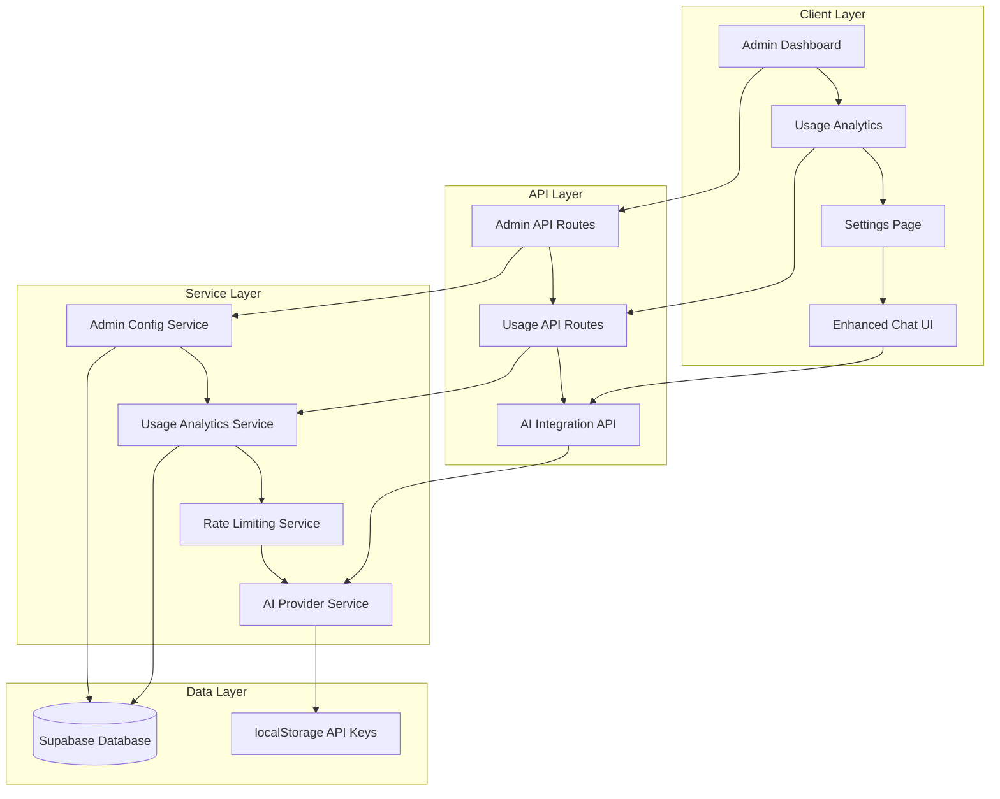

# Design Document

## Overview

This design implements a comprehensive admin system with usage analytics and AI integration for the Supabase-based chatbot application. The system provides administrators with full control over AI agent configurations, detailed usage tracking and analytics, and dynamic AI backend integration that reads from admin configurations. The design leverages the existing Supabase authentication, Drizzle ORM, and Next.js App Router architecture.

## Architecture

### High-Level Architecture



### Component Architecture

The system follows a layered architecture with clear separation of concerns:

1. **Presentation Layer**: React components with shadcn/ui
2. **API Layer**: Next.js App Router API routes
3. **Service Layer**: Business logic and data access
4. **Data Layer**: Supabase database + localStorage for API keys

## Components and Interfaces

### 1. Admin Dashboard Components

#### AdminLayout Component
```typescript
interface AdminLayoutProps {
  children: React.ReactNode
}

// Provides consistent layout for all admin pages
// Includes navigation tabs, breadcrumbs, and RBAC protection
```

#### AgentConfigTabs Component
```typescript
interface AgentConfigTabsProps {
  activeTab: string
  onTabChange: (tab: string) => void
}

// Main tabbed interface for agent configurations
// Tabs: routing-agent, chat-agent, document-agent, python-agent, mermaid-agent, git-mcp-agent
```

#### AgentConfigForm Component
```typescript
interface AgentConfigFormProps {
  agentType: string
  config: AdminConfig | null
  onSave: (config: Record<string, any>) => Promise<void>
  loading: boolean
}

// Reusable form component for agent configurations
// Handles validation, preview, and save operations
```

#### SystemPromptEditor Component
```typescript
interface SystemPromptEditorProps {
  value: string
  onChange: (value: string) => void
  placeholder?: string
  preview?: boolean
}

// Rich text editor with markdown support
// Includes preview panel and syntax highlighting
```

### 2. Usage Analytics Components

#### UsageDashboard Component
```typescript
interface UsageDashboardProps {
  dateRange: DateRange
  onDateRangeChange: (range: DateRange) => void
}

// Main dashboard container with date range selector
// Orchestrates all analytics components
```

#### SummaryCards Component
```typescript
interface SummaryCardsProps {
  data: UsageSummary
  loading: boolean
  previousPeriodData?: UsageSummary
}

interface UsageSummary {
  totalCalls: number
  totalTokens: number
  totalCost: number
  inputTokens: number
  outputTokens: number
  inputCost: number
  outputCost: number
}

// KPI cards showing key metrics with trend indicators
```

#### UsageCharts Component
```typescript
interface UsageChartsProps {
  timelineData: TimelineDataPoint[]
  agentDistribution: AgentUsageData[]
  modelUsage: ModelUsageData[]
  loading: boolean
}

// Chart components using recharts library
// Timeline, pie/donut, and bar charts
```

#### UsageTable Component
```typescript
interface UsageTableProps {
  data: UsageLog[]
  loading: boolean
  pagination: PaginationState
  onPaginationChange: (state: PaginationState) => void
  filters: UsageFilters
  onFiltersChange: (filters: UsageFilters) => void
}

// Detailed usage table with sorting, filtering, pagination
// Export to CSV functionality
```

### 3. Settings Components

#### APIKeyManager Component
```typescript
interface APIKeyManagerProps {
  keyType: 'google' | 'github'
  onKeyChange: (key: string) => void
  onTest: () => Promise<boolean>
}

// Individual API key management component
// Handles show/hide, validation, and testing
```

#### SettingsLayout Component
```typescript
interface SettingsLayoutProps {
  children: React.ReactNode
}

// Layout for settings page with sections and navigation
```

### 4. Enhanced Chat UI Components

#### RepositorySelector Component
```typescript
interface RepositorySelectorProps {
  selectedRepo: GithubRepository | null
  onRepoSelect: (repo: GithubRepository) => void
  onRepoConnect: (repoUrl: string) => Promise<void>
}

// Dropdown for selecting GitHub repositories
// Modal for connecting new repositories
```

#### ThinkingModeToggle Component
```typescript
interface ThinkingModeToggleProps {
  enabled: boolean
  onToggle: (enabled: boolean) => void
  disabled?: boolean
}

// Toggle switch for enabling extended thinking mode
// Shows cost implications and usage warnings
```

## Data Models

### Admin Configuration Schema

```typescript
interface AdminConfigData {
  // Common fields for all agents
  systemPrompt: string
  rateLimit: {
    type: 'hourly' | 'daily'
    value: number
  }
  models: {
    primary: string
    alternatives?: string[]
  }
  
  // Agent-specific configurations
  capabilities?: {
    imageGeneration?: boolean
    extendedThinking?: boolean
    fileInput?: boolean
  }
  
  tools?: {
    googleSearch?: boolean
    urlContext?: boolean
    createDocument?: boolean
    updateDocument?: boolean
  }
  
  codeExecution?: {
    enabled: boolean
    timeout: number
    allowedLibraries: string[]
  }
  
  mcpConfig?: {
    serverUrl: string
    enabledTools: string[]
    permissions: {
      read: boolean
      write: boolean
    }
  }
}
```

### Usage Analytics Schema

```typescript
interface UsageAnalytics {
  summary: {
    totalCalls: number
    totalTokens: number
    totalCost: number
    breakdown: {
      input: { tokens: number; cost: number }
      output: { tokens: number; cost: number }
    }
  }
  
  timeline: Array<{
    date: string
    calls: number
    tokens: number
    cost: number
  }>
  
  agentDistribution: Array<{
    agentType: string
    calls: number
    tokens: number
    cost: number
    percentage: number
  }>
  
  modelUsage: Array<{
    model: string
    calls: number
    tokens: number
    cost: number
  }>
  
  trends: {
    callsGrowth: number
    tokensGrowth: number
    costGrowth: number
  }
}
```

### API Key Storage Schema

```typescript
interface APIKeyStorage {
  apiKeys: {
    google?: string
    github?: string
  }
  lastValidated: {
    google?: string // ISO timestamp
    github?: string // ISO timestamp
  }
  validation: {
    google?: boolean
    github?: boolean
  }
}
```

## Error Handling

### Error Categories and Handling Strategy

```typescript
enum ErrorCategory {
  // Admin errors
  CONFIG_VALIDATION = 'config_validation',
  CONFIG_SAVE_FAILED = 'config_save_failed',
  
  // Usage analytics errors
  ANALYTICS_QUERY_FAILED = 'analytics_query_failed',
  EXPORT_FAILED = 'export_failed',
  
  // API key errors
  API_KEY_INVALID = 'api_key_invalid',
  API_KEY_TEST_FAILED = 'api_key_test_failed',
  
  // AI integration errors
  MODEL_CONFIG_ERROR = 'model_config_error',
  RATE_LIMIT_EXCEEDED = 'rate_limit_exceeded',
  
  // System errors
  DATABASE_ERROR = 'database_error',
  PERMISSION_DENIED = 'permission_denied'
}
```

### Error Handling Components

```typescript
interface ErrorBoundaryProps {
  fallback: React.ComponentType<{ error: Error }>
  onError?: (error: Error, errorInfo: ErrorInfo) => void
}

// Global error boundary for admin pages
// Logs errors to error_logs table
// Provides user-friendly error messages
```

## Testing Strategy

### Unit Testing

1. **Component Testing**
   - Admin form validation logic
   - Usage analytics calculations
   - API key validation functions
   - Chart data transformations

2. **Service Testing**
   - Admin config CRUD operations
   - Usage analytics queries
   - Rate limiting logic
   - AI provider integrations

3. **Hook Testing**
   - Custom hooks for data fetching
   - Authentication state management
   - Form state management

### Integration Testing

1. **API Route Testing**
   - Admin configuration endpoints
   - Usage analytics endpoints
   - Authentication middleware
   - Rate limiting middleware

2. **Database Testing**
   - RLS policy enforcement
   - Query performance
   - Data integrity constraints
   - Migration scripts

3. **End-to-End Testing**
   - Admin workflow scenarios
   - Usage analytics accuracy
   - API key management flow
   - Multi-user access control

### Performance Testing

1. **Database Performance**
   - Usage analytics queries with large datasets
   - Admin config retrieval performance
   - Index effectiveness

2. **UI Performance**
   - Chart rendering with large datasets
   - Table pagination and filtering
   - Real-time updates

## Security Considerations

### Authentication and Authorization

1. **Role-Based Access Control**
   - Server-side admin role validation
   - Client-side UI protection
   - API route protection
   - Database RLS policies

2. **Session Management**
   - Supabase JWT token validation
   - Session expiry handling
   - Secure cookie configuration

### Data Protection

1. **API Key Security**
   - Client-side only storage
   - No server transmission
   - Clear on logout
   - Validation without storage

2. **Admin Configuration Security**
   - Input validation and sanitization
   - SQL injection prevention
   - XSS protection
   - Audit logging

3. **Usage Data Privacy**
   - User data anonymization options
   - GDPR compliance considerations
   - Data retention policies
   - Export controls

### Rate Limiting and Abuse Prevention

1. **Admin Action Rate Limiting**
   - Configuration update limits
   - Bulk operation protection
   - API endpoint throttling

2. **Usage Analytics Protection**
   - Query complexity limits
   - Export frequency limits
   - Resource usage monitoring

## Performance Optimization

### Database Optimization

1. **Indexing Strategy**
   - Usage logs timestamp indexes
   - Admin config key indexes
   - User-based query optimization
   - Composite indexes for analytics

2. **Query Optimization**
   - Pagination for large datasets
   - Aggregation query optimization
   - Connection pooling
   - Read replica usage

### Frontend Optimization

1. **Component Optimization**
   - React.memo for expensive components
   - useMemo for calculations
   - useCallback for event handlers
   - Lazy loading for charts

2. **Data Fetching Optimization**
   - SWR for caching
   - Incremental data loading
   - Background refresh
   - Error retry strategies

3. **Bundle Optimization**
   - Code splitting by route
   - Dynamic imports for charts
   - Tree shaking optimization
   - Asset optimization

## Deployment Strategy

### Environment Configuration

1. **Development Environment**
   - Local Supabase instance
   - Mock API key validation
   - Development-only admin users
   - Debug logging enabled

2. **Staging Environment**
   - Production-like Supabase setup
   - Real API key validation
   - Performance monitoring
   - Security testing

3. **Production Environment**
   - Production Supabase instance
   - Full security measures
   - Performance optimization
   - Error monitoring

### Migration Strategy

1. **Database Migrations**
   - Admin config table seeding
   - Usage logs table optimization
   - Index creation
   - RLS policy updates

2. **Feature Rollout**
   - Admin dashboard first
   - Usage analytics second
   - AI integration third
   - Enhanced UI last

3. **Monitoring and Rollback**
   - Performance metrics tracking
   - Error rate monitoring
   - User feedback collection
   - Rollback procedures