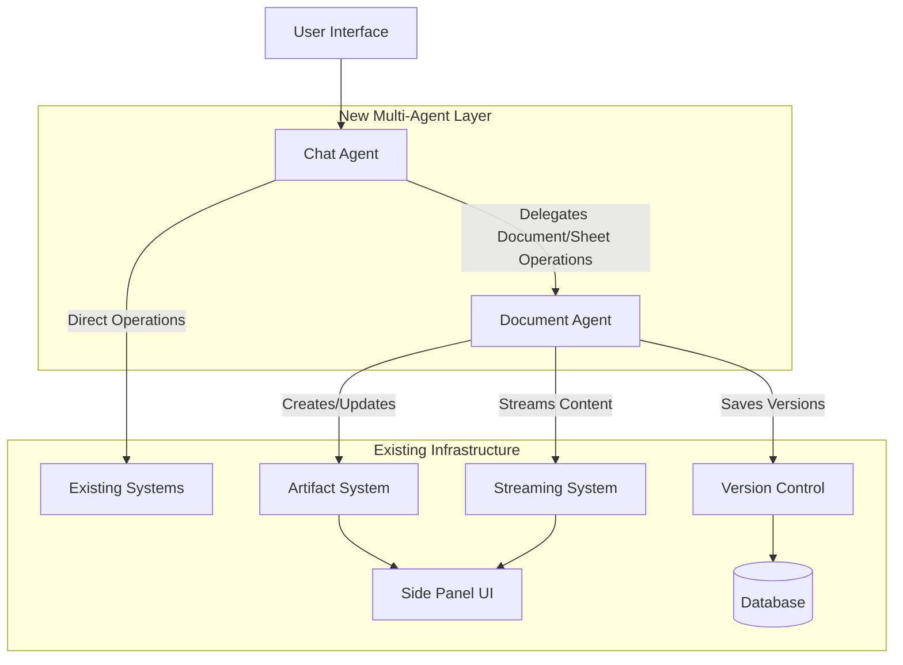

# Design Document

## Overview

The artifact-centric multi-agent system enhances the existing chat infrastructure by introducing intelligent delegation between a Chat Agent (orchestrator) and a Document Agent (specialist). This design builds upon the current artifact system, streaming infrastructure, and version control to provide seamless multi-artifact management with enhanced cross-artifact operations.

The system maintains the existing UI components and database schema while adding a delegation layer that routes document and spreadsheet operations to a specialized agent. This approach preserves all current functionality while enabling more sophisticated content creation workflows.

## Architecture

### High-Level Architecture



### Agent Hierarchy

The system implements a flat, two-tier agent hierarchy:

1. **Chat Agent (Orchestrator)**
   - Primary interface for all user interactions
   - Analyzes user intent and determines delegation needs
   - Coordinates multi-artifact operations
   - Maintains conversation context and state

2. **Document Agent (Specialist)**
   - Handles all text document and spreadsheet operations
   - Leverages existing artifact handlers (textDocumentHandler, sheetDocumentHandler)
   - Provides specialized content generation and modification
   - Integrates with streaming and version control systems

### Integration with Existing Systems

The design preserves and enhances existing components:

- **Artifact System**: Continues to handle UI rendering and user interactions
- **Document Handlers**: Enhanced with agent delegation logic
- **Streaming Infrastructure**: Extended to support multi-agent coordination
- **Version Control**: Enhanced with agent attribution metadata
- **Database Schema**: Extended with agent tracking fields

## Components and Interfaces

### 1. Chat Agent Enhancement

**Location**: `lib/ai/providers/google/chat-agent.ts`

**Enhanced Tool Integration**:
```typescript
// Add Document Agent as a tool in buildTools() method
buildTools(dataStream: any): Record<string, any> | undefined {
  const tools: Record<string, any> = {};

  // Existing Provider Tools Agent
  if (this.providerToolsAgent && this.config.tools?.providerToolsAgent?.enabled) {
    tools.providerToolsAgent = tool({
      description: this.config.tools.providerToolsAgent.description,
      inputSchema: z.object({
        input: z.string().describe(this.config.tools.providerToolsAgent.tool_input.parameter_description)
      }),
      execute: async (params: { input: string }) => {
        const result = await this.providerToolsAgent.execute({ input: params.input });
        return result.output;
      }
    });
  }

  // New Document Agent Tool
  if (this.documentAgent && this.config.tools?.documentAgent?.enabled) {
    tools.documentAgent = tool({
      description: this.config.tools.documentAgent.description,
      inputSchema: z.object({
        input: z.string().describe(this.config.tools.documentAgent.tool_input.parameter_description)
      }),
      execute: async (params: { input: string }) => {
        const result = await this.documentAgent.execute({ 
          input: params.input,
          dataStream 
        });
        return result.output;
      }
    });
  }

  return Object.keys(tools).length > 0 ? tools : undefined;
}

// Enhanced system prompt building
buildSystemPrompt(): string {
  let prompt = this.config.systemPrompt;

  // Add Document Agent instructions
  if (this.documentAgent && this.config.tools?.documentAgent?.enabled) {
    prompt += `\n\nWhen you need to create or update documents or spreadsheets, use the documentAgent tool. This includes text documents, reports, essays, data tables, and CSV files. After receiving the tool result, the artifact will be displayed in the side panel.`;
  }

  return prompt;
}
```

### 2. Document Agent Implementation

**Location**: `lib/ai/providers/google/document-agent.ts` (new)

**Following Provider Tools Agent Pattern**:
```typescript
import "server-only";

import { google, createGoogleGenerativeAI } from "@ai-sdk/google";
import { streamText, tool } from "ai";
import type { UIMessageStreamWriter } from "ai";
import { z } from "zod";
import { documentHandlersByArtifactKind } from "@/lib/artifacts/server";
import type { DocumentAgentConfig } from "../../core/types";

export class GoogleDocumentAgent {
  private apiKey?: string;
  private googleProvider?: ReturnType<typeof createGoogleGenerativeAI>;
  private modelId?: string;

  constructor(private config: DocumentAgentConfig) {
    this.validateConfig();
  }

  setApiKey(apiKey: string): void {
    this.apiKey = apiKey;
    this.googleProvider = createGoogleGenerativeAI({ apiKey });
  }

  setModel(modelId: string): void {
    this.modelId = modelId;
  }

  private getModel() {
    if (!this.modelId) {
      throw new Error("GoogleDocumentAgent: Model ID not set");
    }
    return this.googleProvider ? this.googleProvider(this.modelId) : google(this.modelId);
  }

  async execute(params: {
    input: string;
    dataStream: UIMessageStreamWriter;
  }): Promise<{ output: string; success: boolean }> {
    try {
      const model = this.getModel();
      const tools = this.buildTools(params.dataStream);

      const result = streamText({
        model,
        system: this.config.systemPrompt,
        prompt: params.input,
        tools,
        temperature: 0.7,
      });

      let fullOutput = '';
      for await (const chunk of result.textStream) {
        fullOutput += chunk;
      }

      return { output: fullOutput, success: true };
    } catch (error) {
      const errorMessage = error instanceof Error ? error.message : 'Unknown error';
      return { output: `Error: ${errorMessage}`, success: false };
    }
  }

  private buildTools(dataStream: UIMessageStreamWriter): Record<string, any> {
    const tools: Record<string, any> = {};

    // Create Document Artifact Tool
    if (this.config.tools?.createDocumentArtifact?.enabled) {
      tools.createDocumentArtifact = tool({
        description: this.config.tools.createDocumentArtifact.description,
        inputSchema: z.object({
          title: z.string().describe("Title for the document"),
          content: z.string().describe("Content of the document in markdown format")
        }),
        execute: async (params: { title: string; content: string }) => {
          // Use existing text document handler
          const handler = documentHandlersByArtifactKind.find(h => h.kind === 'text');
          if (handler) {
            await handler.onCreateDocument({
              id: generateUUID(),
              title: params.title,
              dataStream,
              user: null // Will be set by calling context
            });
          }
          return `Created document: ${params.title}`;
        }
      });
    }

    // Update Document Artifact Tool
    if (this.config.tools?.updateDocumentArtifact?.enabled) {
      tools.updateDocumentArtifact = tool({
        description: this.config.tools.updateDocumentArtifact.description,
        inputSchema: z.object({
          documentId: z.string().describe("ID of the document to update"),
          description: z.string().describe("Description of the changes to make")
        }),
        execute: async (params: { documentId: string; description: string }) => {
          // Implementation for updating documents
          return `Updated document: ${params.documentId}`;
        }
      });
    }

    // Create Sheet Artifact Tool
    if (this.config.tools?.createSheetArtifact?.enabled) {
      tools.createSheetArtifact = tool({
        description: this.config.tools.createSheetArtifact.description,
        inputSchema: z.object({
          title: z.string().describe("Title for the spreadsheet"),
          data: z.string().describe("CSV data for the spreadsheet")
        }),
        execute: async (params: { title: string; data: string }) => {
          // Use existing sheet document handler
          const handler = documentHandlersByArtifactKind.find(h => h.kind === 'sheet');
          if (handler) {
            await handler.onCreateDocument({
              id: generateUUID(),
              title: params.title,
              dataStream,
              user: null
            });
          }
          return `Created spreadsheet: ${params.title}`;
        }
      });
    }

    // Update Sheet Artifact Tool
    if (this.config.tools?.updateSheetArtifact?.enabled) {
      tools.updateSheetArtifact = tool({
        description: this.config.tools.updateSheetArtifact.description,
        inputSchema: z.object({
          sheetId: z.string().describe("ID of the spreadsheet to update"),
          description: z.string().describe("Description of the changes to make")
        }),
        execute: async (params: { sheetId: string; description: string }) => {
          // Implementation for updating spreadsheets
          return `Updated spreadsheet: ${params.sheetId}`;
        }
      });
    }

    return tools;
  }

  private validateConfig(): void {
    if (!this.config?.enabled) {
      throw new Error("GoogleDocumentAgent: Agent is disabled");
    }
  }
}
```

### 3. Document Agent Configuration Component

**Location**: `components/admin/agents/document/document-agent-config.tsx` (new)

**Following Provider Tools Agent Pattern**:
```typescript
'use client'

import { useState, useEffect } from 'react'
import { AgentConfigForm } from '../../shared/agent-config-form'
import { SystemPromptEditor } from '../../shared/system-prompt-editor'
import { EnhancedModelSelector } from '../../shared/enhanced-model-selector'
import { EnhancedRateLimitConfiguration } from '../../shared/enhanced-rate-limit-configuration'
import { ToolsConfiguration } from '../../shared/tools-configuration'

interface DocumentAgentConfig {
  enabled: boolean
  systemPrompt: string
  availableModels: ModelConfig[]
  rateLimit: {
    perMinute: number
    perHour: number
    perDay: number
  }
  tools: {
    createDocumentArtifact: ToolConfig
    updateDocumentArtifact: ToolConfig
    createSheetArtifact: ToolConfig
    updateSheetArtifact: ToolConfig
  }
}

export function DocumentAgentConfig({ configKey, provider = 'google' }: DocumentAgentConfigProps) {
  // Similar structure to ProviderToolsAgentConfig
  // Handles document-specific tools and configuration
}
```

### 4. Admin Layout Enhancement

**Location**: `components/admin/admin-layout.tsx`

**Uncomment Document Agent Import and Component**:
```typescript
// Uncomment this line
import { DocumentAgentConfig } from './agents/document/document-agent-config'

// Uncomment this section in the TabsContent mapping
{tab.id === 'document-agent' && (
  <DocumentAgentConfig configKey={tab.configKey} provider={provider} />
)}
```

### 5. Chat Agent Tool Configuration Enhancement

**Location**: `components/admin/agents/chat-model/chat-model-agent-config.tsx`

**Enhanced Tool Configuration**:
```typescript
// Update tools interface to include Document Agent
interface ChatModelAgentConfig {
  tools: {
    providerToolsAgent: ToolConfig
    documentAgent: ToolConfig & {
      tool_input?: {
        parameter_name: string
        parameter_description: string
      }
    }
    // ... other tools
  }
}

// Tool configuration with proper descriptions
const toolsWithAgentStatus = {
  ...config.tools,
  documentAgent: {
    ...config.tools.documentAgent,
    agentEnabled: toolAgentStatuses.document ?? false,
    description: "Create and update text documents and spreadsheets",
    tool_input: {
      parameter_name: "input",
      parameter_description: "Request for document or spreadsheet creation/modification"
    }
  }
}
```

### 6. Database Seed Data Enhancement

**Location**: `lib/db/migrations/0006_seed_data_google.sql`

**Enhanced Document Agent Configuration**:
```sql
-- Update document_agent_google configuration
UPDATE admin_config 
SET config_data = '{
  "enabled": true,
  "systemPrompt": "You are a specialized document and spreadsheet creation assistant. Create well-structured, clear, and professional content. For text documents, use proper markdown formatting. For spreadsheets, provide clean CSV data with appropriate headers and organization.",
  "rateLimit": {
    "perMinute": 5,
    "perHour": 50,
    "perDay": 200
  },
  "tools": {
    "createDocumentArtifact": {
      "description": "Create new text documents with markdown formatting",
      "tool_input": {
        "parameter_name": "title",
        "parameter_description": "Title for the new document"
      },
      "enabled": true
    },
    "updateDocumentArtifact": {
      "description": "Edit and update existing text documents",
      "tool_input": {
        "parameter_name": "description",
        "parameter_description": "Description of changes to make to the document"
      },
      "enabled": true
    },
    "createSheetArtifact": {
      "description": "Create new spreadsheets with CSV data",
      "tool_input": {
        "parameter_name": "title",
        "parameter_description": "Title for the new spreadsheet"
      },
      "enabled": true
    },
    "updateSheetArtifact": {
      "description": "Edit and update existing spreadsheets",
      "tool_input": {
        "parameter_name": "description", 
        "parameter_description": "Description of changes to make to the spreadsheet"
      },
      "enabled": true
    }
  }
}'::jsonb
WHERE config_key = 'document_agent_google';

-- Update chat_model_agent_google to enable Document Agent tool
UPDATE admin_config 
SET config_data = jsonb_set(
  config_data,
  '{tools,documentAgent}',
  '{
    "description": "Create and update text documents and spreadsheets using specialized document agent",
    "tool_input": {
      "parameter_name": "input",
      "parameter_description": "Request for document or spreadsheet creation, modification, or analysis"
    },
    "enabled": true
  }'::jsonb
)
WHERE config_key = 'chat_model_agent_google';
```

## Data Models

### Enhanced Document Schema

**Database Enhancement** (direct modification of existing table):
```sql
-- Modify existing Document table in 0001_tables.sql
CREATE TABLE IF NOT EXISTS "Document" (
    id UUID NOT NULL DEFAULT gen_random_uuid(),
    "createdAt" TIMESTAMP NOT NULL DEFAULT NOW(),
    title TEXT NOT NULL,
    content TEXT,
    kind VARCHAR(20) CHECK (kind IN ('text', 'python code', 'mermaid code', 'sheet')) NOT NULL DEFAULT 'text',
    user_id UUID NOT NULL,
    chat_id UUID REFERENCES "Chat"(id) ON DELETE CASCADE,
    parent_version_id UUID,
    version_number INTEGER NOT NULL DEFAULT 1,
    metadata JSONB DEFAULT '{}',
    agent_type VARCHAR(20) DEFAULT 'chat' CHECK (agent_type IN ('chat', 'document')),
    related_artifacts JSONB DEFAULT '[]',
    operation_metadata JSONB DEFAULT '{}',
    PRIMARY KEY (id, "createdAt"),
    FOREIGN KEY (parent_version_id, "createdAt") REFERENCES "Document"(id, "createdAt") ON DELETE SET NULL
);

-- Add indexes for new fields
CREATE INDEX idx_document_agent_type ON "Document"(agent_type);
CREATE INDEX idx_document_related_artifacts ON "Document" USING GIN(related_artifacts);
```

### Agent Configuration Types

**Location**: `lib/ai/core/types.ts` (enhanced)

```typescript
// Add Document Agent configuration type
export interface DocumentAgentConfig {
  enabled: boolean;
  systemPrompt: string;
  availableModels?: ModelConfig[];
  rateLimit: {
    perMinute: number;
    perHour: number;
    perDay: number;
  };
  tools: {
    createDocumentArtifact: {
      description: string;
      enabled: boolean;
      tool_input?: {
        parameter_name: string;
        parameter_description: string;
      };
    };
    updateDocumentArtifact: {
      description: string;
      enabled: boolean;
      tool_input?: {
        parameter_name: string;
        parameter_description: string;
      };
    };
    createSheetArtifact: {
      description: string;
      enabled: boolean;
      tool_input?: {
        parameter_name: string;
        parameter_description: string;
      };
    };
    updateSheetArtifact: {
      description: string;
      enabled: boolean;
      tool_input?: {
        parameter_name: string;
        parameter_description: string;
      };
    };
  };
}
```

### Agent Context Model

```typescript
interface ArtifactContext {
  chatId: string;
  activeArtifacts: {
    id: string;
    type: 'text' | 'sheet';
    title: string;
    lastModified: Date;
    agentType: 'chat' | 'document';
  }[];
  relationships: ArtifactRelationship[];
  operationHistory: {
    timestamp: Date;
    operation: string;
    agentType: 'chat' | 'document';
    artifactIds: string[];
  }[];
}
```

### Streaming Coordination Model

```typescript
interface StreamingCoordination {
  activeStreams: Map<string, {
    artifactId: string;
    agentType: 'chat' | 'document';
    status: 'streaming' | 'paused' | 'completed';
    startTime: Date;
  }>;
  
  queuedOperations: {
    artifactId: string;
    operation: 'create' | 'update';
    priority: number;
  }[];
}
```

## Error Handling

### Agent-Specific Error Types

```typescript
enum AgentErrorTypes {
  DELEGATION_FAILED = 'delegation_failed',
  DOCUMENT_AGENT_UNAVAILABLE = 'document_agent_unavailable',
  CROSS_ARTIFACT_CONFLICT = 'cross_artifact_conflict',
  STREAMING_COORDINATION_ERROR = 'streaming_coordination_error',
  ARTIFACT_IDENTIFICATION_FAILED = 'artifact_identification_failed'
}

class AgentError extends Error {
  constructor(
    public type: AgentErrorTypes,
    public agentType: 'chat' | 'document',
    message: string,
    public originalError?: Error
  ) {
    super(message);
  }
}
```

### Error Recovery Strategies

1. **Delegation Failures**: Fall back to direct Chat Agent handling
2. **Streaming Conflicts**: Queue operations and process sequentially
3. **Cross-Artifact Errors**: Isolate operations to prevent cascade failures
4. **Version Control Conflicts**: Preserve last known good state


## Implementation Phases

### Phase 1: Core Document Agent Infrastructure
1. **Create Document Agent Class**
   - Create new file `lib/ai/providers/google/document-agent.ts`
   - Follow existing provider-tools-agent pattern
   - Add four core tools: createDocumentArtifact, updateDocumentArtifact, createSheetArtifact, updateSheetArtifact

2. **Enhance Chat Agent Integration**
   - Modify `lib/ai/providers/google/chat-agent.ts`
   - Add Document Agent instantiation and configuration loading
   - Integrate Document Agent as a tool in `buildTools()` method
   - Update system prompt building logic

3. **Database Schema Enhancement**
   - Modify `lib/db/migrations/0001_tables.sql`
   - Add agent_type, related_artifacts, and operation_metadata columns to Document table
   - Create appropriate indexes

### Phase 2: Admin Configuration System
1. **Create Document Agent Config Component**
   - Create new file `components/admin/agents/document/document-agent-config.tsx`
   - Follow provider-tools-agent-config pattern exactly
   - Include system prompt, rate limits, and tools configuration

2. **Update Admin Layout**
   - Modify `components/admin/admin-layout.tsx`
   - Uncomment Document Agent import and component
   - Ensure proper tab navigation and configuration loading

3. **Update Chat Model Agent Config**
   - Modify `components/admin/agents/chat-model/chat-model-agent-config.tsx`
   - Add Document Agent tool configuration
   - Include proper tool descriptions and input parameters
   - Add dependency status checking

### Phase 3: Database Seed Data and Configuration
1. **Update Seed Data**
   - Modify `lib/db/migrations/0006_seed_data_google.sql`
   - Enable Document Agent configuration
   - Configure all four document tools with proper descriptions
   - Enable Document Agent tool in Chat Model Agent configuration

2. **Configuration Types**
   - Modify `lib/ai/core/types.ts` (if exists) or create interface
   - Add DocumentAgentConfig interface
   - Ensure type safety across all components

## Security Considerations

1. **Agent Authorization**: Ensure Document Agent operations are properly authorized
2. **Cross-Artifact Access**: Validate permissions for cross-artifact operations
3. **Data Isolation**: Maintain proper data isolation between different users' artifacts
4. **Version Control Integrity**: Prevent unauthorized version modifications
5. **Streaming Security**: Secure streaming channels and prevent data leakage

## Performance Considerations

1. **Multi-Artifact Rendering**: Optimize UI performance with multiple active artifacts
2. **Streaming Coordination**: Efficient management of concurrent streams
3. **Database Queries**: Optimize queries for agent attribution and relationships
4. **Memory Management**: Efficient handling of multiple artifact states
5. **Caching Strategy**: Cache frequently accessed artifact data and relationships