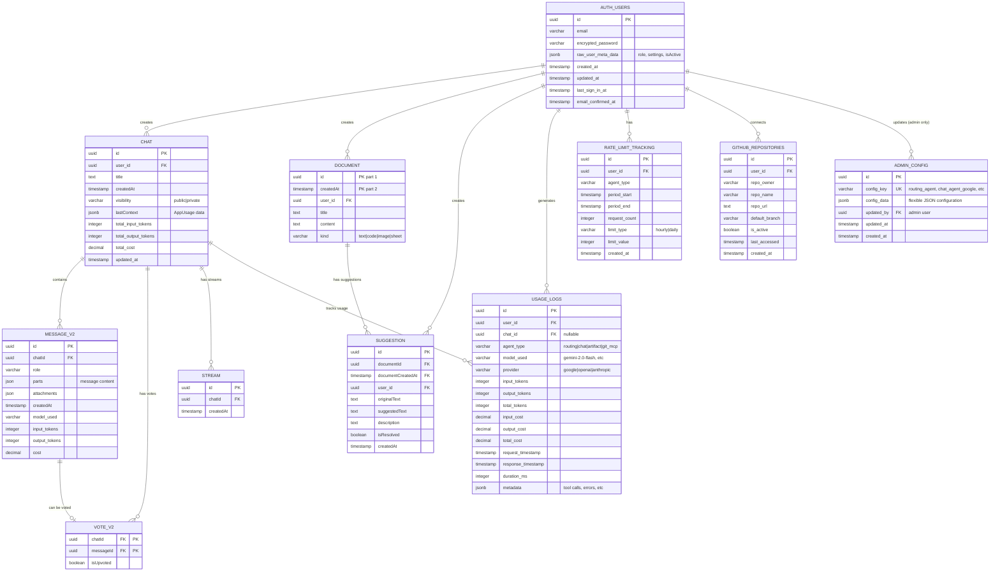

# Database ER Diagram - Final Schema After Migration

## Entity Relationship Diagram



---

## Table Details

### **AUTH_USERS (Supabase Managed)**
- **Schema**: `auth.users`
- **Managed by**: Supabase Auth
- **Access**: Read-only from application
- **Purpose**: Authentication & user metadata (role, settings)
- **Key Fields**:
  - `id`: Primary identifier used in all FKs
  - `raw_user_meta_data`: Contains `{role: 'user'|'admin', settings, isActive}`

---

### **CHAT**
- **Schema**: `public`
- **Purpose**: Store chat conversations
- **Foreign Keys**:
  - `user_id` → `auth.users(id)` ON DELETE CASCADE
- **RLS**: Users can only access their own chats; admins can view all
- **New Fields**:
  - `total_input_tokens`, `total_output_tokens`, `total_cost` - aggregated usage
  - `updated_at` - last modification timestamp

---

### **MESSAGE_V2**
- **Schema**: `public`
- **Purpose**: Store individual messages within chats
- **Foreign Keys**:
  - `chatId` → `chat(id)` ON DELETE CASCADE
- **RLS**: Users can only access messages in their own chats
- **New Fields**:
  - `model_used` - which AI model was used
  - `input_tokens`, `output_tokens`, `cost` - per-message usage tracking

---

### **VOTE_V2**
- **Schema**: `public`
- **Purpose**: Track user votes (upvote/downvote) on messages
- **Composite PK**: `(chatId, messageId)`
- **Foreign Keys**:
  - `chatId` → `chat(id)` ON DELETE CASCADE
  - `messageId` → `Message_v2(id)` ON DELETE CASCADE

---

### **STREAM**
- **Schema**: `public`
- **Purpose**: Track active streaming sessions
- **Foreign Keys**:
  - `chatId` → `chat(id)` ON DELETE CASCADE

---

### **DOCUMENT**
- **Schema**: `public`
- **Purpose**: Store artifacts (text, code, diagrams, sheets)
- **Composite PK**: `(id, createdAt)` - allows versioning
- **Foreign Keys**:
  - `user_id` → `auth.users(id)` ON DELETE CASCADE
- **RLS**: Users can only access their own documents
- **Kinds**: `text`, `code`, `image`, `sheet`

---

### **SUGGESTION**
- **Schema**: `public`
- **Purpose**: Store AI-generated suggestions for document improvements
- **Foreign Keys**:
  - `(documentId, documentCreatedAt)` → `Document(id, createdAt)` ON DELETE CASCADE
  - `user_id` → `auth.users(id)` ON DELETE CASCADE
- **RLS**: Users can only access suggestions for their own documents

---

### **ADMIN_CONFIG** (NEW)
- **Schema**: `public`
- **Purpose**: Store system-wide agent configurations
- **Unique Key**: `config_key`
- **Foreign Keys**:
  - `updated_by` → `auth.users(id)` (admin who made last change)
- **RLS**: Only admins can read/write
- **Config Keys**:
  - `routing_agent`
  - `chat_agent_google`
  - `artifact_agent_google`
  - `git_mcp_agent_google`
- **Config Data (JSONB)**: Flexible structure for each agent's settings

---

### **USAGE_LOGS** (NEW)
- **Schema**: `public`
- **Purpose**: Comprehensive tracking of all API calls, tokens, and costs
- **Foreign Keys**:
  - `user_id` → `auth.users(id)` ON DELETE CASCADE
  - `chat_id` → `chat(id)` ON DELETE SET NULL (nullable)
- **RLS**: Admins see all; users see only their own
- **Indexes**: On `user_id`, `request_timestamp`, `agent_type` for fast queries
- **Agent Types**: `routing`, `chat`, `artifact`, `git_mcp`

---

### **RATE_LIMIT_TRACKING** (NEW)
- **Schema**: `public`
- **Purpose**: Track rate limits per user per agent
- **Foreign Keys**:
  - `user_id` → `auth.users(id)` ON DELETE CASCADE
- **RLS**: Users can only see their own limits
- **Limit Types**: `hourly`, `daily`
- **Used for**: Enforcing per-agent rate limits configured in admin panel

---

### **GITHUB_REPOSITORIES** (NEW)
- **Schema**: `public`
- **Purpose**: Store user's connected GitHub repositories for Git MCP integration
- **Foreign Keys**:
  - `user_id` → `auth.users(id)` ON DELETE CASCADE
- **RLS**: Users can only access their own repositories
- **Used for**: Git MCP Agent context and operations

---

## Key Relationships Summary

### **One-to-Many Relationships**
1. `AUTH_USERS` → `CHAT` (1 user has many chats)
2. `AUTH_USERS` → `DOCUMENT` (1 user has many documents)
3. `AUTH_USERS` → `USAGE_LOGS` (1 user has many usage records)
4. `AUTH_USERS` → `RATE_LIMIT_TRACKING` (1 user has many rate limit records)
5. `AUTH_USERS` → `GITHUB_REPOSITORIES` (1 user connects many repos)
6. `CHAT` → `MESSAGE_V2` (1 chat has many messages)
7. `CHAT` → `USAGE_LOGS` (1 chat has many usage records)
8. `DOCUMENT` → `SUGGESTION` (1 document has many suggestions)

### **Many-to-One Relationships**
1. `ADMIN_CONFIG` ← `AUTH_USERS` (many configs updated by 1 admin)

### **Composite Foreign Keys**
1. `SUGGESTION` → `DOCUMENT` via `(documentId, documentCreatedAt)`

---

## Cascade Delete Behavior

When a user is deleted from `auth.users`:
- ✅ All their **chats** are deleted
- ✅ All **messages** in those chats are deleted (via chat cascade)
- ✅ All **votes** on those messages are deleted (via message cascade)
- ✅ All their **documents** are deleted
- ✅ All **suggestions** on those documents are deleted
- ✅ All their **usage logs** are deleted
- ✅ All their **rate limit tracking** records are deleted
- ✅ All their **connected GitHub repos** are deleted
- ⚠️ **Admin config** updates are preserved (only `updated_by` field)

---

## RLS (Row Level Security) Summary

### **Admin-Only Tables**
- `admin_config` - Only users with `role='admin'` in metadata

### **User-Scoped Tables**
- `chat` - Users see only their own chats; admins see all
- `Message_v2` - Users see only messages in their own chats
- `Document` - Users see only their own documents
- `Suggestion` - Users see only suggestions for their own documents
- `usage_logs` - Users see only their own logs; admins see all
- `rate_limit_tracking` - Users see only their own limits
- `github_repositories` - Users see only their own repos

### **Public Access**
- None - All tables require authentication

---

## Indexes for Performance

```sql
-- Chat queries (by user, sorted by date)
CREATE INDEX idx_chat_user_created ON chat(user_id, createdAt DESC);

-- Message queries (by chat)
CREATE INDEX idx_message_chat ON "Message_v2"(chatId, createdAt ASC);

-- Usage analytics (most common queries)
CREATE INDEX idx_usage_logs_user_timestamp ON usage_logs(user_id, request_timestamp DESC);
CREATE INDEX idx_usage_logs_agent_timestamp ON usage_logs(agent_type, request_timestamp DESC);
CREATE INDEX idx_usage_logs_date_range ON usage_logs(request_timestamp);

-- Rate limiting lookups
CREATE INDEX idx_rate_limit_user_agent ON rate_limit_tracking(user_id, agent_type, period_start);

-- Repository lookups
CREATE INDEX idx_github_repos_user ON github_repositories(user_id, is_active);

-- Document queries
CREATE INDEX idx_document_user ON "Document"(user_id, createdAt DESC);

-- Admin config lookups
CREATE INDEX idx_admin_config_key ON admin_config(config_key);
```

---

## Data Types Reference

### **UUID**
- All primary keys and foreign keys
- Generated via `gen_random_uuid()` or application-level

### **JSONB**
- `auth.users.raw_user_meta_data` - User role and settings
- `chat.lastContext` - Last usage/context data
- `admin_config.config_data` - Agent configurations
- `usage_logs.metadata` - Additional context

### **JSON**
- `Message_v2.parts` - Message content parts
- `Message_v2.attachments` - File attachments

### **DECIMAL(10, 6)**
- All cost fields for precise currency calculations

### **VARCHAR**
- Most string fields with reasonable length limits
- Enums: `visibility`, `agent_type`, `limit_type`, `kind`, `provider`

### **TEXT**
- Unbounded strings: `title`, `content`, `description`, `repo_url`

### **TIMESTAMP**
- All date/time fields with timezone support

---

## Storage Estimate

### **Small Installation (100 users, 1 year)**
- Chat: ~10K rows × 1KB = 10MB
- Message_v2: ~100K rows × 2KB = 200MB
- Document: ~5K rows × 10KB = 50MB
- usage_logs: ~500K rows × 500B = 250MB
- **Total**: ~500MB

### **Medium Installation (1,000 users, 1 year)**
- Chat: ~100K rows × 1KB = 100MB
- Message_v2: ~1M rows × 2KB = 2GB
- Document: ~50K rows × 10KB = 500MB
- usage_logs: ~5M rows × 500B = 2.5GB
- **Total**: ~5GB

### **Large Installation (10,000 users, 1 year)**
- Chat: ~1M rows × 1KB = 1GB
- Message_v2: ~10M rows × 2KB = 20GB
- Document: ~500K rows × 10KB = 5GB
- usage_logs: ~50M rows × 500B = 25GB
- **Total**: ~51GB

---

## Notes

1. **No Custom User Table**: Using Supabase `auth.users` directly eliminates duplication
2. **User Metadata**: Role and settings stored in `raw_user_meta_data` JSONB field
3. **RBAC**: Implemented via RLS policies checking `auth.jwt() -> 'user_metadata' ->> 'role'`
4. **Versioning**: Documents support versioning via composite PK `(id, createdAt)`
5. **Soft Deletes**: Not implemented - using hard deletes with CASCADE
6. **API Keys**: Not in database - stored in browser localStorage
7. **File Uploads**: Handled by Supabase Storage (separate from database)
8. **Migrations**: Old User table will be migrated to auth.users, then dropped
