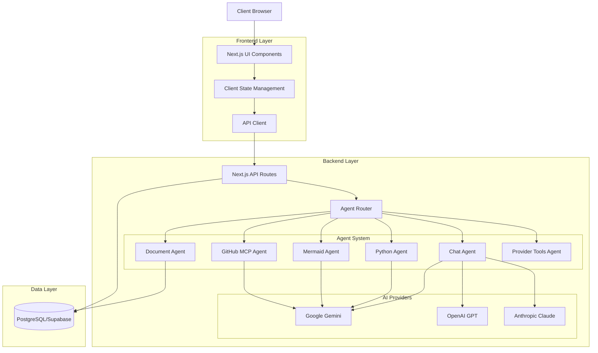
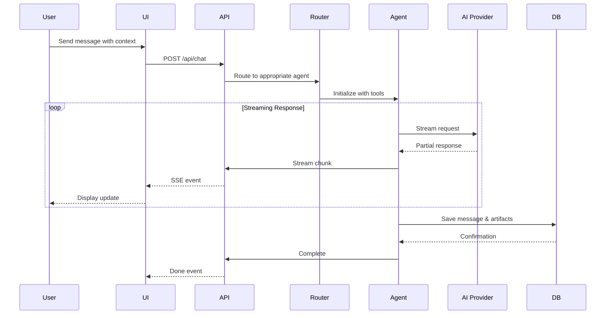
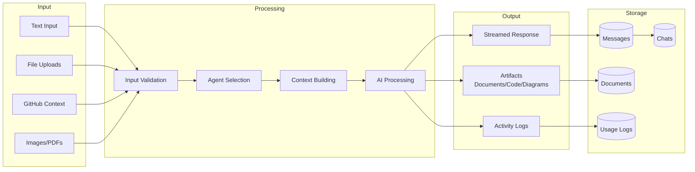

# CodeChat

A multimodal AI chat application with advanced agent orchestration, supporting multiple AI providers and rich interactive features including code execution, diagram generation, and GitHub integration.

## Tech Stack

### Frontend
- **Framework**: Next.js 15 (App Router)
- **Language**: TypeScript
- **UI Library**: React 19
- **Styling**: Tailwind CSS
- **State Management**: React Context & Hooks
- **Real-time Updates**: Server-Sent Events (SSE)

### Backend
- **Runtime**: Node.js
- **API**: Next.js API Routes
- **Database**: PostgreSQL (Supabase)
- **ORM**: Drizzle ORM
- **Authentication**: Custom implementation with localStorage API keys

### AI Providers
- **Google AI**: Gemini 2.0 Flash, Gemini 2.0 Flash Thinking, Gemini 1.5 Pro/Flash
- **OpenAI**: GPT-4, GPT-4 Turbo, GPT-3.5 Turbo
- **Anthropic**: Claude 3.5 Sonnet, Claude 3 Opus/Haiku

### Key Features
- Multi-agent orchestration system
- GitHub MCP (Model Context Protocol) integration
- Document versioning and artifact system
- Python code execution sandbox
- Mermaid diagram rendering
- Admin panel for configuration
- Comprehensive logging and monitoring

## Architecture

### High-Level System Architecture

### Agent Orchestration Flow

### Data Flow Architecture

## Quick Start

For detailed setup instructions, architecture deep-dive, and comprehensive documentation, please refer to:

**[📖 Complete Overview & Documentation](./docs/OVERVIEW.md)**

The overview document includes:
- Detailed project overview and quick start guide
- Complete tech stack breakdown
- Contribution guidelines
- Full documentation index with table of contents for all guides

## Key Documentation

- **[Admin Panel](./docs/admin-panel.md)** - Configuration and management
- **[Agent Architecture](./docs/agent-architecture.md)** - Multi-agent system design
- **[Database Design](./docs/database-design.md)** - Schema and data model
- **[Multimodal Features](./docs/multimodal-chat-features.md)** - Chat capabilities
- **[Testing Strategy](./docs/testing.md)** - Comprehensive testing guide

## License

MIT License - see LICENSE file for details
