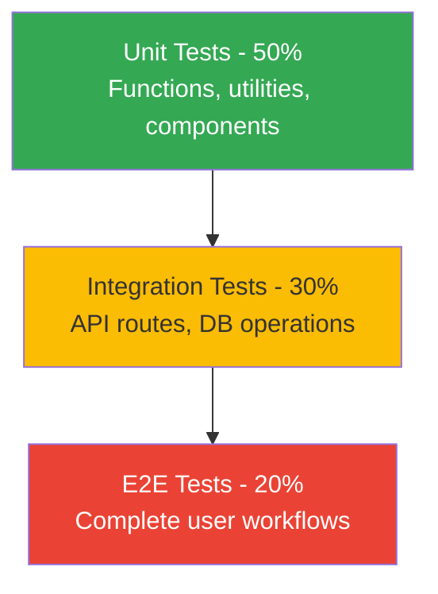

# Comprehensive Testing Strategy

## Table of Contents
- [Overview](#overview)
- [Testing Philosophy](#testing-philosophy)
- [Test Setup](#test-setup)
- [Testing Framework](#testing-framework)
- [API Testing](#api-testing)
- [Feature Testing](#feature-testing)
- [Flow Testing](#flow-testing)
- [UI Testing](#ui-testing)
- [E2E Testing](#e2e-testing)
- [Contributing Tests](#contributing-tests)
- [PR Requirements](#pr-requirements)
- [Running Tests](#running-tests)
- [Test Data Management](#test-data-management)
- [Continuous Integration](#continuous-integration)
- [Appendix](#appendix)

---

## Overview

This document defines the comprehensive testing strategy for the Code-Chatbot application, a multi-agent AI system built with Next.js, Supabase, and Google Gemini AI. The testing framework ensures reliability, maintainability, and quality across all application layers.

**Application Stack:**
- **Frontend**: Next.js 14, React, TypeScript
- **Backend**: Next.js API Routes, Server Actions
- **Database**: PostgreSQL (Supabase)
- **Authentication**: Supabase Auth
- **AI**: Google Gemini (multi-agent architecture)
- **Streaming**: Server-Sent Events (SSE)

**Key Features to Test:**
1. Multimodal chat interface (text, files, GitHub context)
2. Multi-agent AI system (6 specialized agents)
3. Real-time artifact streaming (documents, code, diagrams)
4. Version control for artifacts
5. Admin configuration panel
6. GitHub MCP integration
7. Settings and API key management

---

## Testing Philosophy

### Core Principles

1. **Comprehensive Coverage**: Test all critical paths, edge cases, and error scenarios
2. **Test-Driven Development**: Write tests before or alongside new features
3. **Fast Feedback**: Tests should run quickly and provide clear error messages
4. **Maintainability**: Tests should be easy to understand and update
5. **Realistic Scenarios**: Test actual user workflows, not just isolated units

### Test Pyramid



### Quality Gates

**All PRs must pass:**
- ✅ All existing tests
- ✅ New tests for new features
- ✅ Linting and formatting
- ✅ Type checking
- ✅ Build verification

**⚠️ PRs with failing tests will be automatically rejected.**

---

## Test Setup

### Prerequisites

```bash
# Install dependencies
npm install

# Install Playwright browsers
npx playwright install --with-deps
```

### Environment Configuration

Create `.env.test` file:

```env
# Supabase Test Instance
NEXT_PUBLIC_SUPABASE_URL=your_test_supabase_url
NEXT_PUBLIC_SUPABASE_ANON_KEY=your_test_anon_key
SUPABASE_SERVICE_ROLE_KEY=your_test_service_role_key

# Test API Keys
TEST_GOOGLE_API_KEY=your_test_google_api_key
TEST_GITHUB_PAT=your_test_github_pat

# Test Database
DATABASE_URL=your_test_database_url

# Application URLs
NEXT_PUBLIC_APP_URL=http://localhost:3000
```

### Test Database Setup

```sql
-- Run database migrations
npm run db:migrate:test

-- Seed test data
npm run db:seed:test
```

### Playwright Configuration

File: `playwright.config.ts`

```typescript
import { defineConfig, devices } from '@playwright/test';

export default defineConfig({
  testDir: './tests',
  fullyParallel: true,
  forbidOnly: !!process.env.CI,
  retries: process.env.CI ? 2 : 0,
  workers: process.env.CI ? 1 : undefined,
  reporter: 'html',

  use: {
    baseURL: 'http://localhost:3000',
    trace: 'on-first-retry',
    screenshot: 'only-on-failure',
  },

  projects: [
    {
      name: 'chromium',
      use: { ...devices['Desktop Chrome'] },
    },
    {
      name: 'firefox',
      use: { ...devices['Desktop Firefox'] },
    },
    {
      name: 'webkit',
      use: { ...devices['Desktop Safari'] },
    },
    {
      name: 'Mobile Chrome',
      use: { ...devices['Pixel 5'] },
    },
  ],

  webServer: {
    command: 'npm run dev',
    url: 'http://localhost:3000',
    reuseExistingServer: !process.env.CI,
  },
});
```

---

## Testing Framework

### Directory Structure

```
tests/
├── api/                    # API endpoint tests
│   ├── chat.spec.ts
│   ├── document.spec.ts
│   ├── admin.spec.ts
│   └── files.spec.ts
├── features/              # Feature-specific tests
│   ├── multimodal-input.spec.ts
│   ├── thinking-mode.spec.ts
│   ├── model-selection.spec.ts
│   └── github-integration.spec.ts
├── flows/                 # End-to-end user flows
│   ├── chat-flow.spec.ts
│   ├── document-lifecycle.spec.ts
│   ├── admin-workflow.spec.ts
│   └── multi-agent-flow.spec.ts
├── ui/                    # UI component tests
│   ├── chat-interface.spec.ts
│   ├── artifact-panel.spec.ts
│   ├── settings.spec.ts
│   └── admin-dashboard.spec.ts
├── e2e/                   # Complete end-to-end scenarios
│   ├── user-journey.spec.ts
│   ├── admin-journey.spec.ts
│   └── developer-workflow.spec.ts
├── utils/                 # Test utilities
│   ├── fixtures.ts
│   ├── helpers.ts
│   ├── mock-data.ts
│   └── test-users.ts
└── setup/                 # Test setup and teardown
    ├── global-setup.ts
    └── global-teardown.ts
```

---

## API Testing

### Chat API Tests

File: `tests/api/chat.spec.ts`

```typescript
import { test, expect } from '@playwright/test';

test.describe('Chat API', () => {
  let apiContext;
  let authToken;

  test.beforeAll(async ({ playwright }) => {
    // Create API context with auth
    apiContext = await playwright.request.newContext({
      baseURL: 'http://localhost:3000',
      extraHTTPHeaders: {
        'x-google-api-key': process.env.TEST_GOOGLE_API_KEY!,
      },
    });

    // Get auth token
    authToken = await getTestUserToken();
  });

  test('TC-API-001: Basic chat request', async () => {
    const response = await apiContext.post('/api/chat', {
      headers: {
        'Authorization': `Bearer ${authToken}`,
      },
      data: {
        id: 'test-chat-001',
        message: {
          role: 'user',
          parts: [{ type: 'text', text: 'Hello, how are you?' }],
        },
        selectedChatModel: 'google-gemini-2.0-flash-exp',
        selectedVisibilityType: 'private',
        thinkingEnabled: false,
      },
    });

    expect(response.status()).toBe(200);

    // Verify streaming response
    const contentType = response.headers()['content-type'];
    expect(contentType).toContain('text/event-stream');
  });

  test('TC-API-002: Chat with thinking mode enabled', async () => {
    const response = await apiContext.post('/api/chat', {
      headers: {
        'Authorization': `Bearer ${authToken}`,
      },
      data: {
        id: 'test-chat-002',
        message: {
          role: 'user',
          parts: [{ type: 'text', text: 'Explain quantum computing' }],
        },
        selectedChatModel: 'google-gemini-2.0-flash-thinking-exp',
        selectedVisibilityType: 'private',
        thinkingEnabled: true,
      },
    });

    expect(response.status()).toBe(200);

    // Parse SSE stream and verify reasoning parts
    const stream = await response.body();
    const chunks = parseSSEStream(stream);

    const hasReasoningPart = chunks.some(chunk =>
      chunk.type === 'reasoning'
    );
    expect(hasReasoningPart).toBeTruthy();
  });

  test('TC-API-003: Chat with file attachment', async () => {
    // Upload file first
    const fileUploadResponse = await apiContext.post('/api/files/upload', {
      headers: {
        'Authorization': `Bearer ${authToken}`,
      },
      multipart: {
        file: {
          name: 'test-document.txt',
          mimeType: 'text/plain',
          buffer: Buffer.from('Test document content'),
        },
      },
    });

    const { url, pathname, contentType } = await fileUploadResponse.json();

    // Send chat with attachment
    const chatResponse = await apiContext.post('/api/chat', {
      headers: {
        'Authorization': `Bearer ${authToken}`,
      },
      data: {
        id: 'test-chat-003',
        message: {
          role: 'user',
          parts: [
            { type: 'file', url, name: pathname, mediaType: contentType },
            { type: 'text', text: 'Summarize this document' },
          ],
        },
        selectedChatModel: 'google-gemini-2.0-flash-exp',
        selectedVisibilityType: 'private',
        thinkingEnabled: false,
      },
    });

    expect(chatResponse.status()).toBe(200);
  });

  test('TC-API-004: Rate limiting enforcement', async () => {
    // Send 101 requests (assuming limit is 100/day)
    const requests = Array.from({ length: 101 }, (_, i) =>
      apiContext.post('/api/chat', {
        headers: { 'Authorization': `Bearer ${authToken}` },
        data: {
          id: `test-chat-rate-${i}`,
          message: {
            role: 'user',
            parts: [{ type: 'text', text: 'Test message' }],
          },
          selectedChatModel: 'google-gemini-2.0-flash-exp',
          selectedVisibilityType: 'private',
          thinkingEnabled: false,
        },
      })
    );

    const responses = await Promise.all(requests);

    // First 100 should succeed
    expect(responses.slice(0, 100).every(r => r.status() === 200)).toBeTruthy();

    // 101st should be rate limited
    expect(responses[100].status()).toBe(429);
  });

  test('TC-API-005: Invalid model ID', async () => {
    const response = await apiContext.post('/api/chat', {
      headers: {
        'Authorization': `Bearer ${authToken}`,
      },
      data: {
        id: 'test-chat-invalid-model',
        message: {
          role: 'user',
          parts: [{ type: 'text', text: 'Hello' }],
        },
        selectedChatModel: 'non-existent-model',
        selectedVisibilityType: 'private',
        thinkingEnabled: false,
      },
    });

    expect(response.status()).toBe(400);
    const error = await response.json();
    expect(error.error).toContain('Invalid model');
  });

  test('TC-API-006: Unauthorized access', async () => {
    const response = await apiContext.post('/api/chat', {
      // No auth header
      data: {
        id: 'test-chat-unauth',
        message: {
          role: 'user',
          parts: [{ type: 'text', text: 'Hello' }],
        },
        selectedChatModel: 'google-gemini-2.0-flash-exp',
        selectedVisibilityType: 'private',
        thinkingEnabled: false,
      },
    });

    expect(response.status()).toBe(401);
  });
});
```

### Document API Tests

File: `tests/api/document.spec.ts`

```typescript
import { test, expect } from '@playwright/test';

test.describe('Document API', () => {
  let apiContext;
  let authToken;
  let testDocumentId;

  test.beforeAll(async ({ playwright }) => {
    apiContext = await playwright.request.newContext({
      baseURL: 'http://localhost:3000',
    });
    authToken = await getTestUserToken();
  });

  test('TC-API-007: Get document by ID', async () => {
    // Create a document first
    testDocumentId = await createTestDocument(apiContext, authToken);

    const response = await apiContext.get(`/api/document?id=${testDocumentId}`, {
      headers: { 'Authorization': `Bearer ${authToken}` },
    });

    expect(response.status()).toBe(200);

    const document = await response.json();
    expect(document.id).toBe(testDocumentId);
    expect(document.version_number).toBe(1);
  });

  test('TC-API-008: Get document versions', async () => {
    // Create document with multiple versions
    const docId = await createTestDocument(apiContext, authToken);
    await updateTestDocument(apiContext, authToken, docId, 'Updated content 1');
    await updateTestDocument(apiContext, authToken, docId, 'Updated content 2');

    const response = await apiContext.get(`/api/document/versions?id=${docId}`, {
      headers: { 'Authorization': `Bearer ${authToken}` },
    });

    expect(response.status()).toBe(200);

    const versions = await response.json();
    expect(versions).toHaveLength(3);
    expect(versions.map(v => v.version_number)).toEqual([1, 2, 3]);
  });

  test('TC-API-009: Delete document', async () => {
    const docId = await createTestDocument(apiContext, authToken);

    const deleteResponse = await apiContext.delete(`/api/document?id=${docId}`, {
      headers: { 'Authorization': `Bearer ${authToken}` },
    });

    expect(deleteResponse.status()).toBe(200);

    // Verify document is deleted
    const getResponse = await apiContext.get(`/api/document?id=${docId}`, {
      headers: { 'Authorization': `Bearer ${authToken}` },
    });

    expect(getResponse.status()).toBe(404);
  });
});
```

### Admin API Tests

File: `tests/api/admin.spec.ts`

```typescript
import { test, expect } from '@playwright/test';

test.describe('Admin API', () => {
  let apiContext;
  let adminToken;
  let userToken;

  test.beforeAll(async ({ playwright }) => {
    apiContext = await playwright.request.newContext({
      baseURL: 'http://localhost:3000',
    });
    adminToken = await getAdminUserToken();
    userToken = await getTestUserToken();
  });

  test('TC-API-010: Admin can access config', async () => {
    const response = await apiContext.get('/api/admin/config?configKey=chat_model_agent_google', {
      headers: { 'Authorization': `Bearer ${adminToken}` },
    });

    expect(response.status()).toBe(200);

    const config = await response.json();
    expect(config.config_key).toBe('chat_model_agent_google');
    expect(config.config_data).toBeDefined();
  });

  test('TC-API-011: Regular user cannot access admin config', async () => {
    const response = await apiContext.get('/api/admin/config?configKey=chat_model_agent_google', {
      headers: { 'Authorization': `Bearer ${userToken}` },
    });

    expect(response.status()).toBe(403);
  });

  test('TC-API-012: Admin can update config', async () => {
    const updatedConfig = {
      enabled: true,
      systemPrompt: 'Updated system prompt for testing',
      tools: ['googleSearch', 'codeExecution'],
    };

    const response = await apiContext.post('/api/admin/config', {
      headers: { 'Authorization': `Bearer ${adminToken}` },
      data: {
        configKey: 'chat_model_agent_google',
        configData: updatedConfig,
      },
    });

    expect(response.status()).toBe(200);

    // Verify update
    const getResponse = await apiContext.get('/api/admin/config?configKey=chat_model_agent_google', {
      headers: { 'Authorization': `Bearer ${adminToken}` },
    });

    const config = await getResponse.json();
    expect(config.config_data.systemPrompt).toBe('Updated system prompt for testing');
  });

  test('TC-API-013: Get model configuration', async () => {
    const response = await apiContext.get('/api/admin/models', {
      headers: { 'Authorization': `Bearer ${adminToken}` },
    });

    expect(response.status()).toBe(200);

    const models = await response.json();
    expect(Array.isArray(models)).toBeTruthy();
    expect(models.length).toBeGreaterThan(0);

    const geminiModel = models.find(m => m.model_id === 'gemini-2.0-flash-exp');
    expect(geminiModel).toBeDefined();
    expect(geminiModel.input_pricing_per_million_tokens).toBeDefined();
  });
});
```

---

## Feature Testing

### Multimodal Input Feature

File: `tests/features/multimodal-input.spec.ts`

```typescript
import { test, expect } from '@playwright/test';

test.describe('Multimodal Input Feature', () => {
  test.beforeEach(async ({ page }) => {
    await setupTestUser(page);
    await page.goto('/');
  });

  test('TC-FEAT-001: Text input only', async ({ page }) => {
    const input = page.locator('textarea[placeholder*="Send a message"]');
    await input.fill('Hello, this is a test message');

    await page.click('button[type="submit"]');

    // Verify message appears in chat
    await expect(page.locator('[data-role="user"]').last()).toContainText('Hello, this is a test message');

    // Verify response is streamed
    await expect(page.locator('[data-role="assistant"]').last()).toBeVisible();
  });

  test('TC-FEAT-002: File upload', async ({ page }) => {
    // Click file upload button
    await page.click('button[aria-label="Attach files"]');

    // Upload test file
    const fileInput = page.locator('input[type="file"]');
    await fileInput.setInputFiles({
      name: 'test.txt',
      mimeType: 'text/plain',
      buffer: Buffer.from('This is a test file'),
    });

    // Verify file preview appears
    await expect(page.locator('[data-testid="file-preview"]')).toBeVisible();
    await expect(page.locator('[data-testid="file-preview"]')).toContainText('test.txt');

    // Send message with file
    await page.fill('textarea', 'Summarize this file');
    await page.click('button[type="submit"]');

    // Verify file is included in message
    await expect(page.locator('[data-role="user"]').last()).toContainText('test.txt');
  });

  test('TC-FEAT-003: GitHub context integration', async ({ page }) => {
    // Set up GitHub PAT in settings first
    await setupGitHubPAT(page);

    // Open GitHub context modal
    await page.click('button[aria-label="Add GitHub context"]');

    // Wait for modal
    await expect(page.locator('[role="dialog"]')).toBeVisible();

    // Select a repository
    await page.click('[data-repo-name="test-repo"]');

    // Switch to files tab
    await page.click('button:has-text("Files & Folders")');

    // Select some files
    await page.click('[data-file-path="src/index.ts"]');
    await page.click('[data-file-path="README.md"]');

    // Apply selection
    await page.click('button:has-text("Apply")');

    // Verify selected items appear
    await expect(page.locator('[data-testid="github-context-badge"]')).toContainText('test-repo');
    await expect(page.locator('[data-testid="github-context-badge"]')).toContainText('index.ts');

    // Send message with GitHub context
    await page.fill('textarea', 'Explain this codebase');
    await page.click('button[type="submit"]');

    // Verify GitHub context included in request
    await expect(page.locator('[data-role="user"]').last()).toContainText('GitHub Repositories: test-repo');
  });

  test('TC-FEAT-004: Multiple attachment types', async ({ page }) => {
    // Upload multiple files
    const fileInput = page.locator('input[type="file"]');
    await fileInput.setInputFiles([
      {
        name: 'document.pdf',
        mimeType: 'application/pdf',
        buffer: await getTestPDFBuffer(),
      },
      {
        name: 'image.png',
        mimeType: 'image/png',
        buffer: await getTestImageBuffer(),
      },
    ]);

    // Verify both files appear
    await expect(page.locator('[data-testid="file-preview"]')).toHaveCount(2);

    // Add GitHub context
    await page.click('button[aria-label="Add GitHub context"]');
    await page.click('[data-repo-name="test-repo"]');
    await page.click('button:has-text("Apply")');

    // Send message
    await page.fill('textarea', 'Analyze all this context');
    await page.click('button[type="submit"]');

    // Verify all attachments included
    const userMessage = page.locator('[data-role="user"]').last();
    await expect(userMessage).toContainText('document.pdf');
    await expect(userMessage).toContainText('image.png');
    await expect(userMessage).toContainText('test-repo');
  });
});
```

### Thinking Mode Feature

File: `tests/features/thinking-mode.spec.ts`

```typescript
import { test, expect } from '@playwright/test';

test.describe('Thinking Mode Feature', () => {
  test.beforeEach(async ({ page }) => {
    await setupTestUser(page);
    await page.goto('/');
  });

  test('TC-FEAT-005: Enable thinking mode', async ({ page }) => {
    // Select a thinking-capable model
    await page.click('[data-testid="model-selector"]');
    await page.click('text=Gemini 2.0 Flash Thinking');

    // Verify thinking toggle appears
    await expect(page.locator('[data-testid="thinking-toggle"]')).toBeVisible();

    // Enable thinking mode
    await page.click('[data-testid="thinking-toggle"]');

    // Verify toggle is checked
    await expect(page.locator('[data-testid="thinking-toggle"]')).toBeChecked();
  });

  test('TC-FEAT-006: Thinking mode displays reasoning', async ({ page }) => {
    // Enable thinking mode
    await selectThinkingModel(page);
    await page.click('[data-testid="thinking-toggle"]');

    // Send a complex query
    await page.fill('textarea', 'Explain the concept of recursion with examples');
    await page.click('button[type="submit"]');

    // Wait for response
    await page.waitForSelector('[data-role="assistant"]');

    // Verify reasoning section appears
    await expect(page.locator('[data-testid="reasoning-section"]')).toBeVisible();
    await expect(page.locator('[data-testid="reasoning-section"]')).toContainText('Thinking');

    // Verify reasoning content is not empty
    const reasoningText = await page.locator('[data-testid="reasoning-content"]').textContent();
    expect(reasoningText.length).toBeGreaterThan(0);
  });

  test('TC-FEAT-007: Thinking mode toggle persistence', async ({ page }) => {
    // Enable thinking mode
    await selectThinkingModel(page);
    await page.click('[data-testid="thinking-toggle"]');

    // Reload page
    await page.reload();

    // Verify thinking mode is still enabled
    await expect(page.locator('[data-testid="thinking-toggle"]')).toBeChecked();
  });

  test('TC-FEAT-008: Thinking mode not available for non-thinking models', async ({ page }) => {
    // Select a non-thinking model
    await page.click('[data-testid="model-selector"]');
    await page.click('text=Gemini 2.0 Flash');

    // Verify thinking toggle does not appear
    await expect(page.locator('[data-testid="thinking-toggle"]')).not.toBeVisible();
  });
});
```

### Model Selection Feature

File: `tests/features/model-selection.spec.ts`

```typescript
import { test, expect } from '@playwright/test';

test.describe('Model Selection Feature', () => {
  test.beforeEach(async ({ page }) => {
    await setupTestUser(page);
    await page.goto('/');
  });

  test('TC-FEAT-009: Display available models', async ({ page }) => {
    await page.click('[data-testid="model-selector"]');

    // Verify model dropdown opens
    await expect(page.locator('[role="menu"]')).toBeVisible();

    // Verify provider groups
    await expect(page.locator('text=Google')).toBeVisible();

    // Verify at least one model is listed
    await expect(page.locator('[data-model-id]')).toHaveCount(greaterThan(0));
  });

  test('TC-FEAT-010: Select different model', async ({ page }) => {
    // Open model selector
    await page.click('[data-testid="model-selector"]');

    // Select a different model
    await page.click('[data-model-id="google-gemini-2.0-flash-exp"]');

    // Verify model is selected
    await expect(page.locator('[data-testid="model-selector"]')).toContainText('Gemini 2.0 Flash');

    // Send a message
    await page.fill('textarea', 'Test message');
    await page.click('button[type="submit"]');

    // Verify message uses selected model (check in usage logs)
    // This would require checking the database or API response
  });

  test('TC-FEAT-011: Model selection persists across sessions', async ({ page }) => {
    // Select a model
    await page.click('[data-testid="model-selector"]');
    await page.click('[data-model-id="google-gemini-2.0-flash-thinking-exp"]');

    // Reload page
    await page.reload();

    // Verify model is still selected
    await expect(page.locator('[data-testid="model-selector"]')).toContainText('Gemini 2.0 Flash Thinking');
  });

  test('TC-FEAT-012: Default model is pre-selected', async ({ page }) => {
    // New user, first visit
    await clearModelSelectionCookie(page);
    await page.reload();

    // Verify a default model is selected
    const selectedModel = await page.locator('[data-testid="model-selector"]').textContent();
    expect(selectedModel).toBeTruthy();
    expect(selectedModel).not.toBe('Select Model');
  });
});
```

---

## Flow Testing

### Complete Chat Flow

File: `tests/flows/chat-flow.spec.ts`

```typescript
import { test, expect } from '@playwright/test';

test.describe('Complete Chat Flow', () => {
  test('TC-FLOW-001: New user chat flow', async ({ page }) => {
    // 1. Sign up
    await page.goto('/signup');
    await page.fill('input[name="email"]', 'testuser@example.com');
    await page.fill('input[name="password"]', 'SecurePassword123!');
    await page.click('button[type="submit"]');

    // 2. Verify email (mock)
    await verifyTestUserEmail('testuser@example.com');

    // 3. Login
    await page.goto('/login');
    await page.fill('input[name="email"]', 'testuser@example.com');
    await page.fill('input[name="password"]', 'SecurePassword123!');
    await page.click('button[type="submit"]');

    // 4. Redirect to settings (no API key)
    await expect(page).toHaveURL(/\/settings/);

    // 5. Add Google API key
    await page.fill('input[name="google-api-key"]', process.env.TEST_GOOGLE_API_KEY);
    await page.click('button:has-text("Verify")');
    await page.waitForSelector('text=✅ Verified');
    await page.click('button:has-text("Save")');

    // 6. Navigate to chat
    await page.click('a[href="/"]');

    // 7. Send first message
    await page.fill('textarea', 'Hello! This is my first message.');
    await page.click('button[type="submit"]');

    // 8. Verify response
    await expect(page.locator('[data-role="assistant"]')).toBeVisible();

    // 9. Verify chat is saved
    await page.reload();
    await expect(page.locator('[data-role="user"]')).toContainText('Hello! This is my first message.');
  });

  test('TC-FLOW-002: Multi-turn conversation', async ({ page }) => {
    await setupTestUser(page);
    await page.goto('/');

    // Turn 1
    await page.fill('textarea', 'What is React?');
    await page.click('button[type="submit"]');
    await page.waitForSelector('[data-role="assistant"]');

    // Turn 2 - follow-up question
    await page.fill('textarea', 'Can you give me an example?');
    await page.click('button[type="submit"]');
    await page.waitForSelector('[data-role="assistant"]:nth-child(4)'); // 2 user + 2 assistant

    // Turn 3 - ask for code
    await page.fill('textarea', 'Show me code for a simple React component');
    await page.click('button[type="submit"]');
    await page.waitForSelector('[data-role="assistant"]:nth-child(6)');

    // Verify all messages are present
    const messages = await page.locator('[data-role]').count();
    expect(messages).toBe(6); // 3 user + 3 assistant
  });

  test('TC-FLOW-003: Chat with file processing', async ({ page }) => {
    await setupTestUser(page);
    await page.goto('/');

    // Upload a code file
    const fileInput = page.locator('input[type="file"]');
    await fileInput.setInputFiles({
      name: 'example.py',
      mimeType: 'text/x-python',
      buffer: Buffer.from(`
def factorial(n):
    if n == 0:
        return 1
    return n * factorial(n - 1)

print(factorial(5))
      `),
    });

    // Ask about the file
    await page.fill('textarea', 'Explain this Python code and suggest improvements');
    await page.click('button[type="submit"]');

    // Verify response mentions the code
    const response = page.locator('[data-role="assistant"]').last();
    await expect(response).toContainText('factorial');
    await expect(response).toBeVisible();
  });
});
```

### Document Lifecycle Flow

File: `tests/flows/document-lifecycle.spec.ts`

```typescript
import { test, expect } from '@playwright/test';

test.describe('Document Lifecycle Flow', () => {
  test.beforeEach(async ({ page }) => {
    await setupTestUser(page);
    await page.goto('/');
  });

  test('TC-FLOW-004: Create → Update → Revert document', async ({ page }) => {
    // Step 1: Create document
    await page.fill('textarea', 'Create a document about TypeScript best practices');
    await page.click('button[type="submit"]');

    // Wait for document artifact to appear
    await page.waitForSelector('[data-testid="artifact-panel"]');
    await expect(page.locator('[data-artifact-kind="text"]')).toBeVisible();

    const originalContent = await page.locator('[data-testid="document-content"]').textContent();

    // Step 2: Update document
    await page.fill('textarea', 'Add a section about TypeScript generics to the document');
    await page.click('button[type="submit"]');

    // Wait for update
    await page.waitForTimeout(2000); // Wait for streaming to complete

    const updatedContent = await page.locator('[data-testid="document-content"]').textContent();
    expect(updatedContent).not.toBe(originalContent);
    expect(updatedContent).toContain('generics');

    // Step 3: View version history
    await page.click('[data-testid="version-history-button"]');
    await expect(page.locator('[data-version="1"]')).toBeVisible();
    await expect(page.locator('[data-version="2"]')).toBeVisible();

    // Step 4: Revert to version 1
    await page.click('[data-testid="revert-button"][data-version="1"]');

    // Verify content reverted
    const revertedContent = await page.locator('[data-testid="document-content"]').textContent();
    expect(revertedContent).toBe(originalContent);

    // Verify new version created (version 3)
    await page.click('[data-testid="version-history-button"]');
    await expect(page.locator('[data-version="3"]')).toBeVisible();
  });

  test('TC-FLOW-005: Document with suggestions workflow', async ({ page }) => {
    // Create document
    await page.fill('textarea', 'Create a brief document about API design');
    await page.click('button[type="submit"]');
    await page.waitForSelector('[data-testid="artifact-panel"]');

    // Request suggestions
    await page.fill('textarea', 'Suggest improvements for this document');
    await page.click('button[type="submit"]');

    // Wait for suggestions to appear
    await page.waitForSelector('[data-testid="suggestion-item"]');

    // Verify suggestions are listed
    const suggestionCount = await page.locator('[data-testid="suggestion-item"]').count();
    expect(suggestionCount).toBeGreaterThan(0);

    // Apply first suggestion
    await page.click('[data-testid="apply-suggestion-button"]').first();

    // Verify document updated
    await expect(page.locator('[data-testid="document-content"]')).not.toContainText('original');

    // Verify suggestion marked as resolved
    await expect(page.locator('[data-testid="suggestion-item"]').first()).toHaveClass(/resolved/);
  });

  test('TC-FLOW-006: Multiple documents in same chat', async ({ page }) => {
    // Create document 1
    await page.fill('textarea', 'Create a document about Python');
    await page.click('button[type="submit"]');
    await page.waitForSelector('[data-artifact-title*="Python"]');

    // Random chat message
    await page.fill('textarea', 'What is the capital of France?');
    await page.click('button[type="submit"]');
    await page.waitForSelector('[data-role="assistant"]:has-text("Paris")');

    // Create document 2
    await page.fill('textarea', 'Create a different document about JavaScript');
    await page.click('button[type="submit"]');
    await page.waitForSelector('[data-artifact-title*="JavaScript"]');

    // Update document 1
    await page.fill('textarea', 'Update the Python document to add examples');
    await page.click('button[type="submit"]');

    // Verify correct document was updated
    await page.click('[data-artifact-title*="Python"]');
    const pythonContent = await page.locator('[data-testid="document-content"]').textContent();
    expect(pythonContent).toContain('example');

    // Verify JavaScript document unchanged
    await page.click('[data-artifact-title*="JavaScript"]');
    const jsContent = await page.locator('[data-testid="document-content"]').textContent();
    expect(jsContent).not.toContain('example');
  });
});
```

### Multi-Agent Flow

File: `tests/flows/multi-agent-flow.spec.ts`

```typescript
import { test, expect } from '@playwright/test';

test.describe('Multi-Agent Orchestration Flow', () => {
  test.beforeEach(async ({ page }) => {
    await setupTestUser(page);
    await page.goto('/');
  });

  test('TC-FLOW-007: Chat → Provider Tools → Response', async ({ page }) => {
    // Send query that requires web search
    await page.fill('textarea', 'What are the latest AI model releases in 2024?');
    await page.click('button[type="submit"]');

    // Wait for tool call to appear
    await page.waitForSelector('[data-testid="tool-call"]');
    await expect(page.locator('[data-testid="tool-call"]')).toContainText('Google Search');

    // Verify tool result appears
    await page.waitForSelector('[data-testid="tool-result"]');

    // Verify final response includes search results
    const response = page.locator('[data-role="assistant"]').last();
    await expect(response).toBeVisible();
    await expect(response).not.toContainText('tool-call');
  });

  test('TC-FLOW-008: Chat → Document Agent → Streaming Artifact', async ({ page }) => {
    // Request document creation
    await page.fill('textarea', 'Create a comprehensive document about REST API design principles');
    await page.click('button[type="submit"]');

    // Verify document agent is called
    await page.waitForSelector('[data-testid="tool-call"]:has-text("Document Agent")');

    // Verify artifact panel opens
    await expect(page.locator('[data-testid="artifact-panel"]')).toBeVisible();

    // Verify content streams in real-time
    await page.waitForTimeout(1000);
    const contentAfter1Sec = await page.locator('[data-testid="document-content"]').textContent();

    await page.waitForTimeout(2000);
    const contentAfter3Sec = await page.locator('[data-testid="document-content"]').textContent();

    expect(contentAfter3Sec.length).toBeGreaterThan(contentAfter1Sec.length);
  });

  test('TC-FLOW-009: Chat → Mermaid Agent → Diagram Artifact', async ({ page }) => {
    // Request diagram creation
    await page.fill('textarea', 'Create a flowchart showing the user authentication process');
    await page.click('button[type="submit"]');

    // Verify Mermaid agent is called
    await page.waitForSelector('[data-testid="tool-call"]:has-text("Mermaid Agent")');

    // Verify artifact panel shows diagram
    await expect(page.locator('[data-artifact-kind="mermaid code"]')).toBeVisible();

    // Verify diagram renders
    await page.waitForSelector('svg.mermaid');

    // Verify zoom controls work
    await page.click('[data-testid="zoom-in"]');
    await page.click('[data-testid="zoom-out"]');
    await page.click('[data-testid="zoom-reset"]');
  });

  test('TC-FLOW-010: Complex multi-step workflow', async ({ page }) => {
    // Step 1: Search for information
    await page.fill('textarea', 'Search for information about microservices architecture');
    await page.click('button[type="submit"]');
    await page.waitForSelector('[data-testid="tool-call"]:has-text("Google Search")');
    await page.waitForSelector('[data-role="assistant"]');

    // Step 2: Create document based on search results
    await page.fill('textarea', 'Create a document summarizing microservices best practices');
    await page.click('button[type="submit"]');
    await page.waitForSelector('[data-artifact-kind="text"]');

    // Step 3: Create diagram to visualize
    await page.fill('textarea', 'Create a diagram showing microservices architecture');
    await page.click('button[type="submit"]');
    await page.waitForSelector('[data-artifact-kind="mermaid code"]');

    // Verify both artifacts exist
    const artifacts = await page.locator('[data-testid="artifact-tab"]').count();
    expect(artifacts).toBe(2);
  });
});
```

---

## UI Testing

### Chat Interface UI

File: `tests/ui/chat-interface.spec.ts`

```typescript
import { test, expect } from '@playwright/test';

test.describe('Chat Interface UI', () => {
  test.beforeEach(async ({ page }) => {
    await setupTestUser(page);
    await page.goto('/');
  });

  test('TC-UI-001: Chat interface elements visible', async ({ page }) => {
    // Verify main elements
    await expect(page.locator('textarea[placeholder*="Send a message"]')).toBeVisible();
    await expect(page.locator('button[type="submit"]')).toBeVisible();
    await expect(page.locator('[data-testid="model-selector"]')).toBeVisible();
    await expect(page.locator('button[aria-label="Attach files"]')).toBeVisible();
    await expect(page.locator('button[aria-label="Add GitHub context"]')).toBeVisible();
  });

  test('TC-UI-002: Message streaming animation', async ({ page }) => {
    await page.fill('textarea', 'Tell me a short story');
    await page.click('button[type="submit"]');

    // Verify loading indicator appears
    await expect(page.locator('[data-testid="streaming-indicator"]')).toBeVisible();

    // Verify cursor blinks during streaming
    await expect(page.locator('[data-testid="streaming-cursor"]')).toHaveClass(/animate-blink/);

    // Wait for streaming to complete
    await page.waitForSelector('[data-testid="streaming-indicator"]', { state: 'hidden' });

    // Verify cursor disappears
    await expect(page.locator('[data-testid="streaming-cursor"]')).not.toBeVisible();
  });

  test('TC-UI-003: Chat history sidebar', async ({ page }) => {
    // Create multiple chats
    await createTestChat(page, 'First chat');
    await page.click('[data-testid="new-chat-button"]');
    await createTestChat(page, 'Second chat');

    // Open sidebar
    await page.click('[data-testid="sidebar-toggle"]');

    // Verify both chats listed
    await expect(page.locator('[data-testid="chat-history-item"]')).toHaveCount(2);

    // Verify grouped by date
    await expect(page.locator('text=Today')).toBeVisible();
  });

  test('TC-UI-004: Responsive design - mobile', async ({ page }) => {
    // Set mobile viewport
    await page.setViewportSize({ width: 375, height: 667 });

    // Verify mobile layout
    await expect(page.locator('[data-testid="mobile-header"]')).toBeVisible();

    // Verify sidebar is hidden by default
    await expect(page.locator('[data-testid="sidebar"]')).not.toBeVisible();

    // Open sidebar
    await page.click('[data-testid="menu-button"]');
    await expect(page.locator('[data-testid="sidebar"]')).toBeVisible();

    // Send message
    await page.fill('textarea', 'Mobile test');
    await page.click('button[type="submit"]');

    // Verify sidebar auto-closes
    await expect(page.locator('[data-testid="sidebar"]')).not.toBeVisible();
  });

  test('TC-UI-005: Message actions (copy, regenerate)', async ({ page }) => {
    await page.fill('textarea', 'Test message');
    await page.click('button[type="submit"]');
    await page.waitForSelector('[data-role="assistant"]');

    // Hover over message to reveal actions
    await page.hover('[data-role="assistant"]');

    // Verify action buttons appear
    await expect(page.locator('[data-testid="copy-message"]')).toBeVisible();
    await expect(page.locator('[data-testid="regenerate-message"]')).toBeVisible();

    // Test copy
    await page.click('[data-testid="copy-message"]');
    await expect(page.locator('text=Copied')).toBeVisible();

    // Test regenerate
    const originalText = await page.locator('[data-role="assistant"]').textContent();
    await page.click('[data-testid="regenerate-message"]');
    await page.waitForSelector('[data-testid="streaming-indicator"]');
    await page.waitForSelector('[data-testid="streaming-indicator"]', { state: 'hidden' });

    const newText = await page.locator('[data-role="assistant"]').textContent();
    expect(newText).not.toBe(originalText);
  });
});
```

### Settings Page UI

File: `tests/ui/settings.spec.ts`

```typescript
import { test, expect } from '@playwright/test';

test.describe('Settings Page UI', () => {
  test.beforeEach(async ({ page }) => {
    await setupTestUser(page);
    await page.goto('/settings');
  });

  test('TC-UI-006: Settings tabs navigation', async ({ page }) => {
    // Verify tabs exist
    await expect(page.locator('button[role="tab"]:has-text("API Keys")')).toBeVisible();
    await expect(page.locator('button[role="tab"]:has-text("GitHub")')).toBeVisible();
    await expect(page.locator('button[role="tab"]:has-text("Storage")')).toBeVisible();

    // Switch tabs
    await page.click('button[role="tab"]:has-text("GitHub")');
    await expect(page.locator('[data-testid="github-integration-section"]')).toBeVisible();

    await page.click('button[role="tab"]:has-text("Storage")');
    await expect(page.locator('[data-testid="storage-management-section"]')).toBeVisible();
  });

  test('TC-UI-007: API key input and verification', async ({ page }) => {
    // Enter API key
    const apiKeyInput = page.locator('input[name="google-api-key"]');
    await apiKeyInput.fill(process.env.TEST_GOOGLE_API_KEY!);

    // Verify button
    await page.click('button:has-text("Verify")');

    // Verify loading state
    await expect(page.locator('button:has-text("Verifying")')).toBeVisible();

    // Verify success state
    await expect(page.locator('text=✅ Verified')).toBeVisible({ timeout: 10000 });

    // Save button should be enabled
    await expect(page.locator('button:has-text("Save")')).toBeEnabled();

    // Save
    await page.click('button:has-text("Save")');
    await expect(page.locator('text=API key saved successfully')).toBeVisible();
  });

  test('TC-UI-008: GitHub PAT verification', async ({ page }) => {
    await page.click('button[role="tab"]:has-text("GitHub")');

    // Enter PAT
    await page.fill('input[name="github-pat"]', process.env.TEST_GITHUB_PAT!);

    // Verify
    await page.click('button:has-text("Verify")');

    // Verify user info appears
    await expect(page.locator('[data-testid="github-user-info"]')).toBeVisible({ timeout: 10000 });
    await expect(page.locator('[data-testid="github-avatar"]')).toBeVisible();

    // Save
    await page.click('button:has-text("Save")');
    await expect(page.locator('text=GitHub token saved')).toBeVisible();
  });

  test('TC-UI-009: Storage management display', async ({ page }) => {
    // Save some keys first
    await page.fill('input[name="google-api-key"]', process.env.TEST_GOOGLE_API_KEY!);
    await page.click('button:has-text("Verify")');
    await page.waitForSelector('text=✅ Verified');
    await page.click('button:has-text("Save")');

    // Go to storage tab
    await page.click('button[role="tab"]:has-text("Storage")');

    // Verify stored key is listed
    await expect(page.locator('[data-testid="storage-item"]')).toBeVisible();
    await expect(page.locator('[data-testid="storage-item"]')).toContainText('Google AI API Key');

    // Verify key is masked
    const keyValue = await page.locator('[data-testid="key-value"]').textContent();
    expect(keyValue).toContain('****');

    // Test delete
    await page.click('[data-testid="delete-key-button"]');
    await page.click('button:has-text("Confirm")');

    await expect(page.locator('text=Key deleted')).toBeVisible();
  });
});
```

---

## E2E Testing

### Complete User Journey

File: `tests/e2e/user-journey.spec.ts`

```typescript
import { test, expect } from '@playwright/test';

test.describe('Complete User Journey', () => {
  test('TC-E2E-001: New user complete workflow', async ({ page }) => {
    // 1. Landing page
    await page.goto('/');

    // 2. Sign up
    await page.click('a:has-text("Sign Up")');
    await page.fill('input[name="email"]', `test-${Date.now()}@example.com`);
    await page.fill('input[name="password"]', 'SecurePass123!');
    await page.click('button[type="submit"]');

    // 3. Verify email (mocked)
    const email = await page.locator('input[name="email"]').inputValue();
    await verifyTestUserEmail(email);

    // 4. Login
    await page.goto('/login');
    await page.fill('input[name="email"]', email);
    await page.fill('input[name="password"]', 'SecurePass123!');
    await page.click('button[type="submit"]');

    // 5. First-time setup - Add API key
    await expect(page).toHaveURL(/\/settings/);
    await page.fill('input[name="google-api-key"]', process.env.TEST_GOOGLE_API_KEY!);
    await page.click('button:has-text("Verify")');
    await page.waitForSelector('text=✅ Verified');
    await page.click('button:has-text("Save")');

    // 6. Navigate to chat
    await page.click('a[href="/"]');

    // 7. First chat - simple message
    await page.fill('textarea', 'Hello! How can you help me?');
    await page.click('button[type="submit"]');
    await page.waitForSelector('[data-role="assistant"]');

    // 8. Upload a file
    const fileInput = page.locator('input[type="file"]');
    await fileInput.setInputFiles({
      name: 'notes.txt',
      mimeType: 'text/plain',
      buffer: Buffer.from('Meeting notes: Discuss project timeline'),
    });

    await page.fill('textarea', 'Summarize these notes');
    await page.click('button[type="submit"]');
    await page.waitForSelector('[data-role="assistant"]:nth-child(4)');

    // 9. Create a document
    await page.fill('textarea', 'Create a document outlining project phases');
    await page.click('button[type="submit"]');
    await page.waitForSelector('[data-testid="artifact-panel"]');

    // 10. Update the document
    await page.fill('textarea', 'Add timeline estimates to the document');
    await page.click('button[type="submit"]');
    await page.waitForTimeout(2000);

    // 11. View version history
    await page.click('[data-testid="version-history-button"]');
    await expect(page.locator('[data-version="1"]')).toBeVisible();
    await expect(page.locator('[data-version="2"]')).toBeVisible();

    // 12. Create a diagram
    await page.click('[data-testid="close-version-history"]');
    await page.fill('textarea', 'Create a flowchart for the project phases');
    await page.click('button[type="submit"]');
    await page.waitForSelector('[data-artifact-kind="mermaid code"]');

    // 13. View chat history
    await page.click('[data-testid="sidebar-toggle"]');
    await expect(page.locator('[data-testid="chat-history-item"]')).toHaveCount(1);

    // 14. Create new chat
    await page.click('[data-testid="new-chat-button"]');
    await expect(page.locator('[data-role]')).toHaveCount(0);

    // 15. Return to previous chat
    await page.click('[data-testid="chat-history-item"]');
    await expect(page.locator('[data-role]')).toHaveCount(greaterThan(0));
  });

  test('TC-E2E-002: Developer workflow with GitHub', async ({ page }) => {
    await setupTestUser(page);

    // 1. Add GitHub PAT
    await page.goto('/settings');
    await page.click('button[role="tab"]:has-text("GitHub")');
    await page.fill('input[name="github-pat"]', process.env.TEST_GITHUB_PAT!);
    await page.click('button:has-text("Verify")');
    await page.waitForSelector('[data-testid="github-user-info"]');
    await page.click('button:has-text("Save")');

    // 2. Go to chat
    await page.goto('/');

    // 3. Add GitHub context
    await page.click('button[aria-label="Add GitHub context"]');
    await page.waitForSelector('[role="dialog"]');

    // 4. Select repository
    await page.click('[data-repo-name]:first');

    // 5. Browse files
    await page.click('button:has-text("Files & Folders")');
    await page.waitForSelector('[data-testid="file-tree"]');

    // 6. Select files
    await page.click('[data-file-path="README.md"]');
    await page.click('[data-file-path="package.json"]');

    // 7. Apply
    await page.click('button:has-text("Apply")');

    // 8. Verify context badges
    await expect(page.locator('[data-testid="github-context-badge"]')).toHaveCount(greaterThan(0));

    // 9. Ask about the code
    await page.fill('textarea', 'Explain the structure of this project');
    await page.click('button[type="submit"]');
    await page.waitForSelector('[data-role="assistant"]');

    // 10. Request documentation
    await page.fill('textarea', 'Create documentation for the main features');
    await page.click('button[type="submit"]');
    await page.waitForSelector('[data-artifact-kind="text"]');

    // 11. Create architecture diagram
    await page.fill('textarea', 'Create a diagram showing the project architecture');
    await page.click('button[type="submit"]');
    await page.waitForSelector('[data-artifact-kind="mermaid code"]');
  });
});
```

---

## Contributing Tests

### Guidelines for Contributors

When contributing new features or bug fixes, you MUST include appropriate tests. Follow these guidelines:

#### 1. Identify Test Scope

Determine which test types are needed:

- **API Tests**: If you added/modified API routes
- **Feature Tests**: If you added new UI features or interactions
- **Flow Tests**: If you changed multi-step workflows
- **E2E Tests**: If you added major new functionality

#### 2. Write Tests Before or With Code

Practice Test-Driven Development (TDD):

```typescript
// Example: Adding a new feature - Conversation export

// 1. Write the test first
test('TC-FEAT-XXX: Export conversation as markdown', async ({ page }) => {
  await setupTestUser(page);
  await page.goto('/');

  // Create some chat history
  await page.fill('textarea', 'Test message');
  await page.click('button[type="submit"]');
  await page.waitForSelector('[data-role="assistant"]');

  // Click export button
  await page.click('[data-testid="export-button"]');
  await page.click('text=Export as Markdown');

  // Verify download
  const download = await page.waitForEvent('download');
  const filename = download.suggestedFilename();
  expect(filename).toMatch(/conversation.*\.md$/);
});

// 2. Implement the feature to make the test pass
// 3. Verify all tests still pass
```

#### 3. Test Naming Convention

Follow the established pattern:

```
TC-{TYPE}-{NUMBER}: {Description}

TYPE:
- API: API endpoint tests
- FEAT: Feature tests
- FLOW: User flow tests
- UI: UI component tests
- E2E: End-to-end tests

Example:
TC-FEAT-015: User can export chat as PDF
```

#### 4. Test File Organization

Place tests in the appropriate directory:

```
tests/
├── api/           # API route tests
├── features/      # Feature-specific tests
├── flows/         # Multi-step workflow tests
├── ui/            # UI component tests
└── e2e/           # Complete user journeys
```

#### 5. Use Test Utilities

Leverage existing test utilities:

```typescript
import { setupTestUser, createTestChat, verifyTestUserEmail } from '../utils/helpers';
import { TEST_USER, ADMIN_USER } from '../utils/test-users';
import { mockGoogleAPIResponse, mockGitHubAPIResponse } from '../utils/mock-data';

test('My new feature test', async ({ page }) => {
  // Use helpers
  await setupTestUser(page);

  // Use mock data
  const mockResponse = mockGoogleAPIResponse('chat', { content: 'Test' });
});
```

#### 6. Clean Up After Tests

Ensure tests clean up resources:

```typescript
test.afterEach(async ({ page }) => {
  // Delete test data
  await deleteTestChat(testChatId);
  await deleteTestDocument(testDocId);
});

test.afterAll(async () => {
  // Clean up test users
  await cleanupTestUsers();
});
```

---

## PR Requirements

### Checklist for Pull Requests

Every PR MUST meet these requirements:

#### ✅ Tests

- [ ] All existing tests pass
- [ ] New tests added for new functionality
- [ ] Test coverage maintained or increased
- [ ] Tests are documented and clear

#### ✅ Code Quality

- [ ] Code passes linting (`npm run lint`)
- [ ] Code is properly formatted (`npm run format`)
- [ ] TypeScript types are correct (`npm run type-check`)
- [ ] No console.log or debugging code

#### ✅ Documentation

- [ ] README updated if needed
- [ ] API documentation updated if needed
- [ ] Code comments added for complex logic
- [ ] Test descriptions are clear

#### ✅ Build

- [ ] Application builds successfully (`npm run build`)
- [ ] No build warnings
- [ ] Bundle size is reasonable

### PR Rejection Policy

**PRs will be automatically rejected if:**

1. ❌ Any existing tests fail
2. ❌ New features lack tests
3. ❌ Build fails
4. ❌ Linting errors exist
5. ❌ Type errors exist

### PR Review Process

1. **Automated Checks** (CI/CD)
   - Run all tests
   - Check code quality
   - Verify build
   - Check test coverage

2. **Code Review**
   - Review implementation
   - Review tests
   - Check documentation
   - Verify best practices

3. **Testing Review**
   - Run tests locally
   - Test new features manually
   - Verify edge cases
   - Check error handling

---

## Running Tests

### Commands

```bash
# Run all tests
npm run test

# Run specific test suite
npm run test:api
npm run test:features
npm run test:flows
npm run test:ui
npm run test:e2e

# Run tests in specific file
npx playwright test tests/api/chat.spec.ts

# Run tests in headed mode (see browser)
npx playwright test --headed

# Run tests in debug mode
npx playwright test --debug

# Run tests with specific browser
npx playwright test --project=chromium
npx playwright test --project=firefox
npx playwright test --project=webkit

# Generate test report
npx playwright show-report

# Update snapshots (if using visual regression)
npx playwright test --update-snapshots
```

### CI/CD Integration

#### GitHub Actions Workflow

File: `.github/workflows/test.yml`

```yaml
name: Test Suite

on:
  push:
    branches: [main, develop]
  pull_request:
    branches: [main, develop]

jobs:
  test:
    timeout-minutes: 60
    runs-on: ubuntu-latest

    steps:
      - uses: actions/checkout@v3

      - name: Setup Node.js
        uses: actions/setup-node@v3
        with:
          node-version: 18

      - name: Install dependencies
        run: npm ci

      - name: Install Playwright browsers
        run: npx playwright install --with-deps

      - name: Run linter
        run: npm run lint

      - name: Run type check
        run: npm run type-check

      - name: Run tests
        run: npm run test
        env:
          TEST_GOOGLE_API_KEY: ${{ secrets.TEST_GOOGLE_API_KEY }}
          TEST_GITHUB_PAT: ${{ secrets.TEST_GITHUB_PAT }}
          NEXT_PUBLIC_SUPABASE_URL: ${{ secrets.TEST_SUPABASE_URL }}
          NEXT_PUBLIC_SUPABASE_ANON_KEY: ${{ secrets.TEST_SUPABASE_ANON_KEY }}

      - name: Upload test report
        uses: actions/upload-artifact@v3
        if: always()
        with:
          name: playwright-report
          path: playwright-report/
          retention-days: 30

      - name: Build application
        run: npm run build
```

---

## Test Data Management

### Test Users

File: `tests/utils/test-users.ts`

```typescript
export const TEST_USERS = {
  REGULAR_USER: {
    email: 'testuser@example.com',
    password: 'TestPassword123!',
    role: 'user',
  },
  ADMIN_USER: {
    email: 'admin@example.com',
    password: 'AdminPassword123!',
    role: 'admin',
  },
  POWER_USER: {
    email: 'power@example.com',
    password: 'PowerPassword123!',
    role: 'user',
  },
};

export async function createTestUser(email: string, password: string, role: string = 'user') {
  // Implementation
}

export async function deleteTestUser(email: string) {
  // Implementation
}

export async function cleanupTestUsers() {
  // Delete all test users
  for (const user of Object.values(TEST_USERS)) {
    await deleteTestUser(user.email);
  }
}
```

### Mock Data

File: `tests/utils/mock-data.ts`

```typescript
export function mockChatMessage(role: 'user' | 'assistant', content: string) {
  return {
    id: `msg-${Date.now()}`,
    role,
    parts: [{ type: 'text', text: content }],
    createdAt: new Date().toISOString(),
  };
}

export function mockDocument(title: string, content: string) {
  return {
    id: `doc-${Date.now()}`,
    title,
    content,
    kind: 'text',
    version_number: 1,
    parent_version_id: null,
    created_at: new Date().toISOString(),
  };
}

export function mockGoogleAPIResponse(type: 'chat' | 'thinking', data: any) {
  // Implementation
}

export function mockGitHubAPIResponse(endpoint: 'user' | 'repos', data: any) {
  // Implementation
}
```

### Test Fixtures

File: `tests/utils/fixtures.ts`

```typescript
import { test as base } from '@playwright/test';

type TestFixtures = {
  authenticatedUser: void;
  adminUser: void;
  testChat: string;
  testDocument: string;
};

export const test = base.extend<TestFixtures>({
  authenticatedUser: async ({ page }, use) => {
    await setupTestUser(page);
    await use();
    await cleanupTestUser(page);
  },

  adminUser: async ({ page }, use) => {
    await setupAdminUser(page);
    await use();
    await cleanupAdminUser(page);
  },

  testChat: async ({ page }, use) => {
    const chatId = await createTestChat(page, 'Test chat');
    await use(chatId);
    await deleteTestChat(chatId);
  },

  testDocument: async ({ page }, use) => {
    const docId = await createTestDocument(page, 'Test document');
    await use(docId);
    await deleteTestDocument(docId);
  },
});

export { expect } from '@playwright/test';
```

---

## Appendix

### A. Test Coverage Goals

- **Overall Coverage**: 80%+
- **Critical Paths**: 100%
- **API Routes**: 90%+
- **UI Components**: 70%+
- **Utilities**: 90%+

### B. Performance Benchmarks

Tests should complete within:

- **Unit Tests**: < 100ms each
- **API Tests**: < 2s each
- **Feature Tests**: < 5s each
- **Flow Tests**: < 10s each
- **E2E Tests**: < 30s each

### C. Test Maintenance

- Review tests monthly
- Update tests when features change
- Remove obsolete tests
- Refactor flaky tests
- Keep test data fresh

### D. Common Issues and Solutions

#### Flaky Tests

```typescript
// ❌ Bad - timing dependent
await page.click('button');
expect(page.locator('.result')).toBeVisible();

// ✅ Good - wait for condition
await page.click('button');
await page.waitForSelector('.result');
expect(page.locator('.result')).toBeVisible();
```

#### Slow Tests

```typescript
// ❌ Bad - unnecessary waits
await page.waitForTimeout(5000);

// ✅ Good - wait for specific condition
await page.waitForSelector('[data-loaded="true"]');
```

#### Hard-to-Maintain Tests

```typescript
// ❌ Bad - brittle selectors
await page.click('div > div > button:nth-child(3)');

// ✅ Good - semantic selectors
await page.click('[data-testid="submit-button"]');
await page.click('button:has-text("Submit")');
```

---

## Resources

- [Playwright Documentation](https://playwright.dev)
- [Testing Best Practices](https://playwright.dev/docs/best-practices)
- [CI/CD Integration](https://playwright.dev/docs/ci)
- [Debugging Tests](https://playwright.dev/docs/debug)

---

**Last Updated:** 2025-11-16
**Version:** 2.0
**Maintained By:** Development Team
