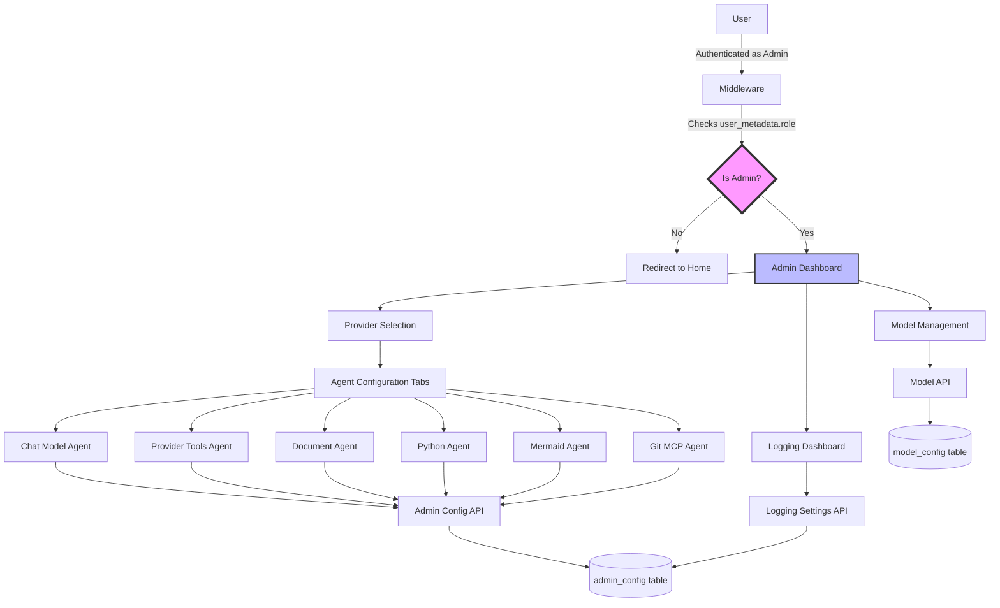
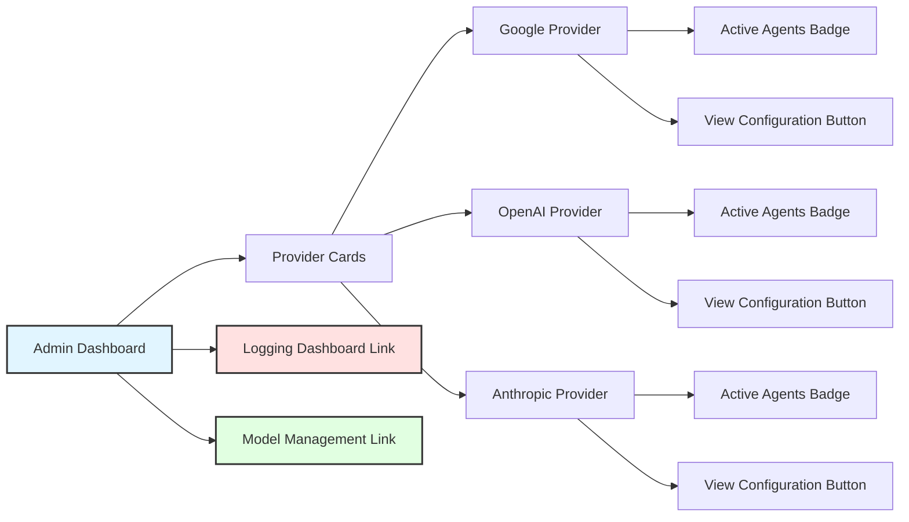
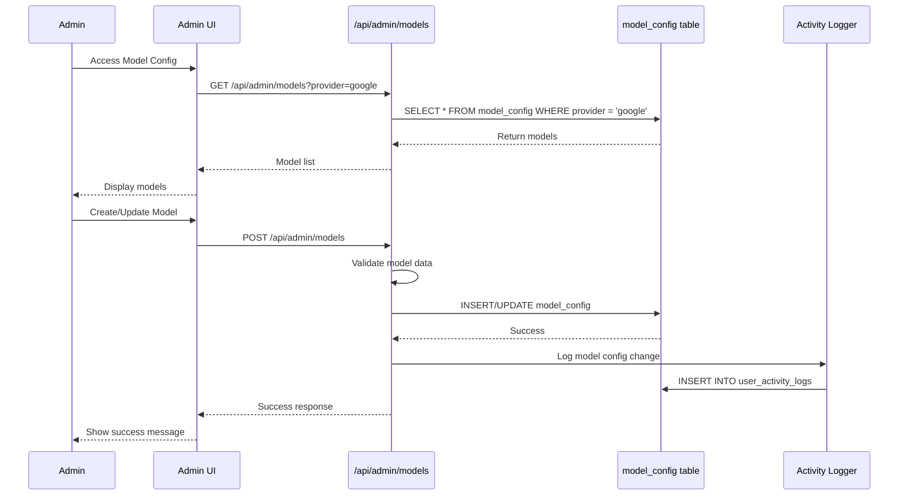
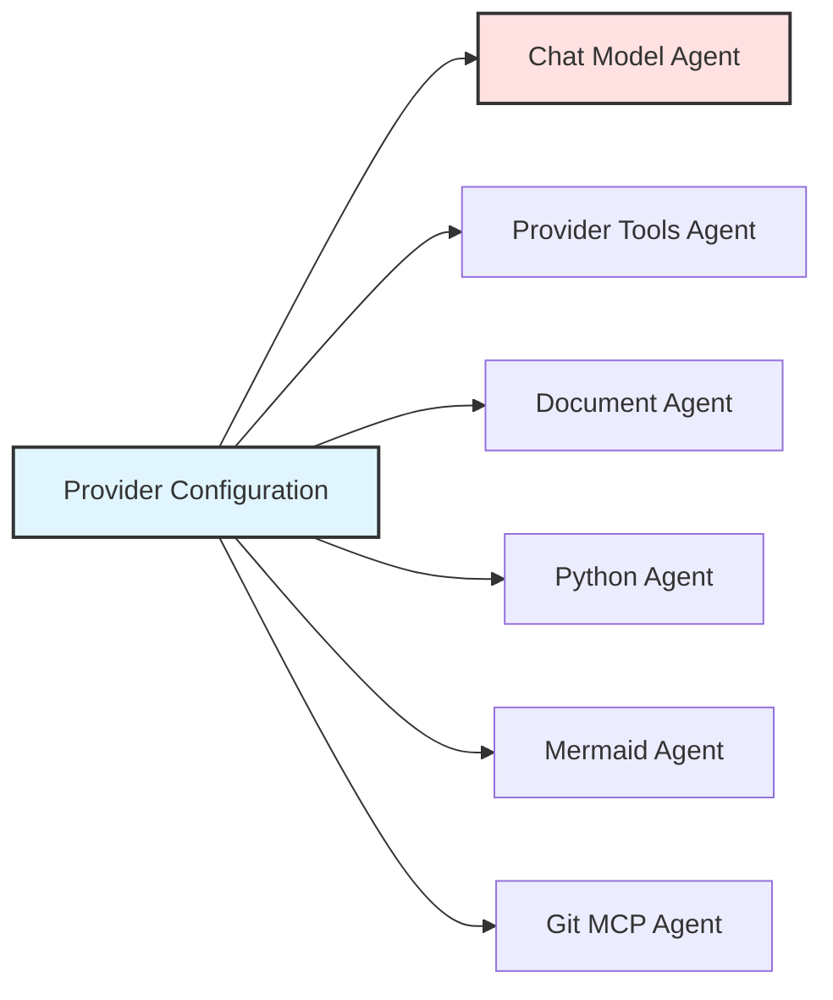
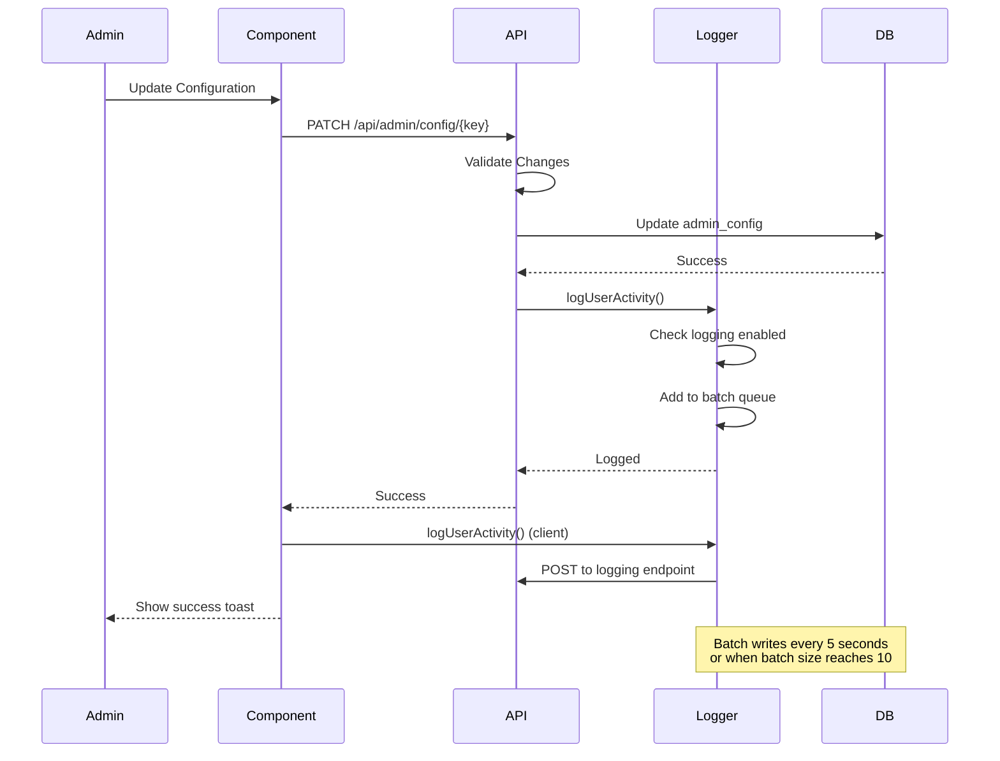

# Admin Panel Documentation

## Table of Contents

1. [Overview](#overview)
2. [Accessing the Admin Panel](#accessing-the-admin-panel)
3. [Making a User Admin](#making-a-user-admin)
4. [Admin Dashboard](#admin-dashboard)
5. [Model Configuration](#model-configuration)
6. [Logging Configuration](#logging-configuration)
7. [Agent Configuration Pages](#agent-configuration-pages)
8. [Logging & Error Handling Integration](#logging--error-handling-integration)
9. [API Endpoints](#api-endpoints)
10. [File References](#file-references)
11. [TODOs](#todos)

---

## Overview

The Admin Panel is a comprehensive management interface that allows administrators to:

- **Configure AI Models**: Manage model pricing, capabilities, and availability
- **Configure Agents**: Customize behavior of 6 specialized agents across multiple providers
- **Monitor Logging**: Control activity logging, error logging, and user activity tracking
- **Manage Providers**: Configure Google, OpenAI, and Anthropic agent settings
- **View Statistics**: Monitor active agents, configurations, and system health

The admin panel is built with Next.js 14, using Server Components for data fetching and Client Components for interactive forms. All configurations are stored in the `admin_config` table with versioning support.

### Admin Panel Architecture



---

## Accessing the Admin Panel

### Prerequisites

1. **User Account**: You must have a registered account in the system
2. **Admin Role**: Your user account must be assigned the `admin` role in Supabase
3. **Active Session**: You must be logged in to the application

### Access URL

Navigate to: **`/admin`**

### Route Protection

The admin panel is protected by middleware that:

1. **Verifies Authentication**: Checks if user is logged in via Supabase session
2. **Validates Admin Role**: Extracts `user_metadata.role` from user object
3. **Redirects Non-Admin Users**: Sends unauthorized users to home page
4. **Logs Access Attempts**: Records failed admin access attempts

**Middleware Implementation** (`middleware.ts:222-249`):

```typescript
// Check admin route access
if (isAdminRoute(pathname)) {
  if (userRole !== "admin") {
    // Log unauthorized admin access attempt
    await logPermissionError(
      ErrorCategory.PERMISSION_DENIED,
      `Non-admin user attempted to access admin route: ${pathname}`,
      {
        pathname,
        userRole,
        userId: user.id,
        userEmail: user.email,
        userAgent: request.headers.get("user-agent"),
        ip: request.headers.get("x-forwarded-for") ||
             request.headers.get("x-real-ip") || "unknown",
        timestamp: new Date().toISOString(),
      },
      user.id,
      ErrorSeverity.WARNING
    );

    // Non-admin users trying to access admin routes get redirected to home
    return NextResponse.redirect(new URL("/", request.url));
  }
}
```

---

## Making a User Admin

To grant admin access to a user, you need to update their role in Supabase directly.

### Step-by-Step Guide

#### 1. Access Supabase Dashboard

1. Go to [https://app.supabase.com](https://app.supabase.com)
2. Log in with your Supabase account
3. Select your project

#### 2. Navigate to Authentication

1. Click on **"Authentication"** in the left sidebar
2. Click on **"Users"** to view all registered users

#### 3. Find the User

1. Locate the user you want to make admin
2. You can search by email or user ID
3. Click on the user to open their details

#### 4. Update User Metadata

1. Scroll down to the **"User Metadata"** section
2. Click **"Edit"** or the edit icon
3. Add or modify the `role` field in the JSON:

```json
{
  "role": "admin"
}
```

4. Click **"Save"** to apply the changes

#### 5. Verify Admin Access

1. Have the user log out and log back in (to refresh their session)
2. The user should now see admin-related features
3. They can navigate to `/admin` to access the admin panel

### Alternative: SQL Command

You can also use SQL to update user metadata directly:

```sql
-- Update user metadata to add admin role
UPDATE auth.users
SET raw_user_meta_data = raw_user_meta_data || '{"role": "admin"}'::jsonb
WHERE email = 'user@example.com';
```

### Role Extraction Logic

The system extracts the role using this logic (`middleware.ts:88-90`):

```typescript
function getUserRole(user: any): "admin" | "user" {
  return user?.user_metadata?.role === "admin" ? "admin" : "user";
}
```

---

## Admin Dashboard

The admin dashboard provides an overview of all agent configurations across providers.

### Dashboard Layout



### Provider Cards

Each provider card displays:

- **Provider Name**: Google, OpenAI, or Anthropic
- **Active Agents**: Shows "X/6 active" where X is the number of enabled agents
- **Configuration Link**: Opens provider-specific agent configuration page

**Dashboard Component** (`components/admin/admin-dashboard.tsx:194`):

```tsx
<Card className="group cursor-pointer transition-all hover:shadow-lg">
  <CardHeader>
    <CardTitle>{provider.name}</CardTitle>
    <CardDescription>
      Configure {provider.name} agents and tools
    </CardDescription>
  </CardHeader>
  <CardContent>
    <div className="flex items-center justify-between">
      <Badge variant="outline">
        {providerStats[provider.id].activeAgents}/
        {providerStats[provider.id].totalAgents} active
      </Badge>
      <Button>Configure</Button>
    </div>
  </CardContent>
</Card>
```

### Navigation Links

- **Logging Configuration**: `/admin/logging` - Manage logging settings
- **Model Management**: `/admin/models` - Configure AI models (planned)

---

## Model Configuration

The model configuration interface allows admins to manage AI models across providers.

### Model Configuration Flow



### Model Fields

Each model configuration includes:

| Field | Type | Description | Required |
|-------|------|-------------|----------|
| `modelId` | String | Unique model identifier (e.g., `gemini-2.0-flash-exp`) | Yes |
| `name` | String | Display name for the model | Yes |
| `provider` | Enum | Provider: `google`, `openai`, or `anthropic` | Yes |
| `isActive` | Boolean | Whether model is available for use | Yes (default: true) |
| `isDefault` | Boolean | Whether this is the default model for provider | Yes (default: false) |
| `thinkingEnabled` | Boolean | Whether model supports thinking/reasoning mode | Yes (default: true) |
| `inputPricingPerMillionTokens` | Decimal | Cost per million input tokens | Yes |
| `outputPricingPerMillionTokens` | Decimal | Cost per million output tokens | Yes |
| `metadata` | JSON | Additional model-specific metadata | No |

### Model API Validation

**Create Model Schema** (`app/api/admin/models/route.ts:51-63`):

```typescript
const CreateModelSchema = z.object({
  modelId: z.string().min(1),
  name: z.string().min(1),
  provider: z.enum(["google", "openai", "anthropic"]),
  isActive: z.boolean().default(true),
  isDefault: z.boolean().default(false),
  thinkingEnabled: z.boolean().default(true),
  inputPricingPerMillionTokens: z.string().min(1),
  outputPricingPerMillionTokens: z.string().min(1),
  metadata: z.record(z.any()).optional(),
});
```

### Model Operations

All model CRUD operations are logged:

```typescript
// Log successful model creation
await logUserActivity({
  user_id: user.id,
  activity_type: UserActivityType.ADMIN_CONFIG_UPDATE,
  activity_category: ActivityCategory.ADMIN,
  activity_metadata: {
    action: "create_model",
    model_id: newModel.modelId,
    provider: newModel.provider,
  },
  resource_type: "model_config",
  resource_id: newModel.id,
  success: true,
});
```

---

## Logging Configuration

The logging configuration dashboard provides centralized control over all logging features.

### Logging Dashboard Layout

```mermaid
graph TB
    A[Logging Dashboard] --> B[Master Toggles]
    A --> C[Retention Policies]
    A --> D[Category Controls]
    A --> E[Performance Settings]
    A --> F[Privacy Settings]
    A --> G[Maintenance]

    B --> B1[Error Logging]
    B --> B2[User Activity Logging]
    B --> B3[Agent Activity Logging]

    C --> C1[Error Log Retention Days]
    C --> C2[User Activity Retention Days]
    C --> C3[Agent Activity Retention Days]

    D --> D1[Auth Events]
    D --> D2[Chat Events]
    D --> D3[Document Events]
    D --> D4[Admin Events]
    D --> D5[API Events]
    D --> D6[System Events]

    E --> E1[Batch Writes]
    E --> E2[Batch Size]
    E --> E3[Async Logging]

    F --> F1[Anonymize IP]
    F --> F2[Hash Email]
    F --> F3[Log User Agent]

    G --> G1[Purge Old Logs Button]

    style A fill:#fff4e6,stroke:#333,stroke-width:2px
    style B fill:#e1f5ff,stroke:#333,stroke-width:2px
    style D fill:#ffe1f5,stroke:#333,stroke-width:2px
    style F fill:#ffe1e1,stroke:#333,stroke-width:2px
```



### Logging Configuration Structure

The logging configuration is stored in `admin_config` with key `logging_settings`:

```typescript
type LoggingConfig = {
  errorLogging: {
    enabled: boolean;
    retentionDays: number;
  };
  userActivityLogging: {
    enabled: boolean;
    retentionDays: number;
    categories: {
      auth: boolean;
      chat: boolean;
      document: boolean;
      admin: boolean;
      api: boolean;
      system: boolean;
    };
  };
  agentActivityLogging: {
    enabled: boolean;
    retentionDays: number;
  };
  performance: {
    batchWrites: boolean;
    batchSize: number;
    asyncLogging: boolean;
  };
  privacy: {
    anonymizeIp: boolean;
    hashEmail: boolean;
    logUserAgent: boolean;
  };
};
```

### Master Toggles

- **Error Logging**: Enable/disable all error logging
- **User Activity Logging**: Enable/disable user activity tracking
- **Agent Activity Logging**: Enable/disable agent activity tracking

### Retention Policies

Set how long logs are kept before automatic deletion:

- **Error Logs**: Default 30 days
- **User Activity Logs**: Default 90 days
- **Agent Activity Logs**: Default 30 days

### Category Controls

Fine-grained control over user activity categories:

| Category | Description | Events Tracked |
|----------|-------------|----------------|
| **Auth** | Authentication events | Login, logout, registration, password reset |
| **Chat** | Chat interactions | Chat creation, message sending, voting |
| **Document** | Document operations | Create, update, revert documents |
| **Admin** | Admin actions | Config updates, model changes |
| **API** | API usage | API calls, rate limiting |
| **System** | System events | Errors, maintenance, health checks |

### Performance Settings

Optimize logging performance:

- **Batch Writes**: Group multiple log entries before writing to database
- **Batch Size**: Number of entries per batch (default: 10)
- **Async Logging**: Write logs asynchronously to avoid blocking main thread

### Privacy Settings

Control sensitive data handling:

- **Anonymize IP**: Hash IP addresses before storing
- **Hash Email**: Hash email addresses for privacy
- **Log User Agent**: Include browser/device information in logs

### Purge Old Logs

Manual maintenance button to immediately delete logs older than retention period:

```typescript
// Purge implementation
const purgeOldLogs = async () => {
  const config = await getLoggingConfig();

  await db.execute(sql`
    DELETE FROM error_logs
    WHERE created_at < NOW() - INTERVAL '${config.errorLogging.retentionDays} days'
  `);

  await db.execute(sql`
    DELETE FROM user_activity_logs
    WHERE created_at < NOW() - INTERVAL '${config.userActivityLogging.retentionDays} days'
  `);

  await db.execute(sql`
    DELETE FROM agent_activity_logs
    WHERE created_at < NOW() - INTERVAL '${config.agentActivityLogging.retentionDays} days'
  `);
};
```

---

## Agent Configuration Pages

Each provider has 6 agent configuration pages accessible via tabs.

### Agent Configuration Tabs



### 1. Chat Model Agent Configuration

The Chat Model Agent is the primary conversational agent that orchestrates all other agents.

**Configuration Path**: `/admin/{provider}/chat-model-agent`

**Configuration Structure**:

```typescript
type ChatModelAgentConfig = {
  enabled: boolean;
  systemPrompt: string;
  capabilities: {
    fileInput: boolean;
  };
  fileInputTypes: {
    codeFiles: Record<string, { enabled: boolean }>;
    textFiles: Record<string, { enabled: boolean }>;
    pdf: { enabled: boolean };
    ppt: { enabled: boolean };
    excel: { enabled: boolean };
    images: { enabled: boolean };
  };
  rateLimit: {
    perMinute: number;
    perHour: number;
    perDay: number;
  };
  tools: {
    providerToolsAgent?: ToolConfig;
    documentAgent?: ToolConfig;
    pythonAgent?: ToolConfig;
    mermaidAgent?: ToolConfig;
    gitMcpAgent?: ToolConfig;
  };
};
```

**Configurable Elements**:

1. **Enable/Disable Agent**: Master toggle for the entire agent
2. **System Prompt**: Define agent behavior, personality, and instructions (20 rows)
3. **Rate Limits**:
   - Per Minute: 1-1000 (default varies by provider)
   - Per Hour: 1-10,000
   - Per Day: 1-100,000
4. **File Input Capability**: Enable file uploads
5. **File Input Types**:
   - **Code Files**: py, ipynb, js, jsx, ts, tsx, html, css, json, xml, sql, sh, bat, ps1
   - **Text Files**: txt, md, yaml, yml, toml, ini, cfg, conf, log, csv
   - **Documents**: PDF, PowerPoint, Excel
   - **Media**: Images
6. **Delegated Tools**: Configure which specialized agents the chat agent can use
   - Each tool has: `description`, `enabled`, `tool_input` parameters

**Tool Delegation Example** (`components/admin/agents/chat-model/chat-model-agent-config.tsx:610-665`):

```tsx
{Object.entries(TOOL_INFO).map(([toolKey, toolInfo]) => {
  const toolName = toolKey as keyof typeof config.tools;
  const tool = config.tools[toolName];

  return (
    <div className="flex items-start justify-between gap-4 rounded-lg border p-4">
      <div className="flex-1 space-y-4">
        <div className="flex items-center justify-between">
          <h4 className="font-medium">{toolInfo.title}</h4>
          <Switch
            checked={tool.enabled}
            onCheckedChange={(enabled) => updateTool(toolName, { enabled })}
          />
        </div>
        <Textarea
          onChange={(e) => updateTool(toolName, { description: e.target.value })}
          value={tool.description}
        />
        {/* Tool Input Parameters */}
      </div>
    </div>
  );
})}
```

**Save with Logging** (`components/admin/agents/chat-model/chat-model-agent-config.tsx:141-207`):

```typescript
const handleSave = async () => {
  try {
    await onSave(config);
    toast.success("Chat model agent configuration saved successfully");

    // Log successful configuration update
    await logUserActivity({
      user_id: "", // Populated from session
      activity_type: UserActivityType.ADMIN_CONFIG_UPDATE,
      activity_category: ActivityCategory.ADMIN,
      activity_metadata: {
        config_type: "chat_model_agent",
        provider,
        agent_enabled: config.enabled,
        file_input_enabled: config.capabilities.fileInput,
        tools_count: Object.keys(config.tools).length,
        enabled_tools: Object.entries(config.tools)
          .filter(([_, toolConfig]) => toolConfig?.enabled)
          .map(([toolName]) => toolName),
      },
      resource_type: "agent_config",
      resource_id: `${provider}_chat_model`,
      success: true,
    });
  } catch (error) {
    // Log configuration save error
    await logAdminError(
      ErrorCategory.CONFIG_UPDATE_FAILED,
      `Failed to save chat model agent config: ${error.message}`,
      { config_type: "chat_model_agent", provider },
      undefined,
      ErrorSeverity.ERROR
    );
  }
};
```

---

### 2. Provider Tools Agent Configuration

The Provider Tools Agent handles external service integrations like web search and code execution.

**Configuration Path**: `/admin/{provider}/provider-tools-agent`

**Configuration Structure**:

```typescript
type ProviderToolsAgentConfig = {
  enabled: boolean;
  systemPrompt: string;
  rateLimit: {
    perMinute: number;
    perHour: number;
    perDay: number;
  };
  tools: {
    googleSearch?: { description: string; enabled: boolean };
    urlContext?: { description: string; enabled: boolean };
    codeExecution?: { description: string; enabled: boolean };
  };
};
```

**Available Tools**:

| Tool | Description | Capability |
|------|-------------|------------|
| **Google Search** | Web search integration | Search the web for current information and real-time data |
| **URL Context** | Web page fetching | Fetch and analyze content from web pages and documents |
| **Code Execution** | Python execution | Execute Python code and return results with output |

**Configurable Elements**:

1. **Enable/Disable Agent**: Master toggle
2. **System Prompt**: Define agent behavior (6 rows)
3. **Rate Limits**: Per minute/hour/day
4. **Tool Toggles**: Enable/disable individual tools
5. **Tool Descriptions**: Customize how each tool is described to the AI

---

### 3. Document Agent Configuration

The Document Agent manages text document creation, editing, and version control.

**Configuration Path**: `/admin/{provider}/document-agent`

**Configuration Structure**:

```typescript
type DocumentAgentConfig = {
  enabled: boolean;
  rateLimit: {
    perMinute: number;
    perHour: number;
    perDay: number;
  };
  tools: {
    create?: ToolConfig;
    update?: ToolConfig;
    suggestion?: ToolConfig;
    revert?: ToolConfig;
  };
};

type ToolConfig = {
  description: string;
  enabled: boolean;
  systemPrompt?: string;
  userPromptTemplate?: string;
};
```

**Available Tools**:

| Tool | Description | Has Prompts | Placeholders |
|------|-------------|-------------|--------------|
| **Create** | Creates new text documents with markdown formatting | Yes | `{instruction}` |
| **Update** | Updates existing text documents based on instructions | Yes | `{currentContent}`, `{updateInstruction}` |
| **Suggestion** | Generates improvement suggestions for existing documents | Yes | `{currentContent}` |
| **Revert** | Reverts documents to previous versions | No | N/A |

**Configurable Elements**:

1. **Enable/Disable Agent**: Master toggle
2. **Rate Limits**: Per minute/hour/day
3. **Per-Tool Configuration**:
   - Enable/disable individual tools
   - Tool description
   - System prompt (8 rows) - defines tool behavior
   - User prompt template (4 rows) - template with placeholders

**User Prompt Template Example**:

```
Current document content:
{currentContent}

User instruction:
{updateInstruction}

Please update the document according to the instruction while preserving the overall structure and formatting.
```

---

### 4. Python Agent Configuration

The Python Agent handles Python code creation, editing, execution, and debugging.

**Configuration Path**: `/admin/{provider}/python-agent`

**Configuration Structure**:

```typescript
type PythonAgentConfig = {
  enabled: boolean;
  rateLimit: {
    perMinute: number;
    perHour: number;
    perDay: number;
  };
  tools: {
    create?: ToolConfig;
    update?: ToolConfig;
    fix?: ToolConfig;
    explain?: ToolConfig;
    generate?: ToolConfig;
    revert?: ToolConfig;
  };
};
```

**Available Tools**:

| Tool | Description | Has Prompts | Placeholders |
|------|-------------|-------------|--------------|
| **Create** | Creates new Python code with proper structure and documentation | Yes | `{instruction}` |
| **Update** | Edits and updates existing Python code based on instructions | Yes | `{currentContent}`, `{updateInstruction}` |
| **Fix** | Debugs and fixes errors in Python code | Yes | `{currentContent}`, `{errorInfo}` |
| **Explain** | Adds comments and documentation to Python code | Yes | `{currentContent}` |
| **Generate** | Generates Python code without saving (for chat-only mode) | Yes | `{instruction}` |
| **Revert** | Reverts Python code to a previous version | No | N/A |

**Configurable Elements**:

1. **Enable/Disable Agent**: Master toggle
2. **Rate Limits**: Per minute/hour/day
3. **Per-Tool Configuration**:
   - Enable/disable individual tools
   - Tool description (2 rows)
   - System prompt (8 rows) - defines tool behavior
   - User prompt template (4 rows) - template with placeholders

---

### 5. Mermaid Agent Configuration

The Mermaid Agent creates and manages Mermaid diagram code.

**Configuration Path**: `/admin/{provider}/mermaid-agent`

**Configuration Structure**:

```typescript
type MermaidAgentConfig = {
  enabled: boolean;
  rateLimit: {
    perMinute: number;
    perHour: number;
    perDay: number;
  };
  tools: {
    create?: ToolConfig;
    update?: ToolConfig;
    fix?: ToolConfig;
    generate?: ToolConfig;
    revert?: ToolConfig;
  };
};
```

**Available Tools**:

| Tool | Description | Has Prompts | Placeholders |
|------|-------------|-------------|--------------|
| **Create** | Creates new Mermaid diagrams with valid syntax | Yes | `{instruction}` |
| **Update** | Updates existing Mermaid diagrams based on instructions | Yes | `{currentContent}`, `{updateInstruction}` |
| **Fix** | Fixes syntax errors in Mermaid diagrams | Yes | `{currentContent}`, `{errorInfo}` |
| **Generate** | Generates Mermaid diagrams without saving (for chat-only mode) | Yes | `{instruction}` |
| **Revert** | Reverts Mermaid diagrams to previous versions | No | N/A |

**Configurable Elements**:

1. **Enable/Disable Agent**: Master toggle
2. **Rate Limits**: Per minute/hour/day
3. **Per-Tool Configuration**:
   - Enable/disable individual tools
   - Tool description (2 rows)
   - System prompt (8 rows) - defines tool behavior
   - User prompt template (4 rows) - template with placeholders

---

### 6. Git MCP Agent Configuration

The Git MCP Agent integrates with GitHub using the Model Context Protocol (MCP).

**Configuration Path**: `/admin/{provider}/git-mcp-agent`

**Configuration Structure**:

```typescript
type GitMcpAgentConfig = {
  enabled: boolean;
  systemPrompt: string;
  rateLimit: {
    perMinute: number;
    perHour: number;
    perDay: number;
  };
  tools: {
    repos?: { description: string; enabled: boolean };
    issues?: { description: string; enabled: boolean };
    pull_requests?: { description: string; enabled: boolean };
    users?: { description: string; enabled: boolean };
    code_search?: { description: string; enabled: boolean };
    branches?: { description: string; enabled: boolean };
  };
};
```

**Available Tools**:

| Tool | Description | Capabilities |
|------|-------------|--------------|
| **Repository Operations** | Repository management | Browse code, get repo info, list contents, search files |
| **Issue Management** | Issue tracking | List issues, search issues, get issue details |
| **Pull Request Operations** | PR management | List pull requests, get PR details, review changes |
| **User Operations** | User information | Get user info, list repos, analyze contributions |
| **Code Search** | Code search | Find patterns, functions, and references across codebase |
| **Branch Operations** | Branch management | List branches, get commits, compare branches |

**Configurable Elements**:

1. **Enable/Disable Agent**: Master toggle
2. **System Prompt**: Define agent behavior (12 rows)
3. **Rate Limits**: Per minute/hour/day
4. **Tool Toggles**: Enable/disable individual GitHub operations
5. **Tool Descriptions**: Customize how each operation is described to the AI

---

## Logging & Error Handling Integration

The admin panel is deeply integrated with the application's logging and error handling systems.

### Activity Logging Integration

Every admin action is logged to track configuration changes and system usage.



### User Activity Logging

All admin panel interactions are tracked:

**Activity Types** (`lib/logging/activity-logger.ts:8-28`):

```typescript
export enum UserActivityType {
  // Admin activities
  ADMIN_CONFIG_UPDATE = 'admin_config_update',
  ADMIN_DASHBOARD_VIEW = 'admin_dashboard_view',
  ADMIN_MODEL_UPDATE = 'admin_model_update',
  ADMIN_USER_UPDATE = 'admin_user_update',

  // Auth activities
  AUTH_LOGIN = 'auth_login',
  AUTH_LOGOUT = 'auth_logout',
  AUTH_REGISTER = 'auth_register',

  // Chat activities
  CHAT_CREATE = 'chat_create',
  CHAT_DELETE = 'chat_delete',
  MESSAGE_SEND = 'message_send',

  // Document activities
  DOCUMENT_CREATE = 'document_create',
  DOCUMENT_UPDATE = 'document_update',
  DOCUMENT_REVERT = 'document_revert',
}
```

**Activity Categories** (`lib/logging/activity-logger.ts:30-38`):

```typescript
export enum ActivityCategory {
  AUTH = 'auth',
  CHAT = 'chat',
  DOCUMENT = 'document',
  ADMIN = 'admin',
  API = 'api',
  SYSTEM = 'system',
}
```

**Logging Function** (`lib/logging/activity-logger.ts:120-180`):

```typescript
export async function logUserActivity(params: {
  user_id: string;
  activity_type: UserActivityType;
  activity_category: ActivityCategory;
  activity_metadata?: Record<string, any>;
  resource_type?: string;
  resource_id?: string;
  request_path?: string;
  request_method?: string;
  success: boolean;
  error_message?: string;
  correlation_id?: string;
}): Promise<void> {
  // Check if logging is enabled
  const config = await getLoggingConfig();
  if (!config.userActivityLogging.enabled) {
    return;
  }

  // Check if category is enabled
  const categoryKey = params.activity_category as keyof typeof config.userActivityLogging.categories;
  if (!config.userActivityLogging.categories[categoryKey]) {
    return;
  }

  // Apply privacy settings
  const metadata = { ...params.activity_metadata };
  if (config.privacy.anonymizeIp && metadata.ip) {
    metadata.ip = hashValue(metadata.ip);
  }

  // Add to batch queue
  if (config.performance.batchWrites) {
    activityBatch.push({
      user_id: params.user_id,
      activity_type: params.activity_type,
      // ... other fields
    });

    if (activityBatch.length >= config.performance.batchSize) {
      await flushActivityBatch();
    }
  } else {
    // Write immediately
    await db.insert(userActivityLogs).values({
      userId: params.user_id,
      activityType: params.activity_type,
      // ... other fields
    });
  }
}
```

### Agent Activity Logging

Agent executions are tracked separately:

**Agent Types** (`lib/logging/activity-logger.ts:40-48`):

```typescript
export enum AgentType {
  CHAT_MODEL_AGENT = 'chat_model_agent',
  PROVIDER_TOOLS_AGENT = 'provider_tools_agent',
  DOCUMENT_AGENT = 'document_agent',
  PYTHON_AGENT = 'python_agent',
  MERMAID_AGENT = 'mermaid_agent',
  GIT_MCP_AGENT = 'git_mcp_agent',
}
```

**Logging Function** (`lib/logging/activity-logger.ts:220-270`):

```typescript
export async function logAgentActivity(params: {
  user_id?: string;
  agent_type: AgentType;
  agent_operation: string;
  input_data?: Record<string, any>;
  output_data?: Record<string, any>;
  execution_time_ms?: number;
  token_usage?: {
    input_tokens: number;
    output_tokens: number;
  };
  success: boolean;
  error_message?: string;
  correlation_id?: string;
}): Promise<void> {
  // Check if agent activity logging is enabled
  const config = await getLoggingConfig();
  if (!config.agentActivityLogging.enabled) {
    return;
  }

  // Add to batch queue or write immediately
  // Similar to user activity logging
}
```

### Error Logging

All errors in the admin panel are categorized and logged:

**Error Categories** (`lib/errors/logger.ts:10-29`):

```typescript
export enum ErrorCategory {
  // Authentication & Authorization
  LOGIN_FAILED = "login_failed",
  PERMISSION_DENIED = "permission_denied",
  SESSION_EXPIRED = "session_expired",
  UNAUTHORIZED_ACCESS = "unauthorized_access",

  // Admin & Configuration
  CONFIG_UPDATE_FAILED = "config_update_failed",
  VALIDATION_ERROR = "validation_error",

  // Database
  DATABASE_ERROR = "database_error",

  // API
  API_REQUEST_FAILED = "api_request_failed",
  INVALID_REQUEST = "invalid_request",
  RATE_LIMIT_EXCEEDED = "rate_limit_exceeded",

  // System
  SYSTEM_ERROR = "system_error",
}
```

**Error Severities** (`lib/errors/logger.ts:31-37`):

```typescript
export enum ErrorSeverity {
  INFO = "info",
  WARNING = "warning",
  ERROR = "error",
  CRITICAL = "critical",
}
```

**Specialized Error Loggers**:

```typescript
// Admin-specific error logging
export async function logAdminError(
  category: ErrorCategory,
  message: string,
  metadata: Record<string, any> = {},
  userId?: string,
  severity: ErrorSeverity = ErrorSeverity.ERROR
): Promise<void> {
  return logError({
    category,
    message,
    severity,
    metadata: {
      ...metadata,
      context: "admin",
    },
    userId,
  });
}

// API error logging
export async function logApiError(
  category: ErrorCategory,
  message: string,
  metadata: Record<string, any> = {},
  severity: ErrorSeverity = ErrorSeverity.ERROR
): Promise<void> {
  return logError({
    category,
    message,
    severity,
    metadata: {
      ...metadata,
      context: "api",
    },
  });
}
```

### Configuration Change Tracking

Every configuration save includes before/after comparison:

**Config Update with Tracking** (`app/api/admin/config/[configKey]/route.ts:391-446`):

```typescript
export async function PUT(request: Request, { params }) {
  const { configKey } = await params;

  // ... authentication and validation

  try {
    const existingConfig = await getAdminConfig({ configKey });

    let updatedConfig;
    if (existingConfig) {
      updatedConfig = await updateAdminConfig({
        configKey,
        configData,
        updatedBy: user.id,
      });
    } else {
      updatedConfig = await createAdminConfig({
        configKey,
        configData,
        updatedBy: user.id,
      });
    }

    // Log successful admin action with before/after data
    await logAdminError(
      ErrorCategory.CONFIG_UPDATE_FAILED, // Will be success category
      `Admin config ${existingConfig ? "updated" : "created"} successfully: ${configKey}`,
      {
        action: existingConfig ? "update" : "create",
        previousData: existingConfig?.configData,  // Before
        newData: configData,                        // After
      },
      user.id,
      ErrorSeverity.INFO
    );

    return Response.json({
      configKey: updatedConfig.configKey,
      configData: updatedConfig.configData,
      updatedAt: updatedConfig.updatedAt,
      updatedBy: updatedConfig.updatedBy,
    });
  } catch (error) {
    await logAdminError(
      ErrorCategory.CONFIG_UPDATE_FAILED,
      `Failed to update admin config ${configKey}: ${error.message}`,
      { configData },
      user.id,
      ErrorSeverity.ERROR
    );

    return new ChatSDKError("bad_request:database").toResponse();
  }
}
```

### Batch Processing

Logging uses batch processing for performance:

**Batch Configuration** (`lib/logging/activity-logger.ts:60-75`):

```typescript
// Batch processing configuration
const BATCH_SIZE = 10;
const BATCH_INTERVAL_MS = 5000; // 5 seconds

// Batch queues
const activityBatch: any[] = [];
const agentBatch: any[] = [];

// Batch interval timers
let activityBatchTimer: NodeJS.Timeout | null = null;
let agentBatchTimer: NodeJS.Timeout | null = null;

// Flush batches
async function flushActivityBatch() {
  if (activityBatch.length === 0) return;

  const batch = [...activityBatch];
  activityBatch.length = 0;

  await db.insert(userActivityLogs).values(batch);
}
```

---

## API Endpoints

### Admin Configuration Endpoints

#### GET /api/admin/config/{configKey}

Retrieve a specific agent configuration.

**Authentication**: Requires admin role

**Parameters**:
- `configKey` (path): Configuration key in format `{agent_type}_{provider}` or special keys like `logging_settings`

**Valid Config Keys**:
- Agent configs: `chat_model_agent_google`, `document_agent_openai`, etc.
- Special configs: `logging_settings`, `model_config`, `app_settings`

**Response**:
```json
{
  "configKey": "chat_model_agent_google",
  "configData": {
    "enabled": true,
    "systemPrompt": "You are a helpful assistant...",
    "capabilities": { "fileInput": true },
    "rateLimit": { "perMinute": 60, "perHour": 1000, "perDay": 10000 },
    "tools": { /* tool configurations */ }
  },
  "updatedAt": "2025-01-15T10:30:00Z",
  "updatedBy": "user-uuid"
}
```

**Error Responses**:
- `401 Unauthorized`: Not logged in or not admin
- `400 Bad Request`: Invalid config key format
- `404 Not Found`: Configuration doesn't exist

---

#### PUT /api/admin/config/{configKey}

Create or update an agent configuration (full replacement).

**Authentication**: Requires admin role

**Request Body**:
```json
{
  "enabled": true,
  "systemPrompt": "Updated system prompt",
  "rateLimit": {
    "perMinute": 100,
    "perHour": 2000,
    "perDay": 20000
  },
  "tools": {
    "documentAgent": {
      "description": "Manages documents",
      "enabled": true
    }
  }
}
```

**Validation**: Validates against agent-specific schema

**Response**: Same as GET

**Logging**: Logs configuration change with before/after data

---

#### PATCH /api/admin/config/{configKey}

Partially update an agent configuration (merge with existing).

**Authentication**: Requires admin role

**Request Body** (partial):
```json
{
  "enabled": false,
  "rateLimit": {
    "perMinute": 50
  }
}
```

**Validation**: Validates partial data against schema

**Response**: Same as GET

**Behavior**: Merges provided fields with existing configuration

---

#### DELETE /api/admin/config/{configKey}

Delete an agent configuration.

**Authentication**: Requires admin role

**Response**:
```json
{
  "success": true,
  "message": "Configuration for chat_model_agent_google deleted successfully",
  "deletedConfig": {
    "configKey": "chat_model_agent_google",
    "updatedAt": "2025-01-15T10:30:00Z",
    "updatedBy": "user-uuid"
  }
}
```

---

#### GET /api/admin/config/summary

Get overview of all configurations with statistics.

**Authentication**: Requires admin role

**Response**:
```json
{
  "agentTypes": [
    {
      "agentType": "chat_model_agent",
      "totalConfigs": 3,
      "enabledConfigs": 2,
      "providers": [
        {
          "provider": "google",
          "configured": true,
          "enabled": true,
          "lastUpdated": "2025-01-15T10:30:00Z",
          "updatedBy": "user-uuid"
        },
        // ... other providers
      ]
    },
    // ... other agent types
  ],
  "providers": [
    {
      "provider": "google",
      "totalConfigs": 6,
      "enabledConfigs": 5,
      "agentTypes": [
        {
          "agentType": "chat_model_agent",
          "configured": true,
          "enabled": true,
          "lastUpdated": "2025-01-15T10:30:00Z"
        },
        // ... other agents
      ]
    },
    // ... other providers
  ],
  "overall": {
    "totalConfigurations": 18,
    "enabledConfigurations": 12,
    "supportedAgentTypes": 6,
    "supportedProviders": 3,
    "lastUpdated": 1705318200000
  },
  "stats": {
    "google": { "activeAgents": 5, "totalAgents": 6 },
    "openai": { "activeAgents": 4, "totalAgents": 6 },
    "anthropic": { "activeAgents": 3, "totalAgents": 6 }
  },
  "capabilities": {
    // Model capability information
  }
}
```

---

### Model Configuration Endpoints

#### GET /api/admin/models

List all models, optionally filtered by provider.

**Authentication**: Requires admin role

**Query Parameters**:
- `provider` (optional): Filter by provider (`google`, `openai`, `anthropic`)

**Response**:
```json
{
  "models": [
    {
      "id": "uuid",
      "modelId": "gemini-2.0-flash-exp",
      "name": "Gemini 2.0 Flash",
      "provider": "google",
      "isActive": true,
      "isDefault": true,
      "thinkingEnabled": true,
      "inputPricingPerMillionTokens": "0.075",
      "outputPricingPerMillionTokens": "0.30",
      "metadata": { "maxTokens": 1048576 },
      "createdAt": "2025-01-15T10:30:00Z",
      "updatedAt": "2025-01-15T10:30:00Z"
    }
  ]
}
```

---

#### POST /api/admin/models

Create a new model configuration.

**Authentication**: Requires admin role

**Request Body**:
```json
{
  "modelId": "gpt-4-turbo",
  "name": "GPT-4 Turbo",
  "provider": "openai",
  "isActive": true,
  "isDefault": false,
  "thinkingEnabled": true,
  "inputPricingPerMillionTokens": "10.00",
  "outputPricingPerMillionTokens": "30.00",
  "metadata": { "maxTokens": 128000 }
}
```

**Validation**: Uses Zod schema for strict validation

**Response**: Same as model object in GET response

**Logging**: Logs model creation to user activity logs

---

#### PATCH /api/admin/models/{modelId}

Update an existing model configuration.

**Authentication**: Requires admin role

**Request Body** (partial):
```json
{
  "isActive": false,
  "inputPricingPerMillionTokens": "9.50"
}
```

**Response**: Updated model object

**Logging**: Logs model update to user activity logs

---

#### DELETE /api/admin/models/{modelId}

Delete a model configuration.

**Authentication**: Requires admin role

**Response**:
```json
{
  "success": true,
  "message": "Model deleted successfully"
}
```

**Logging**: Logs model deletion to user activity logs

---

## File References

### Admin Components

#### Dashboard & Layout
- `components/admin/admin-dashboard.tsx` - Main admin dashboard with provider cards
- `components/admin/admin-layout.tsx` - Provider-specific layout with 6 agent tabs
- `components/admin/logging-dashboard.tsx` - Logging configuration interface

#### Agent Configuration Components
- `components/admin/agents/chat-model/chat-model-agent-config.tsx` - Chat model configuration
- `components/admin/agents/provider-tools/provider-tools-agent-config.tsx` - Provider tools configuration
- `components/admin/agents/document/document-agent-config.tsx` - Document agent configuration
- `components/admin/agents/python/python-agent-config.tsx` - Python agent configuration
- `components/admin/agents/mermaid/mermaid-agent-config.tsx` - Mermaid agent configuration
- `components/admin/agents/git-mcp/git-mcp-agent-config.tsx` - Git MCP agent configuration

### Admin API Routes

#### Configuration APIs
- `app/api/admin/config/[configKey]/route.ts` - CRUD operations for agent configurations
- `app/api/admin/config/summary/route.ts` - Configuration summary and statistics
- `app/api/admin/models/route.ts` - Model CRUD operations

### Authentication & Middleware

- `middleware.ts` - Route protection and admin role validation
- `lib/auth/server.ts` - Server-side authentication helpers (`requireAdmin()`)

### Database Queries

- `lib/db/queries/admin.ts` - Admin configuration queries
- `lib/db/queries/model-config.ts` - Model configuration queries

### Logging & Error Handling

#### Activity Logging
- `lib/logging/activity-logger.ts` - User and agent activity logging
- `lib/logging/index.ts` - Logging exports and utilities

#### Error Logging
- `lib/errors/logger.ts` - Error categorization and logging
- `lib/errors/index.ts` - Error utilities and ChatSDKError

### Database Schema

- `lib/db/migrations/0001_tables.sql` - admin_config, model_config, user_activity_logs, agent_activity_logs, error_logs tables
- `lib/db/migrations/0005_rls.sql` - Row-level security for admin tables
- `lib/db/schema.ts` - TypeScript schema definitions

---

## TODOs

### 1. Log Analytics Section

**Priority**: High
**Complexity**: Medium
**Estimated Effort**: 2-3 days

#### Description
Build a comprehensive log analytics dashboard to visualize and analyze logged data.

#### Requirements

**User Activity Analytics**:
- [ ] Create `/admin/analytics/user-activity` page
- [ ] Time-series charts for activity by type (auth, chat, document, admin, api)
- [ ] User activity heatmap by hour/day
- [ ] Top users by activity count
- [ ] Activity breakdown by category pie charts
- [ ] Filter by date range, user, activity type
- [ ] Export analytics data to CSV

**Agent Activity Analytics**:
- [ ] Create `/admin/analytics/agent-activity` page
- [ ] Agent usage statistics (calls per agent type)
- [ ] Average execution time by agent and operation
- [ ] Token usage charts (input/output tokens by agent)
- [ ] Success rate by agent type
- [ ] Cost analysis based on token usage and pricing
- [ ] Agent performance trends over time

**Error Analytics**:
- [ ] Create `/admin/analytics/errors` page
- [ ] Error frequency by category chart
- [ ] Error severity distribution
- [ ] Most common error messages list
- [ ] Error trends over time
- [ ] Affected users count
- [ ] Error resolution tracking (acknowledged/resolved status)

**System Health Dashboard**:
- [ ] Real-time metrics (active users, requests per minute)
- [ ] Database query performance
- [ ] Cache hit rates
- [ ] API response times
- [ ] Rate limit hit count

#### Technical Approach

**Data Aggregation**:
```typescript
// Example aggregation query
const getActivityStats = async (startDate: Date, endDate: Date) => {
  const stats = await db
    .select({
      activityType: userActivityLogs.activityType,
      count: sql<number>`count(*)`,
      avgDuration: sql<number>`avg(duration_ms)`,
    })
    .from(userActivityLogs)
    .where(
      and(
        gte(userActivityLogs.createdAt, startDate),
        lte(userActivityLogs.createdAt, endDate)
      )
    )
    .groupBy(userActivityLogs.activityType);

  return stats;
};
```

**Visualization Libraries**:
- Use **Recharts** for charts (already in use in the project)
- Use **date-fns** for date formatting
- Use **Tanstack Table** for data tables

**Caching Strategy**:
- Cache aggregated analytics data for 5 minutes
- Use Redis or in-memory cache for frequently accessed metrics
- Regenerate on-demand for real-time data

---

### 2. Rate Limiting Enforcement & Admin Integration

**Priority**: High
**Complexity**: Medium-High
**Estimated Effort**: 3-4 days

#### Description
Implement rate limiting based on admin-configured limits and integrate enforcement throughout the application.

#### Requirements

**Rate Limit Enforcement**:
- [ ] Implement rate limiting middleware for API routes
- [ ] Track requests per user per agent
- [ ] Honor rate limits from agent configurations (perMinute, perHour, perDay)
- [ ] Return 429 Too Many Requests when limit exceeded
- [ ] Include retry-after header in rate limit responses

**Rate Limit Storage**:
- [ ] Use Redis for rate limit counters (fast in-memory storage)
- [ ] Implement sliding window algorithm
- [ ] Track per-user, per-agent, per-operation counters
- [ ] Automatic expiry of old counters

**Rate Limit Tracking**:
- [ ] Update `rate_limit_tracking` table on each request
- [ ] Log rate limit violations to error logs
- [ ] Send notifications when users approach limits (90% threshold)

**Admin Panel Integration**:
- [ ] Add rate limit monitoring dashboard at `/admin/rate-limits`
- [ ] Show current usage vs limits per user
- [ ] List of users hitting rate limits
- [ ] Ability to temporarily increase limits for specific users
- [ ] Rate limit override functionality
- [ ] Rate limit analytics (most limited endpoints, peak usage times)

#### Technical Approach

**Rate Limit Middleware**:
```typescript
// lib/middleware/rate-limiter.ts
export async function rateLimitMiddleware(
  req: Request,
  agentType: AgentType
): Promise<{ allowed: boolean; retryAfter?: number }> {
  const user = await getUser(req);

  // Get rate limit config for this agent
  const config = await getAgentConfig(`${agentType}_${user.provider}`);
  const limits = config.rateLimit;

  // Check all time windows
  const checks = await Promise.all([
    checkRateLimit(user.id, agentType, 'minute', limits.perMinute, 60),
    checkRateLimit(user.id, agentType, 'hour', limits.perHour, 3600),
    checkRateLimit(user.id, agentType, 'day', limits.perDay, 86400),
  ]);

  const violated = checks.find(c => !c.allowed);
  if (violated) {
    await logRateLimitViolation(user.id, agentType, violated.window);
    return { allowed: false, retryAfter: violated.retryAfter };
  }

  // Increment counters
  await incrementRateLimitCounters(user.id, agentType);

  return { allowed: true };
}

async function checkRateLimit(
  userId: string,
  agentType: AgentType,
  window: 'minute' | 'hour' | 'day',
  limit: number,
  windowSeconds: number
): Promise<{ allowed: boolean; retryAfter?: number; window: string }> {
  const key = `ratelimit:${userId}:${agentType}:${window}`;
  const count = await redis.get(key);

  if (count && parseInt(count) >= limit) {
    const ttl = await redis.ttl(key);
    return { allowed: false, retryAfter: ttl, window };
  }

  return { allowed: true, window };
}
```

**Redis Schema**:
```
Key: ratelimit:{userId}:{agentType}:{window}
Value: counter (integer)
TTL: windowSeconds
```

**Rate Limit Dashboard Component**:
```typescript
// components/admin/rate-limit-dashboard.tsx
export function RateLimitDashboard() {
  const [violations, setViolations] = useState([]);
  const [topUsers, setTopUsers] = useState([]);

  // Fetch users hitting rate limits
  // Show usage charts
  // Allow admins to adjust limits temporarily

  return (
    <div>
      <Card>
        <CardHeader>
          <CardTitle>Rate Limit Violations (Last 24h)</CardTitle>
        </CardHeader>
        <CardContent>
          {/* Chart showing violations over time */}
          {/* Table of users and their violation counts */}
        </CardContent>
      </Card>

      <Card>
        <CardHeader>
          <CardTitle>Top Users by Request Volume</CardTitle>
        </CardHeader>
        <CardContent>
          {/* List top users with usage percentage */}
          {/* Option to temporarily increase limits */}
        </CardContent>
      </Card>
    </div>
  );
}
```

**Database Updates**:
```sql
-- Add rate limit override table
CREATE TABLE rate_limit_overrides (
  id UUID PRIMARY KEY DEFAULT gen_random_uuid(),
  user_id UUID NOT NULL REFERENCES auth.users(id),
  agent_type TEXT NOT NULL,
  override_limits JSONB NOT NULL,
  expires_at TIMESTAMPTZ NOT NULL,
  created_by UUID NOT NULL REFERENCES auth.users(id),
  created_at TIMESTAMPTZ NOT NULL DEFAULT NOW(),
  reason TEXT
);
```

---

### 3. Multi-Provider Model Management UI

**Priority**: Medium
**Complexity**: Medium
**Estimated Effort**: 2 days

#### Description
Create a full-featured UI for managing AI models across all providers.

#### Requirements
- [ ] Create `/admin/models` page
- [ ] List all models with provider filter
- [ ] Add new model form with validation
- [ ] Edit model pricing and capabilities
- [ ] Toggle model active/inactive status
- [ ] Set default model per provider
- [ ] Bulk operations (activate/deactivate multiple models)
- [ ] Model capability badges (thinking mode, vision, etc.)

---

### 4. Agent Configuration Templates

**Priority**: Low
**Complexity**: Low
**Estimated Effort**: 1 day

#### Description
Provide pre-configured templates for common agent setups.

#### Requirements
- [ ] Create configuration template library
- [ ] Templates for: "Development", "Production", "Testing", "Cost-Optimized"
- [ ] One-click apply template to provider
- [ ] Save current config as custom template
- [ ] Import/export configurations as JSON

---

### 5. Audit Log Viewer

**Priority**: Medium
**Complexity**: Low-Medium
**Estimated Effort**: 1-2 days

#### Description
Detailed viewer for all admin actions and configuration changes.

#### Requirements
- [ ] Create `/admin/audit-log` page
- [ ] Timeline view of all admin actions
- [ ] Filter by admin user, action type, date range
- [ ] Show before/after diffs for configuration changes
- [ ] Export audit log to CSV
- [ ] Search functionality

---

### 6. Real-Time Notifications

**Priority**: Low
**Complexity**: Medium
**Estimated Effort**: 2 days

#### Description
Real-time notifications for admin events.

#### Requirements
- [ ] WebSocket connection for real-time updates
- [ ] Notify when: rate limit violations, system errors, config changes by other admins
- [ ] Toast notifications in admin panel
- [ ] Notification center with history
- [ ] Email notifications for critical events

---

### 7. Configuration Versioning & Rollback

**Priority**: Medium
**Complexity**: Medium
**Estimated Effort**: 2 days

#### Description
Track configuration history and allow rollback to previous versions.

#### Requirements
- [ ] Store configuration history in separate table
- [ ] Show version history for each agent config
- [ ] Compare versions (diff view)
- [ ] Rollback to previous version
- [ ] Tag versions with labels (e.g., "Pre-launch", "Production")

---

### 8. Performance Monitoring

**Priority**: Medium
**Complexity**: High
**Estimated Effort**: 3-4 days

#### Description
Monitor system performance and identify bottlenecks.

#### Requirements
- [ ] Track API response times
- [ ] Database query performance monitoring
- [ ] Slow query log viewer
- [ ] Agent execution time tracking
- [ ] Memory and CPU usage charts
- [ ] Bottleneck identification and recommendations

---

### 9. Cost Management Dashboard

**Priority**: Medium
**Complexity**: Medium
**Estimated Effort**: 2 days

#### Description
Track AI API costs and provide budget management.

#### Requirements
- [ ] Calculate costs based on token usage and model pricing
- [ ] Daily/weekly/monthly cost reports
- [ ] Cost breakdown by user, agent, model
- [ ] Budget alerts (notify when approaching budget limit)
- [ ] Cost projection based on usage trends
- [ ] Cost optimization recommendations

---

### 10. Advanced Logging Filters

**Priority**: Low
**Complexity**: Low
**Estimated Effort**: 1 day

#### Description
Enhanced filtering and search for logs.

#### Requirements
- [ ] Full-text search across all log types
- [ ] Advanced filters: user ID, correlation ID, date range, severity
- [ ] Saved filter presets
- [ ] Log streaming view (real-time updates)
- [ ] Download filtered logs

---

## Summary

The Admin Panel provides comprehensive control over the code-chatbot system, allowing administrators to:

1. **Configure AI Models** across Google, OpenAI, and Anthropic providers
2. **Customize Agent Behavior** with system prompts, tool selection, and rate limits
3. **Monitor Logging** with granular control over activity, error, and agent logs
4. **Track Changes** through integrated activity and error logging
5. **Manage Access** via Supabase role-based authentication

All configurations are stored in the database with versioning support, and every admin action is logged for audit purposes. The system is designed to scale across multiple providers while maintaining consistent configuration patterns.

**Key Integration Points**:
- Middleware enforces admin-only access based on `user_metadata.role`
- All agent configurations follow the `{agent_type}_{provider}` naming convention
- Logging is batched for performance and can be configured per category
- Rate limits are configurable per agent but not yet enforced (TODO)
- Error handling integrates with the centralized logging system

For questions or issues, refer to the [Database Design Documentation](./database-design.md) and [Agent Architecture Documentation](./agent-architecture.md).
