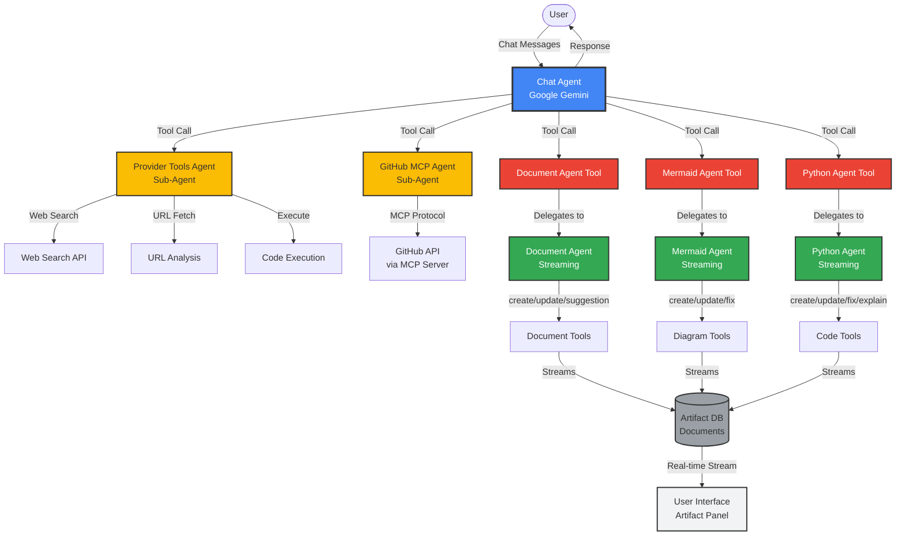
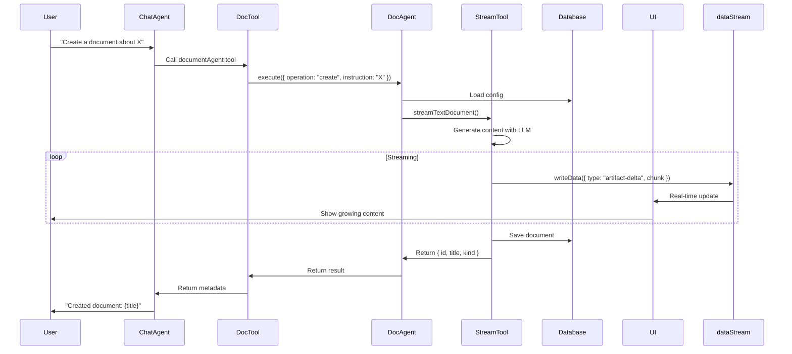
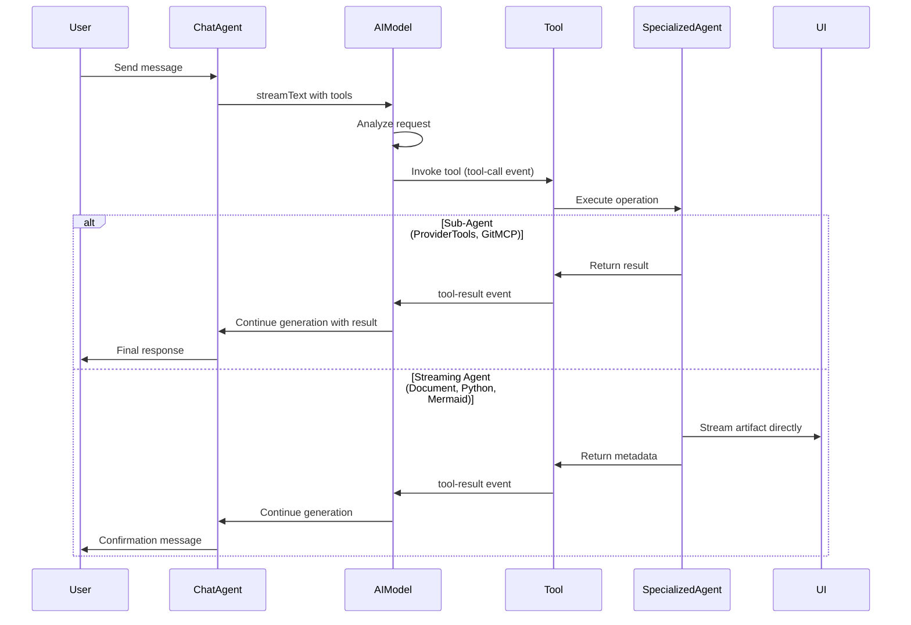
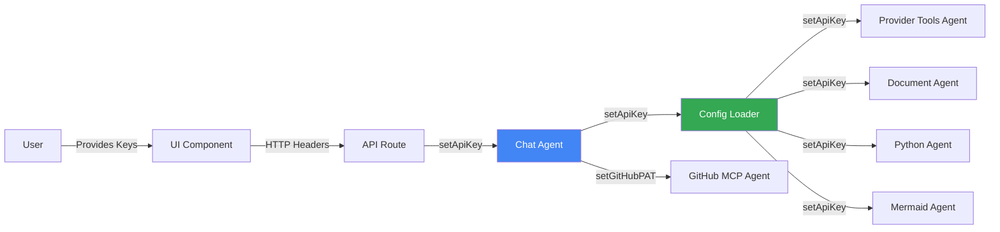
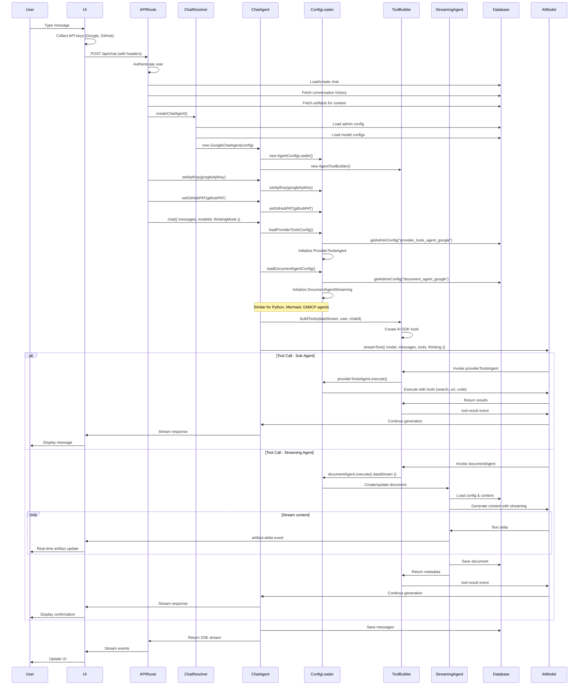
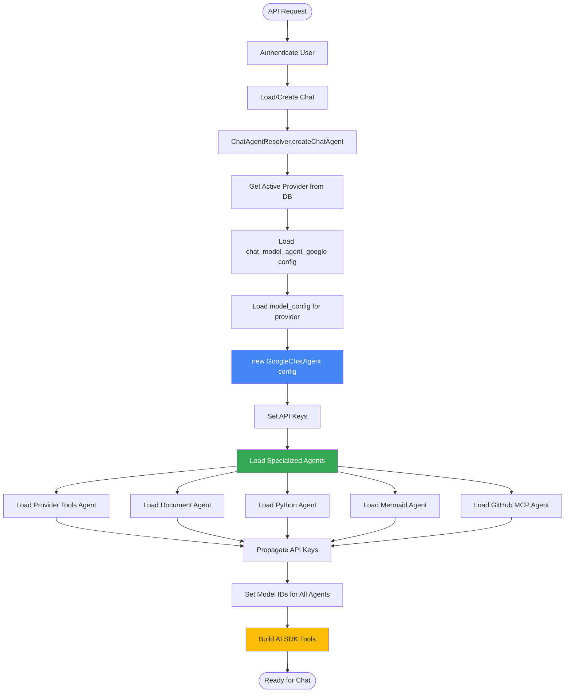

# Agent Architecture Documentation

## Table of Contents
- [Overview](#overview)
- [Architecture Diagram](#architecture-diagram)
- [Provider System](#provider-system)
- [Agent Types](#agent-types)
  - [Chat Model Agent](#chat-model-agent)
  - [Sub-Agents](#sub-agents)
  - [Streaming Agents](#streaming-agents)
- [Streaming Architecture](#streaming-architecture)
- [Tool System](#tool-system)
- [Artifacts](#artifacts)
- [API Key Management](#api-key-management)
- [Request Flow](#request-flow)
- [Agent Initialization](#agent-initialization)
- [File References](#file-references)
- [TODOs](#todos)

---

## Overview

The application uses a **hierarchical agent architecture** where a **Chat Agent** orchestrates multiple specialized agents. There are two distinct types of specialized agents:

1. **Sub-Agents**: Execute tasks and return results to the Chat Agent (e.g., Provider Tools, GitHub MCP)
2. **Streaming Agents**: Stream artifacts directly to the UI in real-time (e.g., Document, Python, Mermaid)

**Key Design Principles:**
- **Single Chat Model Agent** handles all user interactions
- **Tool-based delegation** to specialized agents
- **Real-time streaming** for artifact generation
- **Multi-provider support** (currently Google, planned: OpenAI, Anthropic)
- **Modular configuration** stored in database (admin_config table)

---

## Architecture Diagram



---

## Provider System

The application supports multiple AI providers through a resolver pattern.

**Currently Supported:**
- **Google** (Gemini models) - Fully implemented

**Planned:**
- **OpenAI** (GPT models) - TODO
- **Anthropic** (Claude models) - TODO

### Provider Selection

**File:** `lib/ai/chat-agent-resolver.ts`

```typescript
// Get active provider from app_settings in admin_config table
static async getActiveProvider(): Promise<Provider> {
  const settings = await getAdminConfig({ configKey: "app_settings" });
  return settings?.configData?.activeProvider || "google";
}

// Create appropriate chat agent
static async createChatAgent(provider?: Provider): Promise<GoogleChatAgent> {
  const activeProvider = provider || await ChatAgentResolver.getActiveProvider();

  switch (activeProvider) {
    case "google":
      return await ChatAgentResolver.createGoogleChatAgent();
    case "openai":
      throw new Error("OpenAI chat agent not implemented yet"); // TODO
    case "anthropic":
      throw new Error("Anthropic chat agent not implemented yet"); // TODO
  }
}
```

### Provider Configuration

Each provider has a configuration in the `admin_config` table:

**Config Key Format:** `chat_model_agent_{provider}`

**Example:** `chat_model_agent_google`

**Configuration Structure:**
```json
{
  "enabled": true,
  "systemPrompt": "You are a helpful AI assistant...",
  "availableModels": [...],
  "tools": {
    "providerToolsAgent": { "enabled": true, "description": "..." },
    "documentAgent": { "enabled": true, "description": "..." },
    "pythonAgent": { "enabled": true, "description": "..." },
    "mermaidAgent": { "enabled": true, "description": "..." },
    "gitMcpAgent": { "enabled": true, "description": "..." }
  },
  "rateLimit": {
    "perMinute": 10,
    "perHour": 100,
    "perDay": 1000
  }
}
```

---

## Agent Types

### Chat Model Agent

**Purpose:** Main orchestrator that handles all user interactions and delegates to specialized agents.

**File:** `lib/ai/providers/google/chat-agent.ts`

**Responsibilities:**
- Receive user messages
- Load specialized agent configurations
- Build tools for delegation
- Stream responses to user
- Handle thinking mode (reasoning)
- Manage artifact context

**Key Methods:**

```typescript
class GoogleChatAgent {
  // Initialize with configuration
  constructor(config: ChatModelAgentConfig)

  // Set API key for Google AI
  setApiKey(apiKey: string)

  // Set GitHub PAT for MCP operations
  setGitHubPAT(pat: string)

  // Set models for specialized agents
  setProviderToolsModel(modelId: string)
  setDocumentAgentModel(modelId: string)
  setPythonAgentModel(modelId: string)
  setMermaidAgentModel(modelId: string)
  setGitMcpAgentModel(modelId: string)

  // Main chat method - streams responses
  async chat(params: ChatParams): Promise<Response>

  // Check if model supports thinking mode
  supportsThinking(modelId: string): boolean
}
```

**Thinking Mode:**

Google's thinking mode (extended reasoning) is enabled automatically for supported models:

```typescript
// Check if model supports thinking
const modelSupportsThinking = this.supportsThinking(params.modelId);
const shouldEnableThinking = params.thinkingMode && modelSupportsThinking;

// Configure Google-specific thinking
if (shouldEnableThinking) {
  streamConfig.providerOptions = {
    google: {
      thinkingConfig: {
        thinkingBudget: 8192,      // Max tokens for reasoning
        includeThoughts: true      // Stream reasoning to UI
      }
    }
  };
}
```

**UI Component:** `components/message-reasoning.tsx` displays reasoning steps

---

### Sub-Agents

Sub-agents execute tasks and **return results** to the Chat Agent. The Chat Agent uses these results to formulate its final response to the user.

#### 1. Provider Tools Agent

**Purpose:** Provides access to external services (Web Search, URL fetch, Code Execution).

**Type:** Sub-Agent (returns results to Chat Agent)

**File:** `lib/ai/providers/google/provider-tools-agent.ts`

**Available Tools:**
- **Google Search** - Search the web for information
- **URL Context** - Fetch and analyze webpage content
- **Code Execution** - Execute Python code in sandbox

**Configuration:**
- **Config Key:** `provider_tools_agent_google`
- **Database Tools:** Uses Google's native tools directly
- **Execution:** `streamText` with tools, returns full text output

**Example Flow:**

```
User: "What's the latest news about AI?"
  ↓
Chat Agent: Calls providerToolsAgent tool
  ↓
Provider Tools Agent: Uses google_search tool
  ↓
Provider Tools Agent: Returns search results
  ↓
Chat Agent: Formulates response using search results
  ↓
User: Sees final answer with current information
```

**Admin Config Panel:** `components/admin/agents/provider-tools/provider-tools-agent-config.tsx`

---

#### 2. GitHub MCP Agent

**Purpose:** Provides GitHub operations via Model Context Protocol (MCP).

**Type:** Sub-Agent (returns results to Chat Agent)

**File:** `lib/ai/providers/google/git-mcp-agent.ts`

**MCP Integration:**
- Connects to GitHub's hosted MCP server
- Uses **Streamable HTTP transport** (not SSE)
- **Readonly mode** for safety
- Requires **GitHub Personal Access Token (PAT)**

**Available Operations:**
- Repository information
- Issue management
- Pull request operations
- Code search
- User lookup
- Branch management

**MCP Connection:**

```typescript
// Connect to GitHub's MCP server
const endpoint = "https://api.githubcopilot.com/mcp/x/all/readonly";

const transport = new StreamableHTTPClientTransport(new URL(endpoint), {
  requestInit: {
    headers: {
      Authorization: `Bearer ${this.githubPAT}`,
      "X-MCP-Readonly": "true"
    }
  }
});

const mcpClient = new Client({ name: "github-mcp-agent", version: "1.0.0" });
await mcpClient.connect(transport);
```

**Tool Conversion:**

MCP tools are converted to AI SDK tools dynamically:

```typescript
// List available MCP tools
const mcpTools = await mcpClient.listTools();

// Convert each MCP tool to AI SDK tool
for (const mcpTool of mcpTools.tools) {
  aiSdkTools[mcpTool.name] = tool({
    description: mcpTool.description,
    parameters: convertToZodSchema(mcpTool.inputSchema),
    execute: async (args) => {
      const result = await mcpClient.callTool({
        name: mcpTool.name,
        arguments: args
      });
      return result.content;
    }
  });
}
```

**Authentication:**
- Requires GitHub PAT with scopes: `repo`, `read:packages`, `read:org`
- PAT passed via HTTP header: `x-github-pat`
- Set on Chat Agent: `chatAgent.setGitHubPAT(pat)`

**Example Flow:**

```
User: "Show me recent issues in my repository"
  ↓
Chat Agent: Calls gitMcpAgent tool
  ↓
GitHub MCP Agent: Connects to GitHub MCP server
  ↓
GitHub MCP Agent: Uses MCP tool (e.g., search_repositories, list_issues)
  ↓
GitHub MCP Agent: Returns formatted results
  ↓
Chat Agent: Formulates response with GitHub data
  ↓
User: Sees formatted issue list
```

**UI Components:**
- `components/github-context-integration.tsx` - GitHub PAT input
- `components/github-repo-modal.tsx` - Repository selector
- `components/github-file-browser.tsx` - File browser

**Admin Config Panel:** `components/admin/agents/git-mcp/git-mcp-agent-config.tsx`

---

### Streaming Agents

Streaming agents **stream artifacts directly to the UI** in real-time. They don't return results to the Chat Agent; instead, they write to the `dataStream` which sends updates directly to the client.

#### 1. Document Agent

**Purpose:** Create, update, and manage text documents with version control.

**Type:** Streaming Agent (streams artifacts to UI)

**File:** `lib/ai/providers/google/document-agent-streaming.ts`

**Modes of Operation:**

1. **Create** - Generate new text document
   - Tool: `streamTextDocument()`
   - Streams content as it's generated
   - Saves to database with version 1

2. **Update** - Modify existing document
   - Tool: `streamTextDocumentUpdate()`
   - Loads current version
   - Streams updated content
   - Creates new version (version + 1)

3. **Suggestion** - Provide inline edit suggestions
   - Tool: `streamDocumentSuggestions()`
   - Analyzes document
   - Streams suggestions
   - User can accept/reject

4. **Revert** - Restore previous version
   - Loads specific version from database
   - Non-destructive (creates new version)

**Configuration:**

Each mode has its own configuration in `document_agent_google.tools`:

```json
{
  "tools": {
    "create": {
      "enabled": true,
      "systemPrompt": "You are a document creation expert...",
      "userPromptTemplate": "Create a document about: {instruction}"
    },
    "update": {
      "enabled": true,
      "systemPrompt": "You are a document editing expert...",
      "userPromptTemplate": "Update the document:\n{current_content}\n\nChanges: {instruction}"
    },
    "suggestion": {
      "enabled": true,
      "systemPrompt": "You are a document improvement expert...",
      "userPromptTemplate": "Suggest improvements for:\n{current_content}"
    },
    "revert": {
      "enabled": true
    }
  }
}
```

**Streaming Flow:**



**Admin Config Panel:** `components/admin/agents/document/document-agent-config.tsx`

**Tool Files:**
- `lib/ai/tools/document/streamTextDocument.ts` - Create operation
- `lib/ai/tools/document/streamTextDocumentUpdate.ts` - Update operation
- `lib/ai/tools/document/streamDocumentSuggestions.ts` - Suggestion operation

---

#### 2. Python Agent

**Purpose:** Create, update, fix, and explain Python code with execution capabilities.

**Type:** Streaming Agent (streams artifacts to UI)

**File:** `lib/ai/providers/google/python-agent-streaming.ts`

**Modes of Operation:**

1. **Generate** - Generate Python code and return (no artifact)
   - Used for inline code snippets
   - Returns code as string
   - Not saved as artifact

2. **Create** - Create new Python code artifact
   - Tool: `streamPythonCode()`
   - Streams code as it's generated
   - Saves to database with version 1

3. **Update** - Modify existing code
   - Tool: `streamPythonCodeUpdate()`
   - Loads current version
   - Streams updated code
   - Creates new version

4. **Fix** - Fix errors in code
   - Tool: `streamPythonCodeFix()`
   - Analyzes error message
   - Streams fixed code
   - Highlights changes

5. **Explain** - Explain what code does
   - Generates explanation
   - Doesn't modify code
   - Returned as text to Chat Agent

6. **Revert** - Restore previous version
   - Loads specific version
   - Non-destructive

**Configuration:**

Each mode has dedicated configuration:

```json
{
  "tools": {
    "create": {
      "enabled": true,
      "systemPrompt": "You are a Python coding expert..."
    },
    "update": {
      "enabled": true,
      "systemPrompt": "You are a Python code editor...",
      "userPromptTemplate": "Current code:\n{current_code}\n\nChanges: {instruction}"
    },
    "fix": {
      "enabled": true,
      "systemPrompt": "You are a Python debugging expert...",
      "userPromptTemplate": "Code with error:\n{current_code}\n\nError: {error_message}\n\nFix: {instruction}"
    },
    "explain": {
      "enabled": true,
      "systemPrompt": "You are a Python code explainer...",
      "userPromptTemplate": "Explain this code:\n{current_code}"
    },
    "generate": {
      "enabled": true,
      "systemPrompt": "You are a Python code generator..."
    },
    "revert": {
      "enabled": true
    }
  }
}
```

**Code Execution:**

Python code can be executed in the UI using Pyodide (Python in WebAssembly):

**UI Components:**
- `components/python-viewer.tsx` - Main viewer with tabs
- `components/python-code-editor.tsx` - Monaco editor
- `components/python-console.tsx` - Execution console
- `components/python-diff-viewer.tsx` - Version diff viewer

**Execution Flow:**

```typescript
// Pyodide loaded in browser
const pyodide = await loadPyodide();

// Execute code
const result = await pyodide.runPythonAsync(code);

// Capture stdout/stderr
pyodide.setStdout({ batched: (text) => appendOutput(text) });
pyodide.setStderr({ batched: (text) => appendError(text) });
```

**Admin Config Panel:** `components/admin/agents/python/python-agent-config.tsx`

**Tool Files:**
- `lib/ai/tools/python/streamPythonCode.ts` - Create operation
- `lib/ai/tools/python/streamPythonCodeUpdate.ts` - Update operation
- `lib/ai/tools/python/streamPythonCodeFix.ts` - Fix operation

---

#### 3. Mermaid Agent

**Purpose:** Create, update, and fix Mermaid diagrams with live preview.

**Type:** Streaming Agent (streams artifacts to UI)

**File:** `lib/ai/providers/google/mermaid-agent-streaming.ts`

**Modes of Operation:**

1. **Generate** - Generate Mermaid code and return (no artifact)
   - Used for inline diagrams in chat
   - Returns code as string
   - Not saved as artifact

2. **Create** - Create new Mermaid diagram artifact
   - Tool: `streamMermaidDiagram()`
   - Streams code as it's generated
   - Live preview updates in real-time

3. **Update** - Modify existing diagram
   - Tool: `streamMermaidDiagramUpdate()`
   - Loads current version
   - Streams updated code
   - Live preview shows changes

4. **Fix** - Fix syntax/rendering errors
   - Tool: `streamMermaidDiagramFix()`
   - Analyzes error message
   - Streams fixed code
   - Validates syntax

5. **Revert** - Restore previous version
   - Loads specific version
   - Non-destructive

**Supported Diagram Types:**
- Flowcharts
- Sequence diagrams
- Class diagrams
- State diagrams
- ER diagrams
- Gantt charts
- Pie charts
- Git graphs
- User journey maps

**Configuration:**

```json
{
  "tools": {
    "create": {
      "enabled": true,
      "systemPrompt": "You are a Mermaid diagram expert..."
    },
    "update": {
      "enabled": true,
      "systemPrompt": "You are a diagram editor...",
      "userPromptTemplate": "Current diagram:\n{current_code}\n\nChanges: {instruction}"
    },
    "fix": {
      "enabled": true,
      "systemPrompt": "You are a Mermaid syntax expert...",
      "userPromptTemplate": "Diagram with error:\n{current_code}\n\nError: {error_message}\n\nFix: {instruction}"
    },
    "generate": {
      "enabled": true,
      "systemPrompt": "You are a diagram generator..."
    },
    "revert": {
      "enabled": true
    }
  }
}
```

**Live Preview:**

Mermaid diagrams render in real-time as code streams:

```typescript
// Mermaid rendering with error handling
try {
  const { svg } = await mermaid.render('preview', code);
  setRenderedDiagram(svg);
} catch (error) {
  setRenderError(error.message);
}
```

**Admin Config Panel:** `components/admin/agents/mermaid/mermaid-agent-config.tsx`

**Tool Files:**
- `lib/ai/tools/mermaid/streamMermaidDiagram.ts` - Create operation
- `lib/ai/tools/mermaid/streamMermaidDiagramUpdate.ts` - Update operation
- `lib/ai/tools/mermaid/streamMermaidDiagramFix.ts` - Fix operation

---

## Streaming Architecture

The application uses **Server-Sent Events (SSE)** for real-time streaming from backend to frontend.

### Backend Streaming

**File:** `lib/ai/providers/google/chat-agent.ts`

```typescript
// Create UI message stream using AI SDK
const stream = createUIMessageStream({
  execute: ({ writer: dataStream }) => {
    // Build tools (providerTools, gitMcp, document, python, mermaid)
    const tools = this.toolBuilder.buildTools(dataStream, user, chatId);

    // Configure streaming
    const result = streamText({
      model: this.getModel(modelId),
      system: this.config.systemPrompt,
      messages,
      tools,
      stopWhen: stepCountIs(5),  // Multi-step tool execution
      providerOptions: { /* thinking config */ }
    });

    // Merge AI stream into UI message stream
    dataStream.merge(result.toUIMessageStream({
      sendReasoning: shouldEnableThinking
    }));
  },
  onFinish: async (event) => {
    // Save messages to database
    await saveMessages(event.messages);
  }
});

// Return SSE stream
return new Response(
  stream.pipeThrough(new JsonToSseTransformStream()),
  { headers: { "Content-Type": "text/event-stream" } }
);
```

### Frontend Streaming

**File:** `hooks/use-messages.tsx`

```typescript
import { useChat } from "@ai-sdk/react";

const { messages, status, data } = useChat({
  api: "/api/chat",
  id: chatId,
  body: {
    selectedChatModel: modelId,
    thinkingEnabled: true
  },
  headers: {
    "x-google-api-key": apiKey,
    "x-github-pat": githubPAT
  },
  experimental_throttle: 100,  // Throttle updates for smooth UI
  streamProtocol: "data",       // Use SSE
  onFinish: (message) => {
    // Update UI after streaming completes
  }
});
```

### Artifact Streaming

Specialized agents stream artifacts using `dataStream.writeData()`:

**Example:** Document creation streaming

```typescript
// In streamTextDocument.ts
async function streamTextDocument(params) {
  const { dataStream, instruction, user, chatId } = params;

  // Stream artifact metadata first
  dataStream.writeData({
    type: "artifact",
    artifact: {
      id: documentId,
      title: "Untitled Document",
      kind: "text",
      status: "streaming"
    }
  });

  // Stream content deltas
  for await (const chunk of result.textStream) {
    dataStream.writeData({
      type: "artifact-delta",
      delta: chunk
    });
  }

  // Mark as complete
  dataStream.writeData({
    type: "artifact",
    artifact: {
      id: documentId,
      title: finalTitle,
      kind: "text",
      status: "idle"
    }
  });

  // Save to database
  await saveDocument({ id: documentId, content, title, kind: "text" });
}
```

### Stream Event Types

**AI SDK Stream Events:**

- `text-delta` - Incremental text content
- `tool-call` - Tool invocation
- `tool-result` - Tool execution result
- `reasoning` - Thinking/reasoning steps
- `finish` - Stream complete

**Custom Artifact Events:**

- `artifact` - Artifact metadata (id, title, kind, status)
- `artifact-delta` - Incremental artifact content

---

## Tool System

Tools are how the Chat Agent delegates work to specialized agents.

### Tool Builder

**File:** `lib/ai/providers/google/agentToolBuilder.ts`

```typescript
class AgentToolBuilder {
  buildTools(dataStream, user, chatId): Record<string, any> {
    const tools = {};

    // Provider Tools Agent - Sub-agent
    if (providerToolsAgent && enabled) {
      tools.providerToolsAgent = tool({
        description: "Access web search, URL fetch, and code execution",
        inputSchema: z.object({
          input: z.string().describe("User query for external tools")
        }),
        execute: async ({ input }) => {
          const result = await providerToolsAgent.execute({ input, userId });
          return result.output;  // Returns to Chat Agent
        }
      });
    }

    // Document Agent - Streaming agent
    if (documentAgent && enabled) {
      tools.documentAgent = tool({
        description: "Create, update, or manage text documents",
        inputSchema: z.object({
          operation: z.enum(["create", "update", "revert", "suggestion"]),
          instruction: z.string(),
          documentId: z.string().uuid().optional(),
          targetVersion: z.number().int().positive().optional()
        }),
        execute: async (params) => {
          const result = await documentAgent.execute({
            ...params,
            dataStream,  // Pass stream for real-time updates
            user,
            chatId
          });
          return result.output;  // Returns metadata only
        }
      });
    }

    // Similar for pythonAgent, mermaidAgent, gitMcpAgent...

    return tools;
  }
}
```

### Tool Invocation Flow



### Multi-Step Execution

The Chat Agent supports multi-step tool execution using `stopWhen`:

```typescript
streamText({
  model,
  messages,
  tools,
  stopWhen: stepCountIs(5)  // Allow up to 5 steps
});
```

**Example Multi-Step Flow:**

```
User: "Search for Python best practices and create a document"
  ↓
Step 1: Model calls providerToolsAgent (search)
  ↓
Step 2: Model receives search results
  ↓
Step 3: Model calls documentAgent (create)
  ↓
Step 4: Model receives document metadata
  ↓
Step 5: Model generates final response
```

---

## Artifacts

Artifacts are persistent documents created by streaming agents.

### Artifact Types

**File:** `components/artifact.tsx`

```typescript
export const artifactDefinitions = [
  textArtifact,      // Plain text documents
  codeArtifact,      // Generic code (syntax highlighting)
  mermaidArtifact,   // Mermaid diagrams
  pythonArtifact,    // Python code (with execution)
  imageArtifact,     // Images
  sheetArtifact      // Spreadsheets
];
```

### Artifact Storage

**Database Table:** `Document`

```sql
CREATE TABLE "Document" (
  id UUID,                    -- Same for all versions
  createdAt TIMESTAMP,        -- Version timestamp
  title TEXT,
  content TEXT,
  kind VARCHAR(20),          -- 'text', 'python code', 'mermaid code'
  user_id UUID,
  chat_id UUID,
  parent_version_id UUID,    -- Version tree
  version_number INTEGER,     -- Sequential version
  metadata JSONB,
  PRIMARY KEY (id, createdAt)
);
```

### Artifact Panels

Different artifact types have specialized UI panels:

#### Text Artifact Panel

**File:** `components/document.tsx`

**Features:**
- Rich text display
- Edit mode with Monaco editor
- Version history with timeline
- Diff viewer for version comparison
- Suggestion system (inline edits)

**Admin Artifact Actions:**
- Edit content
- View versions
- Compare versions
- Accept suggestions
- Revert to version

#### Python Artifact Panel

**File:** `components/python-viewer.tsx`

**Features:**
- **Code Tab:** Monaco editor with Python syntax highlighting
- **Console Tab:** Execute code with Pyodide
- **Diff Tab:** Compare versions
- Execution controls (Run, Stop, Clear)
- Output capture (stdout, stderr)
- Error highlighting

**Execution:**

```typescript
// Initialize Pyodide (Python in WebAssembly)
const pyodide = await loadPyodide();

// Execute code
const result = await pyodide.runPythonAsync(code);

// Capture output
pyodide.setStdout({ batched: (text) => console.log(text) });
pyodide.setStderr({ batched: (text) => console.error(text) });
```

#### Mermaid Artifact Panel

**File:** `components/document-preview.tsx` (Mermaid rendering)

**Features:**
- **Preview Tab:** Live diagram rendering
- **Code Tab:** Monaco editor with Mermaid syntax
- **Diff Tab:** Compare versions
- Auto-refresh on code changes
- Syntax error highlighting
- Export to PNG/SVG

**Rendering:**

```typescript
import mermaid from 'mermaid';

// Initialize Mermaid
mermaid.initialize({
  theme: 'default',
  securityLevel: 'strict'
});

// Render diagram
const { svg } = await mermaid.render('preview-id', code);
```

### Artifact Context

When user has existing artifacts in the conversation, they are provided as context to the Chat Agent:

**File:** `app/(chat)/api/chat/route.ts`

```typescript
// Fetch all artifacts in conversation
const allArtifacts = await getLatestDocumentVersionsByChat({ chatId });
const lastDocument = await getLastDocumentInChat({ chatId });

// Build artifact context string
const artifactContext = buildArtifactContext(allArtifacts, lastDocument);

// Add to latest user message
const lastMessage = messages.at(-1);
if (lastMessage && lastMessage.role === "user") {
  lastMessage.content += artifactContext;
}
```

**Artifact Context Format:**

```
Available Documents (Artifacts):

1. Document ID: abc-123
   Title: API Documentation
   Type: text
   Version: 3
   Preview: ## API Reference...

2. Document ID: def-456
   Title: Data Processor
   Type: python code
   Version: 2
   Preview: import pandas as pd...

Last Active Document:
- ID: def-456
- Title: Data Processor
- Type: python code
```

This context allows the Chat Agent to:
- Reference existing artifacts
- Update specific documents
- Understand conversation history
- Maintain context across sessions

### Artifact Versioning

**File:** `lib/db/queries/document.ts`

Every artifact modification creates a new version:

```typescript
// Create new version
await saveDocument({
  id: documentId,           // Same ID for all versions
  title: "Updated Title",
  content: updatedContent,
  kind: "python code",
  userId: user.id,
  chatId: chatId,
  parentVersionId: currentDocument.id,  // Link to parent
  versionNumber: currentDocument.versionNumber + 1,
  metadata: {
    updateType: "fix",
    changedLines: [10, 15, 20]
  }
});
```

**Version Navigation:**

Users can navigate between versions using the version footer:

**File:** `components/version-footer.tsx`

```typescript
// Get all versions
const documents = await getDocumentById({ id: documentId });

// Navigate to specific version
const targetDocument = documents[versionIndex];
setDocument(targetDocument);
setContent(targetDocument.content);
```

---

## API Key Management

API keys are managed through HTTP headers and propagated to all agents.

### Key Flow



### API Route

**File:** `app/(chat)/api/chat/route.ts`

```typescript
export async function POST(request: Request) {
  // Extract API keys from headers
  const googleApiKey = request.headers.get("x-google-api-key");
  const githubPAT = request.headers.get("x-github-pat");  // Optional

  // Validate Google API key (required)
  if (!googleApiKey?.trim()) {
    return new ChatSDKError("bad_request:api").toResponse();
  }

  // Create chat agent
  const chatAgent = await ChatAgentResolver.createChatAgent();

  // Set API keys
  chatAgent.setApiKey(googleApiKey);

  // Set GitHub PAT if provided (for MCP operations)
  if (githubPAT?.trim()) {
    chatAgent.setGitHubPAT(githubPAT);
  }

  // Use chat agent
  const response = await chatAgent.chat({ /* params */ });
  return response;
}
```

### Config Loader Propagation

**File:** `lib/ai/providers/google/agentConfigLoader.ts`

```typescript
class AgentConfigLoader {
  private apiKey?: string;
  private githubPAT?: string;

  setApiKey(apiKey: string) {
    this.apiKey = apiKey;

    // Propagate to all loaded agents
    if (this.providerToolsAgent) {
      this.providerToolsAgent.setApiKey(apiKey);
    }
    if (this.documentAgentStreaming) {
      this.documentAgentStreaming.setApiKey(apiKey);
    }
    // ... and so on for all agents
  }

  setGitHubPAT(pat: string) {
    this.githubPAT = pat;

    // Propagate to GitHub MCP agent
    if (this.gitMcpAgent) {
      this.gitMcpAgent.setApiKey(pat);
      if (this.apiKey) {
        this.gitMcpAgent.setGoogleApiKey(this.apiKey);
      }
    }
  }
}
```

### UI Components

**Google API Key Input:**

**File:** `components/model-selector.tsx`

```typescript
<Input
  type="password"
  placeholder="Enter Google AI API key"
  value={apiKey}
  onChange={(e) => setApiKey(e.target.value)}
/>
```

**GitHub PAT Input:**

**File:** `components/github-context-integration.tsx`

```typescript
<Input
  type="password"
  placeholder="Enter GitHub Personal Access Token"
  value={githubPAT}
  onChange={(e) => setGitHubPAT(e.target.value)}
/>
```

---

## Request Flow

### Complete Request Lifecycle



### Key Points

1. **API keys provided via HTTP headers** (`x-google-api-key`, `x-github-pat`)
2. **Chat Agent loads all specialized agents** on initialization
3. **Tool Builder creates AI SDK tools** that wrap agent operations
4. **Sub-agents return results** to Chat Agent for final response
5. **Streaming agents write directly** to `dataStream` for real-time UI updates
6. **Multi-step execution** allows tool chaining within single request
7. **All messages and artifacts saved** to database for persistence

---

## Agent Initialization

### Initialization Flow



### Performance Optimization

**Lazy Loading:**

Specialized agents are only initialized when their configuration is loaded:

```typescript
// Agent only created if config exists and is enabled
if (config?.configData && config.configData.enabled) {
  this.providerToolsAgent = new GoogleProviderToolsAgent(config.configData);
}
```

**Configuration Caching:**

Tool configurations are loaded once and cached:

```typescript
private toolConfigs?: { create, update, fix, ... };

private async loadToolConfigs() {
  if (this.toolConfigs) {
    return; // Already loaded
  }

  const config = await getAdminConfig({ configKey: "document_agent_google" });
  this.toolConfigs = config.configData.tools;
}
```

**Connection Reuse:**

GitHub MCP client connection is reused across tool calls:

```typescript
private async initializeMcpClient() {
  if (this.mcpClient) {
    return; // Already connected
  }

  this.mcpClient = new Client({ ... });
  await this.mcpClient.connect(transport);
}
```

---

## File References

### Core Architecture

| File | Purpose |
|------|---------|
| `lib/ai/chat-agent-resolver.ts` | Provider selection and chat agent creation |
| `lib/ai/providers/google/chat-agent.ts` | Main chat agent implementation |
| `lib/ai/providers/google/agentConfigLoader.ts` | Specialized agent initialization |
| `lib/ai/providers/google/agentToolBuilder.ts` | AI SDK tool building |

### Sub-Agents

| File | Purpose |
|------|---------|
| `lib/ai/providers/google/provider-tools-agent.ts` | Web search, URL fetch, code execution |
| `lib/ai/providers/google/git-mcp-agent.ts` | GitHub operations via MCP |

### Streaming Agents

| File | Purpose |
|------|---------|
| `lib/ai/providers/google/document-agent-streaming.ts` | Text document operations |
| `lib/ai/providers/google/python-agent-streaming.ts` | Python code operations |
| `lib/ai/providers/google/mermaid-agent-streaming.ts` | Mermaid diagram operations |

### Streaming Tools

| File | Purpose |
|------|---------|
| `lib/ai/tools/document/streamTextDocument.ts` | Document creation |
| `lib/ai/tools/document/streamTextDocumentUpdate.ts` | Document updates |
| `lib/ai/tools/document/streamDocumentSuggestions.ts` | Suggestion generation |
| `lib/ai/tools/python/streamPythonCode.ts` | Python code creation |
| `lib/ai/tools/python/streamPythonCodeUpdate.ts` | Python code updates |
| `lib/ai/tools/python/streamPythonCodeFix.ts` | Python code fixes |
| `lib/ai/tools/mermaid/streamMermaidDiagram.ts` | Diagram creation |
| `lib/ai/tools/mermaid/streamMermaidDiagramUpdate.ts` | Diagram updates |
| `lib/ai/tools/mermaid/streamMermaidDiagramFix.ts` | Diagram fixes |

### API Routes

| File | Purpose |
|------|---------|
| `app/(chat)/api/chat/route.ts` | Main chat API endpoint |
| `app/(chat)/api/chat/[id]/stream/route.ts` | Stream resumption endpoint |

### UI Components - Artifacts

| File | Purpose |
|------|---------|
| `components/artifact.tsx` | Main artifact container |
| `components/document.tsx` | Text artifact viewer |
| `components/python-viewer.tsx` | Python artifact viewer |
| `components/python-code-editor.tsx` | Python code editor (Monaco) |
| `components/python-console.tsx` | Python execution console |
| `components/python-diff-viewer.tsx` | Python version diff |
| `components/document-preview.tsx` | Mermaid rendering |
| `components/document-skeleton.tsx` | Loading placeholder |

### UI Components - Chat

| File | Purpose |
|------|---------|
| `components/multimodal-input.tsx` | Chat input with file upload |
| `components/message-reasoning.tsx` | Thinking mode display |
| `components/model-selector.tsx` | Model and API key input |
| `components/github-context-integration.tsx` | GitHub PAT input |
| `components/github-repo-modal.tsx` | Repository selector |
| `components/github-file-browser.tsx` | File browser |

### UI Components - Admin

| File | Purpose |
|------|---------|
| `components/admin/admin-dashboard.tsx` | Admin dashboard |
| `components/admin/admin-layout.tsx` | Admin layout |
| `components/admin/agents/chat-model/chat-model-agent-config.tsx` | Chat agent config |
| `components/admin/agents/provider-tools/provider-tools-agent-config.tsx` | Provider tools config |
| `components/admin/agents/document/document-agent-config.tsx` | Document agent config |
| `components/admin/agents/python/python-agent-config.tsx` | Python agent config |
| `components/admin/agents/mermaid/mermaid-agent-config.tsx` | Mermaid agent config |
| `components/admin/agents/git-mcp/git-mcp-agent-config.tsx` | GitHub MCP config |

### Hooks

| File | Purpose |
|------|---------|
| `hooks/use-messages.tsx` | Chat message streaming |
| `hooks/use-artifact.ts` | Artifact state management |
| `hooks/use-auto-resume.ts` | Auto-resume streaming |

### Storage

| File | Purpose |
|------|---------|
| `lib/storage/local-storage-manager.ts` | Local storage for API keys |

### File Processing

| File | Purpose |
|------|---------|
| `lib/ai/file-processing.ts` | File attachment validation and extraction |

---

## TODOs

### High Priority

- [ ] **Add OpenAI Provider Support**
  - Implement `OpenAIChatAgent` class
  - Update `ChatAgentResolver` to support `openai` provider
  - Create OpenAI-specific tool builders
  - Add OpenAI streaming agents (document, python, mermaid)
  - Add admin config: `chat_model_agent_openai`
  - Test with GPT-4 and GPT-3.5

- [ ] **Add Anthropic Provider Support**
  - Implement `AnthropicChatAgent` class
  - Update `ChatAgentResolver` to support `anthropic` provider
  - Create Anthropic-specific tool builders
  - Add Anthropic streaming agents (document, python, mermaid)
  - Add admin config: `chat_model_agent_anthropic`
  - Test with Claude models

- [ ] **Implement Rate Limiting**
  - Create rate limit middleware
  - Integrate with `rate_limit_tracking` table
  - Add rate limit checks before agent execution
  - Display rate limit status in admin panel
  - Add rate limit reset functionality
  - Show user-facing rate limit warnings

- [ ] **Add Rate Limit Admin Panel Integration**
  - Display current rate limits per user
  - Show usage statistics (requests per minute/hour/day)
  - Add controls to adjust rate limits
  - Add rate limit override for specific users
  - Show rate limit violation logs

### Medium Priority

- [ ] **Improve Error Handling for Agent Workflows**
  - Add retry logic for transient failures
  - Implement exponential backoff
  - Add circuit breaker pattern for failing agents
  - Better error messages for users
  - Log errors to `error_logs` table
  - Add error recovery suggestions

- [ ] **Improve Error Handling for Streaming Workflows**
  - Handle stream disconnections gracefully
  - Add stream resumption after errors
  - Validate streaming data before rendering
  - Add error boundaries for artifact panels
  - Show user-friendly error messages during streaming
  - Preserve partial results on stream failure

- [ ] **Add Token Usage Analytics**
  - **User Level:** Dashboard showing total tokens/cost per user
  - **Admin Level:** Analytics across all users
  - **Message Level:** Show tokens/cost per message in chat
  - Integrate with `usage_logs` table
  - Add cost calculation using `model_config` pricing
  - Create usage trend charts
  - Add export functionality

- [ ] **Add Cost Analytics**
  - Real-time cost calculation during streaming
  - Display cost per message in UI
  - Monthly cost breakdown per user
  - Cost alerts and budgets
  - Cost optimization suggestions

### Low Priority

- [ ] **Add Tools Used in Chat UI**
  - Show which tools were called in each message
  - Display tool execution time
  - Show tool success/failure status
  - Add tool call logs for debugging
  - Create expandable tool call details

- [ ] **Add Tests**
  - **Unit Tests:**
    - Test agent initialization
    - Test tool building
    - Test streaming functions
    - Test artifact creation/updates
  - **Integration Tests:**
    - Test complete chat flow
    - Test multi-step tool execution
    - Test streaming agent workflows
    - Test MCP agent integration
  - **E2E Tests:**
    - Test UI interactions
    - Test artifact panels
    - Test version history
    - Test GitHub MCP operations

- [ ] **Add File Upload Support for Specialized Agents**
  - Allow file attachments in document creation
  - Support images in Python code (data analysis)
  - Support data files for Mermaid (chart generation)
  - Add file size limits per agent

- [ ] **Add Artifact Sharing**
  - Share artifacts via public links
  - Embed artifacts in other websites
  - Export artifacts (PDF, PNG, etc.)
  - Collaborative editing

- [ ] **Add Artifact Templates**
  - Pre-built document templates
  - Python code snippets library
  - Mermaid diagram templates
  - Template marketplace

---

**Last Updated:** 2025-11-15
