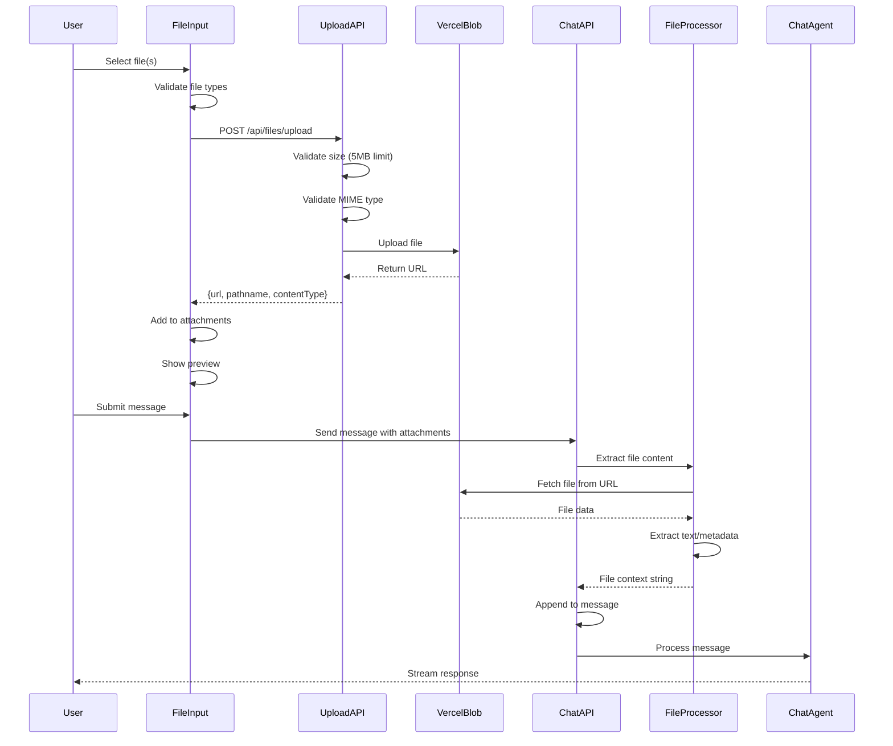
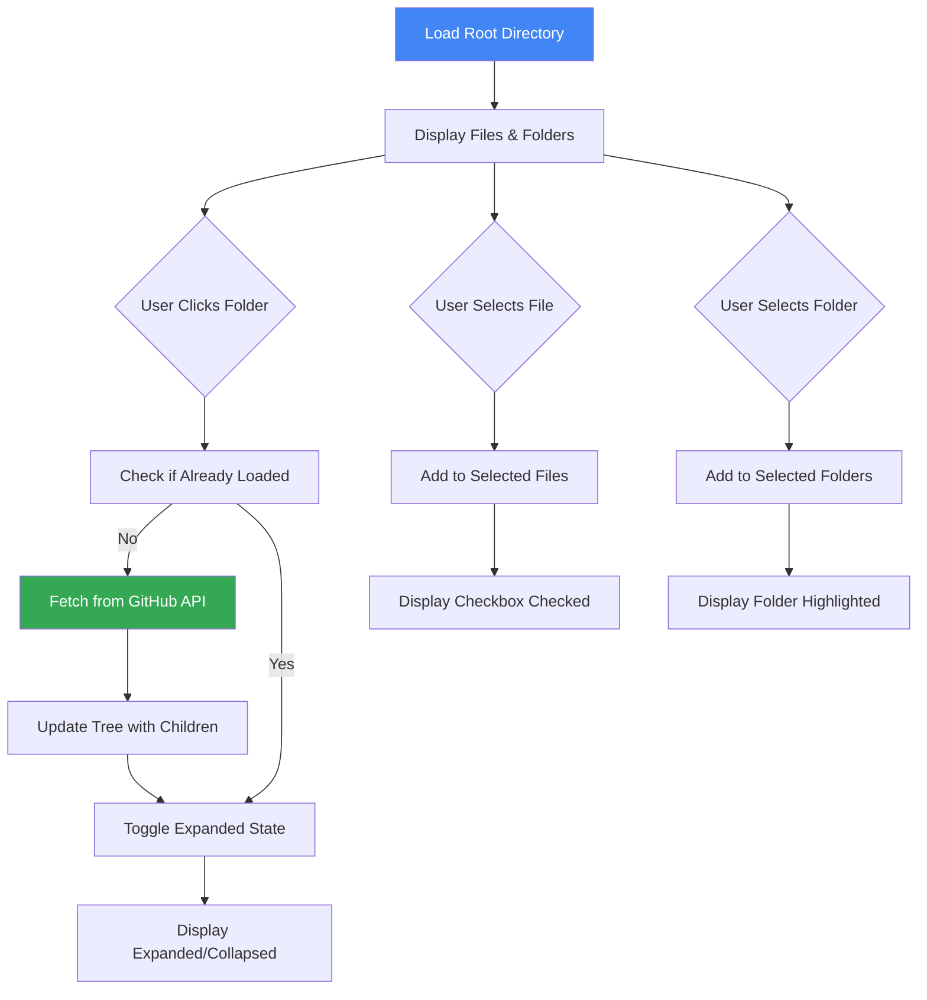
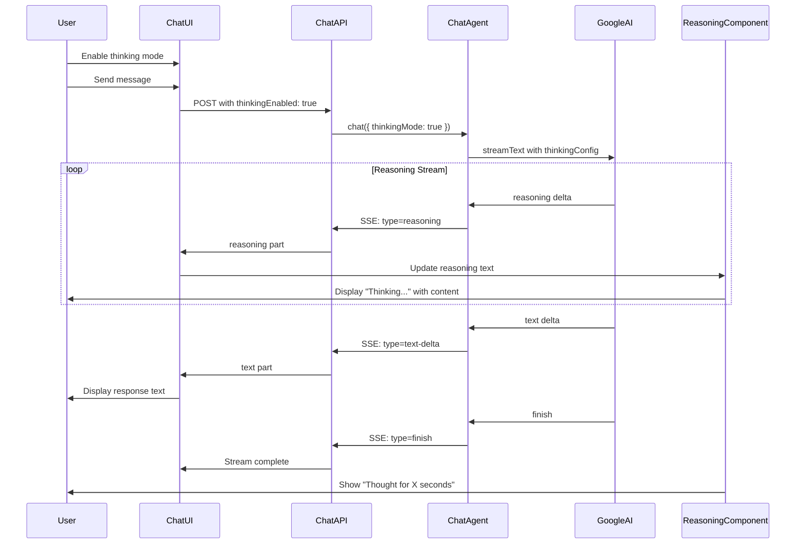
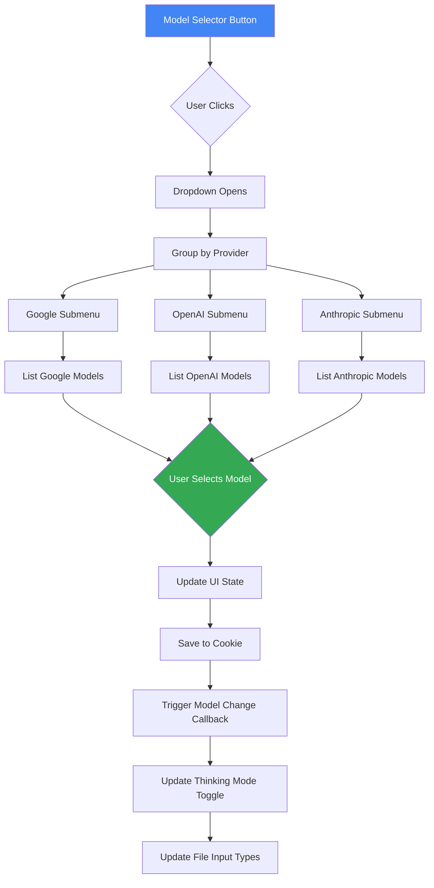
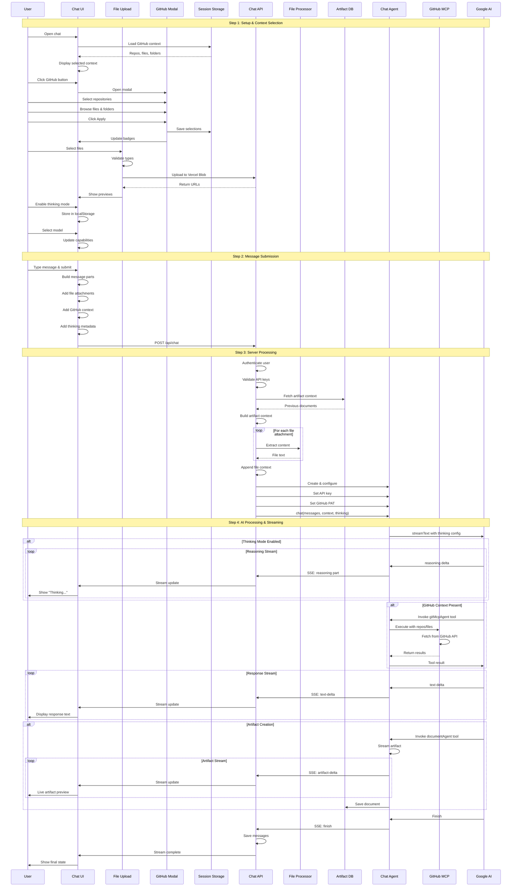

# Multimodal Chat & GitHub Context Documentation

## Table of Contents
- [Overview](#overview)
- [Architecture Diagram](#architecture-diagram)
- [Multimodal Input System](#multimodal-input-system)
  - [File Upload & Processing](#file-upload--processing)
  - [Supported File Types](#supported-file-types)
  - [File Validation & Security](#file-validation--security)
- [GitHub Context Integration](#github-context-integration)
  - [Repository Selection](#repository-selection)
  - [File & Folder Browser](#file--folder-browser)
  - [GitHub MCP Agent Integration](#github-mcp-agent-integration)
- [Thinking Mode & Reasoning](#thinking-mode--reasoning)
  - [Extended Reasoning](#extended-reasoning)
  - [Reasoning Streaming](#reasoning-streaming)
  - [UI Display](#ui-display)
- [Model Selection](#model-selection)
  - [Model Selector Component](#model-selector-component)
  - [Admin Configuration Integration](#admin-configuration-integration)
  - [Per-Provider Model Management](#per-provider-model-management)
- [Chat History](#chat-history)
  - [Conversation Management](#conversation-management)
  - [Infinite Scroll Pagination](#infinite-scroll-pagination)
  - [Grouping & Organization](#grouping--organization)
- [Message System](#message-system)
  - [Message Parts](#message-parts)
  - [Streaming Display](#streaming-display)
  - [Tool Call Rendering](#tool-call-rendering)
- [Complete User Flow](#complete-user-flow)
- [File References](#file-references)
- [TODOs](#todos)

---

## Overview

The **Multimodal Chat & GitHub Context** system provides a comprehensive conversational interface that supports:

1. **Multimodal Input**: Text, file attachments, and GitHub repository context
2. **GitHub Integration**: Repository, file, and folder selection with MCP agent access
3. **Thinking Mode**: Extended reasoning with streaming thought process visualization
4. **Model Selection**: Dynamic model switching across multiple AI providers
5. **Chat History**: Organized conversation management with infinite scroll
6. **Real-time Streaming**: Live updates for AI responses, artifacts, and reasoning

**Key Design Principles:**
- **Session-based persistence** - GitHub context stored in sessionStorage per chat
- **Real-time streaming** - Server-Sent Events (SSE) for live updates
- **Provider abstraction** - Works with Google, OpenAI, and Anthropic (future)
- **Artifact context awareness** - Automatically includes previous documents in conversation
- **Cost transparency** - Track token usage and costs (planned feature)

---

## Architecture Diagram

```mermaid
flowchart TB
    subgraph UserInterface["User Interface Layer"]
        MultimodalInput[Multimodal Input Component]
        FileUpload[File Upload Handler]
        GitHubButton[GitHub Context Button]
        ModelSelector[Model Selector]
        ThinkingToggle[Thinking Mode Toggle]
    end

    subgraph GitHubModal["GitHub Context Modal"]
        RepoTab[Repository Tab]
        FilesTab[Files & Folders Tab]
        RepoIntegration[GitHub Context Integration]
        FileBrowser[GitHub File Browser]
    end

    subgraph Storage["Client-side Storage"]
        SessionStore[(Session Storage)]
        LocalStore[(Local Storage)]
    end

    subgraph ChatAPI["Chat API Layer"]
        APIRoute[/api/chat Route]
        FileProcessing[File Content Extraction]
        ArtifactContext[Artifact Context Builder]
        GitHubContext[GitHub Context Handler]
    end

    subgraph AgentSystem["Agent System"]
        ChatAgent[Chat Agent]
        GitMcpAgent[GitHub MCP Agent]
        ProviderTools[Provider Tools Agent]
        StreamingAgents[Streaming Agents]
    end

    subgraph ExternalServices["External Services"]
        VercelBlob[Vercel Blob Storage]
        GitHubAPI[GitHub API]
        AIProviders[AI Providers<br/>Google/OpenAI/Anthropic]
    end

    MultimodalInput --> FileUpload
    MultimodalInput --> GitHubButton
    MultimodalInput --> ModelSelector
    MultimodalInput --> ThinkingToggle

    GitHubButton --> GitHubModal
    GitHubModal --> RepoTab
    GitHubModal --> FilesTab
    RepoTab --> RepoIntegration
    FilesTab --> FileBrowser

    RepoIntegration --> GitHubAPI
    FileBrowser --> GitHubAPI

    GitHubModal --> SessionStore
    ThinkingToggle --> LocalStore

    FileUpload --> VercelBlob
    MultimodalInput --> APIRoute

    APIRoute --> FileProcessing
    APIRoute --> ArtifactContext
    APIRoute --> GitHubContext
    APIRoute --> ChatAgent

    ChatAgent --> GitMcpAgent
    ChatAgent --> ProviderTools
    ChatAgent --> StreamingAgents

    GitMcpAgent --> GitHubAPI
    ProviderTools --> AIProviders
    StreamingAgents --> AIProviders

    ChatAgent --> MultimodalInput

    style MultimodalInput fill:#4285f4,stroke:#333,stroke-width:3px,color:#fff
    style GitHubModal fill:#34a853,stroke:#333,stroke-width:2px,color:#fff
    style ChatAgent fill:#ea4335,stroke:#333,stroke-width:2px,color:#fff
    style SessionStore fill:#fbbc04,stroke:#333,stroke-width:2px
```

---

## Multimodal Input System

The multimodal input system allows users to combine text, file attachments, and GitHub repository context in a single message.

### File Upload & Processing

**Component:** `components/multimodal-input.tsx:372-430`

**Upload Flow:**



**Upload Implementation:**

```typescript
// components/multimodal-input.tsx:372-397
const uploadFile = useCallback(async (file: File) => {
  const formData = new FormData();
  formData.append("file", file);

  try {
    const response = await fetch("/api/files/upload", {
      method: "POST",
      body: formData,
    });

    if (response.ok) {
      const data = await response.json();
      const { url, pathname, contentType } = data;

      return {
        url,
        name: pathname,
        contentType,
      };
    }
    const { error } = await response.json();
    toast.error(error);
  } catch (_error) {
    toast.error("Failed to upload file, please try again!");
  }
}, []);
```

**File Processing on Server:**

```typescript
// app/(chat)/api/chat/route.ts:96-119
const fileContexts: string[] = [];
const fileParts = message.parts.filter((part) => part.type === "file");

for (const filePart of fileParts) {
  try {
    const attachment = {
      name: filePart.name ?? "file",
      url: filePart.url,
      mediaType: filePart.mediaType,
    };

    const validation = validateFileAttachment(attachment);
    if (validation.valid) {
      const fileContent = await extractFileContent(attachment);
      fileContexts.push(
        `File: ${attachment.name}\nContent:\n${fileContent}`
      );
    }
  } catch (error) {
    console.error(`Failed to process file ${filePart.name}:`, error);
  }
}

const fileContext = fileContexts.length > 0
  ? `\n\nAttached files:\n${fileContexts.join("\n\n")}`
  : "";
```

---

### Supported File Types

File type support is configured per provider and per model in the admin panel.

**Configuration Location:** `Chat Model Agent Config > File Input Types`

**File Categories:**

```typescript
// components/admin/agents/chat-model/chat-model-agent-config.tsx:354-401
type FileInputTypes = {
  codeFiles: {
    py: { enabled: boolean };
    ipynb: { enabled: boolean };
    js: { enabled: boolean };
    jsx: { enabled: boolean };
    ts: { enabled: boolean };
    tsx: { enabled: boolean };
    html: { enabled: boolean };
    css: { enabled: boolean };
    json: { enabled: boolean };
    xml: { enabled: boolean };
    sql: { enabled: boolean };
    sh: { enabled: boolean };
    bat: { enabled: boolean };
    ps1: { enabled: boolean };
  };
  textFiles: {
    txt: { enabled: boolean };
    md: { enabled: boolean };
    yaml: { enabled: boolean };
    yml: { enabled: boolean };
    toml: { enabled: boolean };
    ini: { enabled: boolean };
    cfg: { enabled: boolean };
    conf: { enabled: boolean };
    log: { enabled: boolean };
    csv: { enabled: boolean };
  };
  pdf: { enabled: boolean };
  ppt: { enabled: boolean };
  excel: { enabled: boolean };
  images: { enabled: boolean };
};
```

**Validation Logic:**

```typescript
// components/conditional-file-input.tsx
export function createValidatedFileChangeHandler(
  selectedProvider: string,
  selectedModel: string,
  adminConfig: AdminConfigSummary | undefined,
  handleFileChange: (event: ChangeEvent<HTMLInputElement>) => Promise<void>,
  fileInputRef: React.RefObject<HTMLInputElement>
) {
  return async (event: ChangeEvent<HTMLInputElement>) => {
    const files = Array.from(event.target.files || []);

    // Get file input configuration for this model
    const providerConfig = adminConfig?.providers?.[selectedProvider];
    const modelConfig = providerConfig?.models?.[selectedModel];
    const fileInputTypes = modelConfig?.fileInputTypes;

    if (!fileInputTypes) {
      toast.error("File input not configured for this model");
      return;
    }

    // Validate each file
    for (const file of files) {
      const extension = file.name.split('.').pop()?.toLowerCase();

      // Check if extension is allowed
      const isAllowed = checkFileTypeAllowed(extension, fileInputTypes);

      if (!isAllowed) {
        toast.error(`File type .${extension} not supported for this model`);
        if (fileInputRef.current) {
          fileInputRef.current.value = "";
        }
        return;
      }
    }

    // If all files valid, proceed with upload
    await handleFileChange(event);
  };
}
```

---

### File Validation & Security

**API Route Validation:** `app/(chat)/api/files/upload/route.ts:6-17`

```typescript
const FileSchema = z.object({
  file: z
    .instanceof(Blob)
    .refine((file) => file.size <= 5 * 1024 * 1024, {
      message: "File size should be less than 5MB",
    })
    .refine((file) => ["image/jpeg", "image/png"].includes(file.type), {
      message: "File type should be JPEG or PNG",
    }),
});
```

**Security Measures:**

1. **Size Limit**: 5MB maximum per file
2. **MIME Type Validation**: Only allowed types accepted
3. **Authentication Required**: User must be logged in
4. **Public Access URLs**: Files stored in Vercel Blob with public URLs
5. **Virus Scanning**: Not implemented (TODO)

---

## GitHub Context Integration

GitHub context integration allows users to select repositories, files, and folders to provide as context to the AI chat agent.

### Repository Selection

**Component:** `components/github-context-integration.tsx`

**Modal Component:** `components/github-repo-modal.tsx:29-249`


**Repository Selection UI:**

```typescript
// components/github-repo-modal.tsx:123-148
<TabsList className="grid w-full grid-cols-2">
  <TabsTrigger value="repos">
    <GitBranch className="h-4 w-4" />
    Repositories
    {tempSelectedRepos.length > 0 && (
      <span className="badge">{tempSelectedRepos.length}</span>
    )}
  </TabsTrigger>
  <TabsTrigger value="files" disabled={!selectedRepo}>
    <FileCode className="h-4 w-4" />
    Files & Folders
    {(tempSelectedFiles.length > 0 || tempSelectedFolders.length > 0) && (
      <span className="badge">
        {tempSelectedFiles.length + tempSelectedFolders.length}
      </span>
    )}
  </TabsTrigger>
</TabsList>
```

**Session Storage Persistence:**

```typescript
// components/multimodal-input.tsx:99-162
// Load GitHub context from session storage on mount
useEffect(() => {
  const savedRepos = sessionStorage.getItem(`github-repos-${chatId}`);
  const savedFiles = sessionStorage.getItem(`github-files-${chatId}`);
  const savedFolders = sessionStorage.getItem(`github-folders-${chatId}`);

  if (savedRepos) {
    try {
      setSelectedRepos(JSON.parse(savedRepos));
    } catch (error) {
      console.error("Failed to parse saved GitHub repos:", error);
    }
  }
  // ... similar for files and folders
}, [chatId]);

// Save GitHub context to session storage when they change
useEffect(() => {
  if (selectedRepos.length > 0) {
    sessionStorage.setItem(
      `github-repos-${chatId}`,
      JSON.stringify(selectedRepos)
    );
  } else {
    sessionStorage.removeItem(`github-repos-${chatId}`);
  }
}, [selectedRepos, chatId]);
```

---

### File & Folder Browser

**Component:** `components/github-file-browser.tsx`

**Features:**

1. **Tree Structure**: Hierarchical file/folder navigation
2. **Lazy Loading**: Directories loaded on-demand when expanded
3. **Search**: Filter files and folders by name
4. **Multi-Selection**: Select multiple files and folders
5. **File Icons**: Visual indicators for different file types
6. **Error Handling**: Graceful handling of API errors

**Tree Navigation:**



**Directory Loading:**

```typescript
// components/github-file-browser.tsx:98-166
const loadDirectory = useCallback(async (path: string) => {
  if (!githubPAT) {
    toast.error("GitHub PAT is required");
    return;
  }

  const isRoot = path === "";
  if (isRoot) {
    setIsLoadingRoot(true);
  }

  try {
    const encodedPath = path ? encodeURIComponent(path) : "";
    const url = `https://api.github.com/repos/${repo.full_name}/contents/${encodedPath}`;

    const response = await fetch(url, {
      headers: {
        Authorization: `Bearer ${githubPAT}`,
        Accept: "application/vnd.github.v3+json",
      },
    });

    if (!response.ok) {
      if (response.status === 404) {
        throw new Error("Directory not found");
      }
      if (response.status === 403) {
        throw new Error("API rate limit exceeded or insufficient permissions");
      }
      throw new Error(`GitHub API error: ${response.status}`);
    }

    const data = await response.json();

    const nodes: TreeNode[] = data.map((item: any) => ({
      name: item.name,
      path: item.path,
      type: item.type === "dir" ? "dir" : "file",
      size: item.size,
      sha: item.sha,
      isExpanded: false,
      isLoading: false,
      children: item.type === "dir" ? [] : undefined,
    }));

    // Sort: directories first, then files
    nodes.sort((a, b) => {
      if (a.type === b.type) {
        return a.name.localeCompare(b.name);
      }
      return a.type === "dir" ? -1 : 1;
    });

    if (isRoot) {
      setTreeData(nodes);
      setError(null);
    } else {
      setTreeData((prevTree) => updateTreeNode(prevTree, path, nodes));
    }
  } catch (error) {
    // Error handling with logging
    logAppError(/* ... */);
  } finally {
    if (isRoot) {
      setIsLoadingRoot(false);
    }
  }
}, [githubPAT, repo.full_name, updateTreeNode]);
```

**File Type Icons:**

```typescript
// components/github-file-browser.tsx
const getFileIcon = (filename: string) => {
  const ext = filename.split('.').pop()?.toLowerCase();

  if (ext === 'json') return <FileJson className="h-4 w-4" />;
  if (['js', 'ts', 'jsx', 'tsx', 'py'].includes(ext)) {
    return <FileCode className="h-4 w-4" />;
  }
  if (['md', 'txt'].includes(ext)) {
    return <FileText className="h-4 w-4" />;
  }
  if (['jpg', 'png', 'gif', 'svg'].includes(ext)) {
    return <ImageIcon className="h-4 w-4" />;
  }

  return <File className="h-4 w-4" />;
};
```

---

### GitHub MCP Agent Integration

When GitHub context is selected, it's passed to the chat agent and made available to the GitHub MCP agent.

**Message Preparation:**

```typescript
// components/multimodal-input.tsx:262-343
const submitForm = useCallback(() => {
  // Prepare message parts
  const messageParts: any[] = [
    ...attachments.map((attachment) => ({
      type: "file" as const,
      url: attachment.url,
      name: attachment.name,
      mediaType: attachment.contentType,
    })),
  ];

  // Add GitHub context if any items are selected
  if (
    selectedRepos.length > 0 ||
    selectedFiles.length > 0 ||
    selectedFolders.length > 0
  ) {
    let githubContext = "";

    if (selectedRepos.length > 0) {
      githubContext += `GitHub Repositories: ${selectedRepos.map((r) => r.full_name).join(", ")}`;
    }

    if (selectedFiles.length > 0) {
      githubContext +=
        (githubContext ? "\n" : "") +
        `Files: ${selectedFiles.map((f) => f.path).join(", ")}`;
    }

    if (selectedFolders.length > 0) {
      githubContext +=
        (githubContext ? "\n" : "") +
        `Folders: ${selectedFolders.map((f) => f.path).join(", ")}`;
    }

    messageParts.push({
      type: "text",
      text: `${githubContext}\n\nQuery: ${input}`,
    });
  } else {
    messageParts.push({
      type: "text",
      text: input,
    });
  }

  const messageData: any = {
    role: "user",
    parts: messageParts,
  };

  // Add GitHub context metadata for GitHub MCP agent
  if (
    selectedRepos.length > 0 ||
    selectedFiles.length > 0 ||
    selectedFolders.length > 0
  ) {
    messageData.experimental_providerMetadata = {
      github: {
        repos: selectedRepos,
        files: selectedFiles,
        folders: selectedFolders,
      },
    };
  }

  sendMessage(messageData);
}, [/* dependencies */]);
```

**GitHub PAT Propagation:**

```typescript
// app/(chat)/api/chat/route.ts:132-197
// Get GitHub PAT (optional - for GitHub MCP agent)
const githubPAT = request.headers.get("x-github-pat");

// Create chat agent
const chatAgent = await ChatAgentResolver.createChatAgent();
chatAgent.setApiKey(apiKey);

// Set GitHub PAT if provided (for GitHub MCP agent)
if (githubPAT?.trim()) {
  chatAgent.setGitHubPAT(githubPAT);
  console.log("🐙 [GITHUB-PAT] GitHub PAT provided for MCP agent");
}
```

**GitHub Context Display:**

```typescript
// components/multimodal-input.tsx:530-636
{(selectedRepos.length > 0 ||
  selectedFiles.length > 0 ||
  selectedFolders.length > 0) && (
  <div className="border-t px-3 pb-2">
    <div className="mt-2 mb-2 flex items-center gap-2">
      <GitHubIcon />
      <span>
        GitHub Context ({selectedRepos.length + selectedFiles.length + selectedFolders.length})
      </span>
    </div>
    <div className="flex flex-wrap gap-1.5">
      {/* Repository badges */}
      {selectedRepos.map((repo) => (
        <Badge key={repo.id}>
          {repo.full_name}
          <X onClick={() => removeRepo(repo)} />
        </Badge>
      ))}

      {/* File badges */}
      {selectedFiles.map((file) => (
        <Badge key={file.path}>
          <FileIcon />
          {file.name}
          <X onClick={() => removeFile(file)} />
        </Badge>
      ))}

      {/* Folder badges */}
      {selectedFolders.map((folder) => (
        <Badge key={folder.path}>
          <FolderIcon />
          {folder.name}
          <X onClick={() => removeFolder(folder)} />
        </Badge>
      ))}
    </div>
  </div>
)}
```

---

## Thinking Mode & Reasoning

Thinking mode enables extended reasoning capabilities for supported AI models, displaying the model's thought process in real-time.

### Extended Reasoning

**Supported Models:**
- Google Gemini 2.0 Flash Thinking (Experimental)
- Future: OpenAI o1, Anthropic Claude 3 Opus with extended thinking

**Model Capability Check:**

```typescript
// components/thinking-mode-toggle.tsx:23-54
const supportsThinkingMode = (() => {
  if (!adminConfig || !selectedModel) {
    return false;
  }

  // Find the provider and model that matches the selectedModel
  for (const [providerKey, provider] of Object.entries(adminConfig.providers)) {
    if (!provider.enabled) {
      continue;
    }

    for (const [modelKey, model] of Object.entries(provider.models)) {
      // Try multiple matching patterns
      const matches = [
        modelKey === selectedModel,
        `${providerKey}-${modelKey}` === selectedModel,
        selectedModel.replace(`${providerKey}-`, "") === modelKey,
        selectedModel.endsWith(modelKey) && selectedModel.startsWith(providerKey),
      ];

      if (matches.some((match) => match)) {
        return model.enabled && model.supportsThinkingMode;
      }
    }
  }

  return false;
})();

// Don't render if thinking mode is not supported
if (!supportsThinkingMode) {
  return null;
}
```

**Thinking Configuration:**

```typescript
// lib/ai/providers/google/chat-agent.ts
const modelSupportsThinking = this.supportsThinking(params.modelId);
const shouldEnableThinking = params.thinkingMode && modelSupportsThinking;

if (shouldEnableThinking) {
  streamConfig.providerOptions = {
    google: {
      thinkingConfig: {
        thinkingBudget: 8192,      // Max tokens for reasoning
        includeThoughts: true      // Stream reasoning to UI
      }
    }
  };
}
```

---

### Reasoning Streaming

**Streaming Flow:**



**Message Part Structure:**

```typescript
// Message with reasoning
{
  id: "msg-123",
  role: "assistant",
  parts: [
    {
      type: "reasoning",
      text: "Let me think about this step by step...\n1. First, I need to...\n2. Then..."
    },
    {
      type: "text",
      text: "Based on my analysis, here's the answer..."
    }
  ]
}
```

---

### UI Display

**Reasoning Component:** `components/message-reasoning.tsx:17-37`

```typescript
export function MessageReasoning({
  isLoading,
  reasoning,
}: MessageReasoningProps) {
  const [hasBeenStreaming, setHasBeenStreaming] = useState(isLoading);

  useEffect(() => {
    if (isLoading) {
      setHasBeenStreaming(true);
    }
  }, [isLoading]);

  return (
    <Reasoning
      defaultOpen={hasBeenStreaming}  // Auto-expand while streaming
      isStreaming={isLoading}
    >
      <ReasoningTrigger />  {/* Shows "Thinking..." or "Thought for X seconds" */}
      <ReasoningContent>{reasoning}</ReasoningContent>
    </Reasoning>
  );
}
```

**Reasoning Display States:**

1. **Streaming**: Shows "Thinking..." with animated dots
2. **Complete**: Shows "Thought for X seconds" (collapsed by default)
3. **Expanded**: Shows full reasoning text with markdown formatting

**Message Rendering:**

```typescript
// components/message.tsx:113-131
if (type === "reasoning" && part.text?.trim().length > 0) {
  // Find the last reasoning part index
  const reasoningParts = message.parts?.filter((p) => p.type === "reasoning") || [];
  const isLastReasoningPart = reasoningParts.length > 0 && reasoningParts.at(-1) === part;

  // Only the last reasoning part should be in loading state while streaming
  const isReasoningLoading = isLoading && isLastReasoningPart;

  return (
    <MessageReasoning
      isLoading={isReasoningLoading}
      key={key}
      reasoning={part.text}
    />
  );
}
```

---

## Model Selection

### Model Selector Component

**Component:** `components/model-selector.tsx:28-286`

**Features:**

1. **Provider Grouping**: Models organized by provider (Google, OpenAI, Anthropic)
2. **Default Model Indicator**: Shows which model is default per provider
3. **Model Descriptions**: Each model has name and description
4. **Active State**: Visual indicator for currently selected model
5. **Cookie Persistence**: Selected model saved to cookie

**Model Selection UI:**



**Dropdown Structure:**

```typescript
// components/model-selector.tsx:202-282
<DropdownMenu>
  <DropdownMenuTrigger>
    <button>
      <CpuIcon />
      <span>{currentModel?.name || "Select Model"}</span>
      <span>({currentProvider})</span>
      <ChevronDownIcon />
    </button>
  </DropdownMenuTrigger>

  <DropdownMenuContent>
    {providerGroups.map((group) => (
      <DropdownMenuSub key={group.providerId}>
        <DropdownMenuSubTrigger>
          <span>{group.providerName}</span>
          <span>{group.models.length} models</span>
        </DropdownMenuSubTrigger>

        <DropdownMenuSubContent>
          {group.models.map((model) => (
            <DropdownMenuItem onClick={() => handleModelSelection(model.id)}>
              <div>
                <span>{model.name}</span>
                {model.isDefault && <Badge>Default</Badge>}
                <p>{model.description}</p>
              </div>
              {selectedModel === model.id && <CheckIcon />}
            </DropdownMenuItem>
          ))}
        </DropdownMenuSubContent>
      </DropdownMenuSub>
    ))}
  </DropdownMenuContent>
</DropdownMenu>
```

---

### Admin Configuration Integration

Models are configured in the `model_config` table and loaded via the admin panel.

**Model Configuration API:** `/api/admin/models`

**Model Data Structure:**

```typescript
type ModelConfig = {
  id: string;                                    // UUID
  modelId: string;                               // "gemini-2.0-flash-exp"
  name: string;                                  // "Gemini 2.0 Flash"
  description: string;                           // "Fast model with thinking"
  provider: "google" | "openai" | "anthropic";
  isActive: boolean;                             // Available for selection
  isDefault: boolean;                            // Default for provider
  thinkingEnabled: boolean;                      // Supports thinking mode
  inputPricingPerMillionTokens: number;          // 0.075
  outputPricingPerMillionTokens: number;         // 0.30
  metadata: {
    maxTokens?: number;                          // Context window
    maxOutputTokens?: number;                    // Max output
    supportsVision?: boolean;
    supportsAudio?: boolean;
  };
};
```

**Model Loading:**

```typescript
// hooks/use-model-capabilities.ts
export function useModelCapabilities() {
  const { data, error, isLoading } = useSWR<AdminConfigSummary>(
    "/api/admin/config/summary",
    fetcher
  );

  return {
    modelCapabilities: data,
    isLoading,
    error: error?.message,
  };
}
```

**Admin Config Summary:**

```typescript
type AdminConfigSummary = {
  providers: {
    [providerId: string]: {
      enabled: boolean;
      models: {
        [modelId: string]: {
          name: string;
          description: string;
          enabled: boolean;
          isDefault: boolean;
          supportsThinkingMode: boolean;
          fileInputTypes: FileInputTypes;
        };
      };
    };
  };
};
```

---

### Per-Provider Model Management

**Default Model Enforcement:**

```typescript
// components/model-selector.tsx:95-123
// Second pass: ensure only one default per provider
const defaultModels = models.filter((m) => m.isDefault);
if (defaultModels.length > 1) {
  // If multiple defaults, keep only the first one
  models.forEach((model, index) => {
    if (model.isDefault && index > 0) {
      model.isDefault = false;
    }
  });
} else if (defaultModels.length === 0 && models.length > 0) {
  // If no default, make the first model default
  models[0].isDefault = true;
}

// Sort models: default first, then by name
models.sort((a, b) => {
  if (a.isDefault && !b.isDefault) {
    return -1;
  }
  if (!a.isDefault && b.isDefault) {
    return 1;
  }
  return a.name.localeCompare(b.name);
});
```

**Model Selection Persistence:**

```typescript
// components/model-selector.tsx:194-199
const handleModelSelection = (modelId: string) => {
  onModelChange(modelId);
  startTransition(() => {
    saveChatModelAsCookie(modelId);
  });
};
```

---

## Chat History

### Conversation Management

**Component:** `components/sidebar-history.tsx:100-240`

**Features:**

1. **Infinite Scroll**: Load more chats as user scrolls
2. **Date Grouping**: Organize by Today, Yesterday, Last Week, Last Month, Older
3. **Delete Confirmation**: Alert dialog before deletion
4. **Real-time Updates**: SWR for automatic revalidation
5. **Mobile Responsive**: Closes sidebar on selection (mobile)

**Chat History Structure:**

```typescript
type ChatHistory = {
  chats: Chat[];
  hasMore: boolean;
};

type Chat = {
  id: string;
  title: string;
  createdAt: Date;
  user_id: string;
  visibility: "public" | "private";
};
```

---

### Infinite Scroll Pagination

**Pagination Implementation:**

```typescript
// components/sidebar-history.tsx:79-98
export function getChatHistoryPaginationKey(
  pageIndex: number,
  previousPageData: ChatHistory
) {
  if (previousPageData && previousPageData.hasMore === false) {
    return null;  // Reached the end
  }

  if (pageIndex === 0) {
    return `/api/history?limit=${PAGE_SIZE}`;
  }

  const firstChatFromPage = previousPageData.chats.at(-1);

  if (!firstChatFromPage) {
    return null;
  }

  return `/api/history?ending_before=${firstChatFromPage.id}&limit=${PAGE_SIZE}`;
}
```

**SWR Infinite Hook:**

```typescript
// components/sidebar-history.tsx:105-113
const {
  data: paginatedChatHistories,
  setSize,
  isValidating,
  isLoading,
  mutate,
} = useSWRInfinite<ChatHistory>(getChatHistoryPaginationKey, fetcher, {
  fallbackData: [],
});
```

**Load More Trigger:**

```typescript
// When user scrolls to bottom of list
const hasReachedEnd = paginatedChatHistories
  ? paginatedChatHistories.some((page) => page.hasMore === false)
  : false;

if (!hasReachedEnd && !isLoading && !isValidating) {
  setSize((size) => size + 1);  // Load next page
}
```

---

### Grouping & Organization

**Date-based Grouping:**

```typescript
// components/sidebar-history.tsx:46-77
const groupChatsByDate = (chats: Chat[]): GroupedChats => {
  const now = new Date();
  const oneWeekAgo = subWeeks(now, 1);
  const oneMonthAgo = subMonths(now, 1);

  return chats.reduce(
    (groups, chat) => {
      const chatDate = new Date(chat.createdAt);

      if (isToday(chatDate)) {
        groups.today.push(chat);
      } else if (isYesterday(chatDate)) {
        groups.yesterday.push(chat);
      } else if (chatDate > oneWeekAgo) {
        groups.lastWeek.push(chat);
      } else if (chatDate > oneMonthAgo) {
        groups.lastMonth.push(chat);
      } else {
        groups.older.push(chat);
      }

      return groups;
    },
    {
      today: [],
      yesterday: [],
      lastWeek: [],
      lastMonth: [],
      older: [],
    } as GroupedChats
  );
};
```

**Grouped Display:**

```tsx
<SidebarGroup>
  {groupedChats.today.length > 0 && (
    <>
      <SidebarGroupLabel>Today</SidebarGroupLabel>
      <SidebarGroupContent>
        {groupedChats.today.map((chat) => (
          <ChatItem key={chat.id} chat={chat} />
        ))}
      </SidebarGroupContent>
    </>
  )}

  {groupedChats.yesterday.length > 0 && (
    <>
      <SidebarGroupLabel>Yesterday</SidebarGroupLabel>
      <SidebarGroupContent>
        {groupedChats.yesterday.map((chat) => (
          <ChatItem key={chat.id} chat={chat} />
        ))}
      </SidebarGroupContent>
    </>
  )}

  {/* Similar for lastWeek, lastMonth, older */}
</SidebarGroup>
```

---

## Message System

### Message Parts

Messages support multiple part types for rich content display.

**Message Part Types:**

```typescript
type MessagePart =
  | { type: "text"; text: string }
  | { type: "file"; url: string; name: string; mediaType: string }
  | { type: "reasoning"; text: string }
  | { type: "tool-call"; toolCallId: string; toolName: string; args: any }
  | { type: "tool-result"; toolCallId: string; toolName: string; result: any }
  | { type: "artifact"; id: string; kind: string; title: string; content: string };
```

**Message Structure:**

```typescript
type ChatMessage = {
  id: string;
  role: "user" | "assistant" | "system";
  parts: MessagePart[];
  createdAt: Date;
};
```

---

### Streaming Display

**Message Rendering:** `components/message.tsx:28-240`

```typescript
// components/message.tsx:109-176
{message.parts?.map((part, index) => {
  const { type } = part;
  const key = `message-${message.id}-part-${index}`;

  if (type === "reasoning" && part.text?.trim().length > 0) {
    const isReasoningLoading = isLoading && isLastReasoningPart;
    return (
      <MessageReasoning
        isLoading={isReasoningLoading}
        key={key}
        reasoning={part.text}
      />
    );
  }

  if (type === "text") {
    if (mode === "view") {
      return (
        <MessageContent key={key}>
          <Response>{sanitizeText(part.text)}</Response>
        </MessageContent>
      );
    }
  }

  if (type === "tool-call") {
    return (
      <Tool key={toolCallId}>
        <ToolHeader type={toolName} />
        <ToolContent>
          <ToolInput input={args} />
        </ToolContent>
      </Tool>
    );
  }

  if (type === "tool-result") {
    return (
      <Tool key={toolCallId}>
        <ToolHeader type={toolName} />
        <ToolContent>
          <ToolOutput output={result} />
        </ToolContent>
      </Tool>
    );
  }
})}
```

---

### Tool Call Rendering

**Tool Component:** `components/elements/tool.tsx`

```typescript
<Tool defaultOpen={true}>
  <ToolHeader state="input-available" type={toolName}>
    {toolName === "providerToolsAgent" && "Provider Tools"}
    {toolName === "googleSearch" && "Web Search"}
    {toolName === "urlContext" && "URL Fetch"}
    {toolName === "codeExecution" && "Code Execution"}
  </ToolHeader>

  <ToolContent>
    {/* Input Phase */}
    <ToolInput>
      <pre>{JSON.stringify(args, null, 2)}</pre>
    </ToolInput>

    {/* Output Phase */}
    <ToolOutput>
      <pre>{JSON.stringify(result, null, 2)}</pre>
    </ToolOutput>
  </ToolContent>
</Tool>
```

**Tool States:**

1. **input-available**: Tool called with arguments
2. **output-available**: Tool returned result
3. **error**: Tool execution failed

---

## Complete User Flow

### End-to-End Chat Flow with All Features



---

## File References

### UI Components

#### Input & Selection
- `components/multimodal-input.tsx` - Main input with file upload, GitHub context, thinking mode
- `components/model-selector.tsx` - AI model selection dropdown
- `components/thinking-mode-toggle.tsx` - Thinking mode toggle switch
- `components/conditional-file-input.tsx` - File type validation

#### GitHub Integration
- `components/github-repo-modal.tsx` - Repository and file selection modal
- `components/github-context-integration.tsx` - Repository list and selection
- `components/github-file-browser.tsx` - Tree-based file/folder browser

#### Chat History
- `components/sidebar-history.tsx` - Chat history with infinite scroll
- `components/sidebar-history-item.tsx` - Individual chat item

#### Message Display
- `components/message.tsx` - Main message component with all part types
- `components/message-reasoning.tsx` - Reasoning/thinking display
- `components/message-actions.tsx` - Message actions (copy, regenerate, etc.)
- `components/message-analytics-dialog.tsx` - Token usage analytics (planned)
- `components/preview-attachment.tsx` - File attachment preview

### API Routes

- `app/(chat)/api/chat/route.ts` - Main chat endpoint with streaming
- `app/(chat)/api/files/upload/route.ts` - File upload to Vercel Blob
- `app/(chat)/api/history/route.ts` - Chat history with pagination
- `app/api/admin/config/summary/route.ts` - Model capabilities endpoint

### Hooks

- `hooks/use-messages.tsx` - Message state and scroll management
- `hooks/use-model-capabilities.ts` - Fetch admin model configuration
- `hooks/use-chat-visibility.ts` - Chat visibility state

### AI System

- `lib/ai/chat-agent-resolver.ts` - Chat agent creation
- `lib/ai/providers/google/chat-agent.ts` - Google chat agent implementation
- `lib/ai/providers/google/git-mcp-agent.ts` - GitHub MCP integration
- `lib/ai/file-processing.ts` - File content extraction

### Database

- `lib/db/queries/chat.ts` - Chat CRUD operations
- `lib/db/queries/document.ts` - Artifact management
- `lib/db/drizzle-schema.ts` - Database schema

### Types

- `lib/types.ts` - TypeScript type definitions (GitHubRepo, GitHubFile, etc.)

---

## TODOs

### High Priority

- [ ] **Add Token Usage & Cost Analytics**
  - **User Level**: Dashboard showing total tokens/cost per user
  - **Admin Level**: Analytics across all users
  - **Message Level**: Show tokens/cost per message in chat UI
  - Integrate with `usage_logs` table
  - Add cost calculation using `model_config` pricing
  - Create usage trend charts
  - File: `components/message-analytics-dialog.tsx` (stub exists)

- [ ] **Add Tools Used in Chat UI**
  - Show which tools were called in each message
  - Display tool execution time
  - Show tool success/failure status
  - Add tool call logs for debugging
  - Create expandable tool call details
  - File: `components/message.tsx` (partial implementation exists)

- [ ] **Setup Supabase Storage for File Uploads**
  - Replace Vercel Blob with Supabase Storage
  - Configure RLS policies for file storage
  - Add file size limits per user tier
  - Implement virus scanning
  - Add file retention policies

- [ ] **Enhance GitHub Folder Structure in Context**
  - When folder selected, include file tree structure
  - Add `.gitignore` respect option
  - Show folder statistics (file count, total size)
  - Add "Include all files" option for folders
  - Implement folder size limits

### Medium Priority

- [ ] **Add File Preview for More Types**
  - PDF preview in modal
  - Excel/CSV table preview
  - Code syntax highlighting in preview
  - Image thumbnails
  - Video/audio player

- [ ] **Improve GitHub Context UX**
  - Add search across all user repositories
  - Add recently used repos quick select
  - Implement repository favorites/bookmarks
  - Add branch selection per repository
  - Show repository metadata (stars, language, size)

- [ ] **Add Conversation Export**
  - Export chat as Markdown
  - Export chat as PDF
  - Include artifacts in export
  - Export with reasoning sections
  - Add metadata (model used, tokens, cost)

- [ ] **Implement Chat Sharing**
  - Generate shareable links
  - Public/private toggle
  - Embed chat in external sites
  - Share with specific users
  - View analytics on shared chats

### Low Priority

- [ ] **Add Conversation Search**
  - Full-text search across all chats
  - Filter by date range
  - Filter by model used
  - Search within artifacts
  - Search within file attachments

- [ ] **Add Voice Input**
  - Speech-to-text for messages
  - Multiple language support
  - Real-time transcription
  - Voice command integration

- [ ] **Add Collaborative Features**
  - Multiple users in same chat
  - Real-time updates via WebSocket
  - User presence indicators
  - @mention functionality
  - Shared GitHub context

- [ ] **Add Chat Templates**
  - Pre-configured chat setups
  - Template marketplace
  - GitHub context templates
  - Thinking mode presets
  - Model recommendation templates

---

**Last Updated:** 2025-11-16
