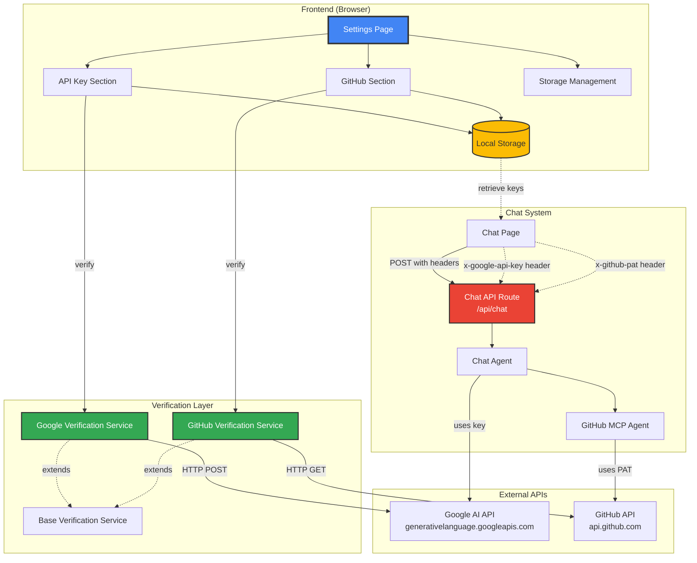
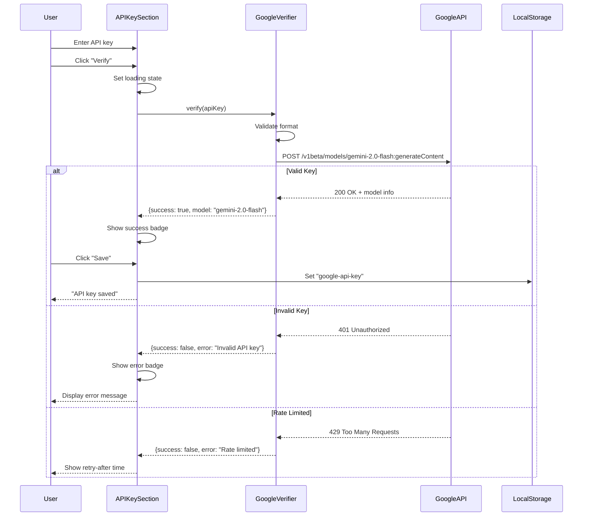
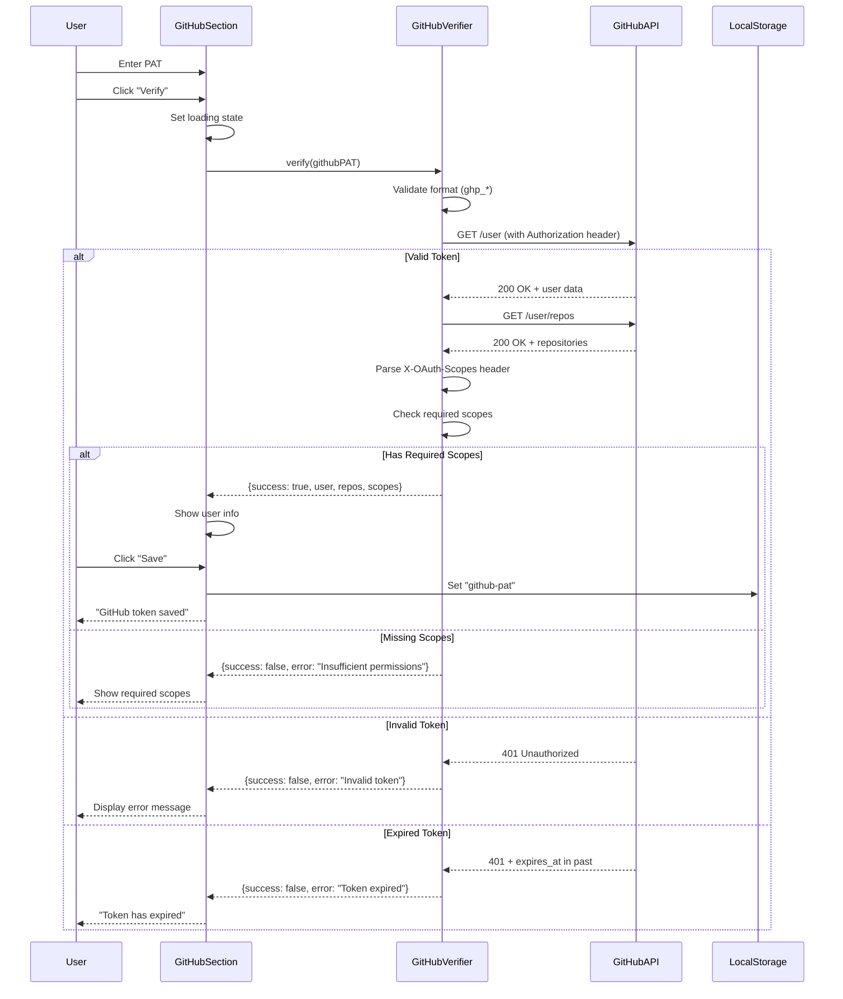
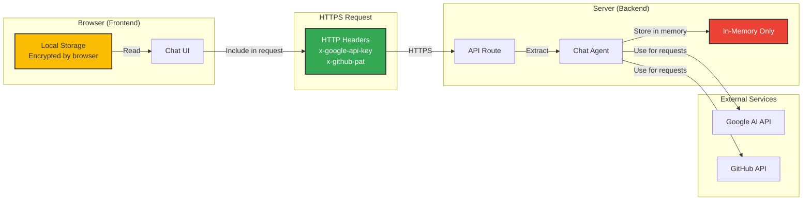

# Settings & Verification Documentation

## Table of Contents
- [Overview](#overview)
- [Architecture Diagram](#architecture-diagram)
- [Settings Page Features](#settings-page-features)
  - [API Key Management](#api-key-management)
  - [GitHub Integration](#github-integration)
  - [Storage Management](#storage-management)
- [Verification System](#verification-system)
  - [Google API Key Verification](#google-api-key-verification)
  - [GitHub Token Verification](#github-token-verification)
  - [Verification Service Architecture](#verification-service-architecture)
- [Local Storage System](#local-storage-system)
  - [Storage Manager](#storage-manager)
  - [Storage Session Hook](#storage-session-hook)
  - [Storage Helpers](#storage-helpers)
- [API Key Flow in Chat](#api-key-flow-in-chat)
- [Agent API Key Access](#agent-api-key-access)
- [UI Components](#ui-components)
- [API Endpoints](#api-endpoints)
- [Security Considerations](#security-considerations)
- [File References](#file-references)
- [TODOs](#todos)

---

## Overview

The **Settings & Verification System** provides a comprehensive interface for users to configure and verify their API credentials for using AI models and GitHub integrations. The system is designed with:

**Key Design Principles:**
- **Client-side storage** - API keys stored in browser's localStorage (never sent to backend for storage)
- **Real-time verification** - Immediate validation when users enter credentials
- **Secure transmission** - Keys sent via HTTP headers on each request
- **Provider abstraction** - Extensible verification system for multiple providers
- **User-friendly feedback** - Clear error messages and success states
- **Persistent sessions** - Keys remain available across page reloads

**Supported Integrations:**
1. **Google AI** - Gemini models (required for chat functionality)
2. **GitHub** - Personal Access Token for MCP operations (optional)

---

## Architecture Diagram



---

## Settings Page Features

### API Key Management

**Purpose:** Allows users to configure and verify their Google AI API key for using Gemini models.

**File:** `components/settings/api-key-section.tsx`

**Features:**

1. **API Key Input**
   - Password-masked input field
   - Show/hide password toggle
   - Auto-trim whitespace
   - Paste support

2. **Real-time Verification**
   - Click "Verify" to test API key
   - Shows loading state during verification
   - Displays verification result (success/error)
   - Shows model information on success

3. **Status Indicators**
   - ✅ Success badge with model name
   - ❌ Error badge with detailed message
   - 🔄 Loading spinner during verification

4. **Key Management**
   - Save verified key to localStorage
   - Clear saved key
   - Persist across page reloads

**UI Components:**

```typescript
// Main component structure
<Card>
  <CardHeader>
    <CardTitle>Google AI API Key</CardTitle>
    <CardDescription>Configure your Google AI credentials</CardDescription>
  </CardHeader>

  <CardContent>
    <Input
      type={showKey ? "text" : "password"}
      value={apiKey}
      onChange={handleChange}
      placeholder="Enter Google AI API Key"
    />

    <Button onClick={handleVerify}>
      {isVerifying ? "Verifying..." : "Verify"}
    </Button>

    <Button onClick={handleSave} disabled={!isVerified}>
      Save
    </Button>

    {verificationStatus && (
      <VerificationBadge status={verificationStatus} />
    )}
  </CardContent>
</Card>
```

**Verification Flow:**



---

### GitHub Integration

**Purpose:** Configure GitHub Personal Access Token for repository operations via MCP.

**File:** `components/settings/github-integration-section.tsx`

**Features:**

1. **GitHub PAT Input**
   - Secure password field
   - Show/hide toggle
   - Format validation
   - Placeholder with format hint

2. **Permission Verification**
   - Tests PAT against GitHub API
   - Validates required scopes
   - Shows user information on success
   - Lists accessible repositories

3. **Scope Requirements**
   - `repo` - Full repository access
   - `read:packages` - Read package metadata
   - `read:org` - Read organization data

4. **Status Display**
   - Shows authenticated user's login
   - Displays avatar image
   - Lists repository count
   - Shows scope permissions
   - Displays expiration time (if set)

**UI Components:**

```typescript
<Card>
  <CardHeader>
    <CardTitle>GitHub Integration</CardTitle>
    <CardDescription>
      Configure GitHub Personal Access Token for MCP operations
    </CardDescription>
  </CardHeader>

  <CardContent>
    <Input
      type={showToken ? "text" : "password"}
      value={githubPAT}
      onChange={handleChange}
      placeholder="ghp_xxxxxxxxxxxxxxxxxxxx"
    />

    <Button onClick={handleVerify}>
      {isVerifying ? "Verifying..." : "Verify"}
    </Button>

    <Button onClick={handleSave} disabled={!isVerified}>
      Save
    </Button>

    {verificationResult?.user && (
      <UserInfo>
        <Avatar src={verificationResult.user.avatar_url} />
        <UserName>{verificationResult.user.login}</UserName>
        <RepoCount>{verificationResult.repositories?.length} repos</RepoCount>
        <Scopes>{verificationResult.scopes?.join(", ")}</Scopes>
      </UserInfo>
    )}
  </CardContent>
</Card>
```

**Verification Flow:**



---

### Storage Management

**Purpose:** View and manage stored API keys and credentials.

**File:** `components/settings/storage-management-section.tsx`

**Features:**

1. **Storage Overview**
   - List all stored keys
   - Show key status (verified/unverified)
   - Display last verified timestamp
   - Show storage usage

2. **Key Actions**
   - View masked key preview
   - Copy key to clipboard
   - Delete individual keys
   - Clear all storage

3. **Storage Statistics**
   - Total keys stored
   - Storage size used
   - Last update timestamp

**UI Components:**

```typescript
<Card>
  <CardHeader>
    <CardTitle>Storage Management</CardTitle>
    <CardDescription>Manage stored API keys and credentials</CardDescription>
  </CardHeader>

  <CardContent>
    <StorageItem>
      <Label>Google AI API Key</Label>
      <Value>{maskKey(googleApiKey)}</Value>
      <Status>{isVerified ? "✅ Verified" : "⚠️ Unverified"}</Status>
      <Actions>
        <Button onClick={copyToClipboard}>Copy</Button>
        <Button onClick={deleteKey} variant="destructive">Delete</Button>
      </Actions>
    </StorageItem>

    <StorageItem>
      <Label>GitHub PAT</Label>
      <Value>{maskKey(githubPAT)}</Value>
      <Status>{isVerified ? "✅ Verified" : "⚠️ Unverified"}</Status>
      <Actions>
        <Button onClick={copyToClipboard}>Copy</Button>
        <Button onClick={deleteKey} variant="destructive">Delete</Button>
      </Actions>
    </StorageItem>

    <Divider />

    <Button onClick={clearAllStorage} variant="destructive">
      Clear All Storage
    </Button>
  </CardContent>
</Card>
```

**Storage Keys:**

| Key | Purpose | Format |
|-----|---------|--------|
| `google-api-key` | Google AI API key | String (plain text) |
| `github-pat` | GitHub Personal Access Token | String (plain text) |
| `google-api-key-verified` | Verification timestamp | ISO 8601 timestamp |
| `github-pat-verified` | Verification timestamp | ISO 8601 timestamp |

---

## Verification System

### Google API Key Verification

**File:** `lib/verification/google-verification-service.ts`

**Purpose:** Validates Google AI API keys by making a test request to the Gemini API.

**Verification Method:**

```typescript
async verify(apiKey: string): Promise<VerificationResult> {
  // 1. Validate API key format
  if (!apiKey || apiKey.trim().length === 0) {
    throw new VerificationError(
      "API key cannot be empty",
      VerificationErrorCode.INVALID_FORMAT
    );
  }

  // 2. Make test request to Gemini API
  const response = await fetch(
    "https://generativelanguage.googleapis.com/v1beta/models/gemini-2.0-flash:generateContent?key=" + apiKey,
    {
      method: "POST",
      headers: {
        "Content-Type": "application/json",
      },
      body: JSON.stringify({
        contents: [{
          parts: [{ text: "Hello" }]
        }]
      }),
    }
  );

  // 3. Handle response
  if (response.ok) {
    const data = await response.json();
    return {
      success: true,
      details: {
        model: "gemini-2.0-flash",
        provider: "google",
        usage: data.usageMetadata,
      },
    };
  }

  // 4. Handle errors
  if (response.status === 401) {
    throw new VerificationError(
      "Invalid API key",
      VerificationErrorCode.AUTHENTICATION_FAILED,
      401
    );
  }

  if (response.status === 429) {
    const retryAfter = response.headers.get("Retry-After");
    throw new VerificationError(
      "Rate limit exceeded",
      VerificationErrorCode.RATE_LIMITED,
      429,
      {
        retryAfter: retryAfter ? parseInt(retryAfter) : undefined,
      }
    );
  }

  if (response.status === 403) {
    throw new VerificationError(
      "Insufficient quota or API not enabled",
      VerificationErrorCode.INSUFFICIENT_QUOTA,
      403
    );
  }

  throw new VerificationError(
    "Service unavailable",
    VerificationErrorCode.SERVICE_UNAVAILABLE,
    response.status
  );
}
```

**API Endpoint:**

- **URL:** `https://generativelanguage.googleapis.com/v1beta/models/gemini-2.0-flash:generateContent`
- **Method:** POST
- **Authentication:** API key in query parameter
- **Test Payload:**
  ```json
  {
    "contents": [
      {
        "parts": [
          { "text": "Hello" }
        ]
      }
    ]
  }
  ```

**Response Codes:**

| Code | Meaning | Action |
|------|---------|--------|
| 200 | Valid API key | Success - save key |
| 401 | Invalid API key | Show error - do not save |
| 403 | API not enabled or quota exceeded | Show quota error |
| 429 | Rate limited | Show retry-after time |
| 500+ | Google service error | Show temporary error |

---

### GitHub Token Verification

**File:** `lib/verification/github-verification-service.ts`

**Purpose:** Validates GitHub Personal Access Tokens and checks permissions.

**Verification Method:**

```typescript
async verify(token: string): Promise<GitHubVerificationResult> {
  // 1. Validate token format
  if (!token || !token.startsWith("ghp_")) {
    throw new VerificationError(
      "Invalid GitHub token format",
      VerificationErrorCode.INVALID_FORMAT
    );
  }

  // 2. Verify token with GitHub API - Get user info
  const userResponse = await fetch("https://api.github.com/user", {
    method: "GET",
    headers: {
      Authorization: `Bearer ${token}`,
      Accept: "application/vnd.github.v3+json",
    },
  });

  if (!userResponse.ok) {
    if (userResponse.status === 401) {
      throw new VerificationError(
        "Invalid or expired GitHub token",
        VerificationErrorCode.AUTHENTICATION_FAILED,
        401
      );
    }
    throw new VerificationError(
      "Failed to verify GitHub token",
      VerificationErrorCode.SERVICE_UNAVAILABLE,
      userResponse.status
    );
  }

  const user = await userResponse.json();

  // 3. Get accessible repositories
  const reposResponse = await fetch("https://api.github.com/user/repos", {
    method: "GET",
    headers: {
      Authorization: `Bearer ${token}`,
      Accept: "application/vnd.github.v3+json",
    },
  });

  const repositories = reposResponse.ok ? await reposResponse.json() : [];

  // 4. Parse OAuth scopes from header
  const scopesHeader = userResponse.headers.get("X-OAuth-Scopes");
  const scopes = scopesHeader ? scopesHeader.split(", ") : [];

  // 5. Check required scopes
  const requiredScopes = ["repo", "read:packages", "read:org"];
  const hasRequiredScopes = requiredScopes.every((scope) =>
    scopes.includes(scope)
  );

  if (!hasRequiredScopes) {
    throw new VerificationError(
      `Missing required scopes. Required: ${requiredScopes.join(", ")}`,
      VerificationErrorCode.INSUFFICIENT_PERMISSIONS,
      403
    );
  }

  // 6. Parse rate limit info
  const rateLimitRemaining = userResponse.headers.get("X-RateLimit-Remaining");
  const rateLimitReset = userResponse.headers.get("X-RateLimit-Reset");

  return {
    success: true,
    user: {
      login: user.login,
      name: user.name,
      avatar_url: user.avatar_url,
    },
    repositories: repositories.map((repo: any) => ({
      name: repo.name,
      full_name: repo.full_name,
      private: repo.private,
      permissions: repo.permissions,
    })),
    scopes,
    expiresAt: user.expires_at,
    rateLimitInfo: {
      remaining: rateLimitRemaining ? parseInt(rateLimitRemaining) : undefined,
      resetTime: rateLimitReset
        ? new Date(parseInt(rateLimitReset) * 1000)
        : undefined,
    },
  };
}
```

**API Endpoints:**

1. **User Info:**
   - **URL:** `https://api.github.com/user`
   - **Method:** GET
   - **Authentication:** Bearer token in Authorization header
   - **Response:** User profile with login, name, avatar

2. **Repositories:**
   - **URL:** `https://api.github.com/user/repos`
   - **Method:** GET
   - **Authentication:** Bearer token in Authorization header
   - **Response:** Array of accessible repositories

**Required Scopes:**

| Scope | Purpose |
|-------|---------|
| `repo` | Full control of private repositories (required for MCP operations) |
| `read:packages` | Read package metadata (for GitHub Packages) |
| `read:org` | Read organization data (for organization repos) |

**Response Headers:**

| Header | Purpose |
|--------|---------|
| `X-OAuth-Scopes` | Comma-separated list of granted scopes |
| `X-RateLimit-Remaining` | Remaining API calls in current window |
| `X-RateLimit-Reset` | Unix timestamp when rate limit resets |

---

### Verification Service Architecture

**File:** `lib/verification/base-verification-service.ts`

**Purpose:** Provides base class and common utilities for verification services.

**Base Service Interface:**

```typescript
export interface BaseVerificationService {
  verify(credential: string): Promise<VerificationResult>;
}
```

**Error Handling:**

```typescript
export class VerificationError extends Error {
  code?: string;
  statusCode?: number;
  rateLimitInfo?: RateLimitInfo;

  constructor(
    message: string,
    code?: string,
    statusCode?: number,
    rateLimitInfo?: RateLimitInfo
  ) {
    super(message);
    this.name = "VerificationError";
    this.code = code;
    this.statusCode = statusCode;
    this.rateLimitInfo = rateLimitInfo;
  }
}
```

**Error Codes:**

```typescript
export enum VerificationErrorCode {
  INVALID_KEY = "INVALID_KEY",
  AUTHENTICATION_FAILED = "AUTHENTICATION_FAILED",
  RATE_LIMITED = "RATE_LIMITED",
  NETWORK_ERROR = "NETWORK_ERROR",
  SERVICE_UNAVAILABLE = "SERVICE_UNAVAILABLE",
  INSUFFICIENT_QUOTA = "INSUFFICIENT_QUOTA",
  INVALID_FORMAT = "INVALID_FORMAT",
  INSUFFICIENT_PERMISSIONS = "INSUFFICIENT_PERMISSIONS",
  TOKEN_EXPIRED = "TOKEN_EXPIRED",
}
```

**Type Definitions:**

```typescript
export type VerificationResult = {
  success: boolean;
  error?: string;
  details?: {
    model?: string;
    usage?: object;
    provider?: string;
  };
};

export type GitHubVerificationResult = {
  success: boolean;
  error?: string;
  user?: {
    login: string;
    name: string;
    avatar_url?: string;
  };
  repositories?: Array<{
    name: string;
    full_name: string;
    private: boolean;
    permissions?: {
      admin: boolean;
      push: boolean;
      pull: boolean;
    };
  }>;
  scopes?: string[];
  expiresAt?: string;
  rateLimitInfo?: {
    remaining: number;
    resetTime: Date;
  };
};
```

---

## Local Storage System

### Storage Manager

**File:** `lib/storage/local-storage-manager.ts`

**Purpose:** Centralized manager for browser localStorage operations with type safety.

**Implementation:**

```typescript
export class LocalStorageManager {
  private static instance: LocalStorageManager;

  private constructor() {}

  static getInstance(): LocalStorageManager {
    if (!LocalStorageManager.instance) {
      LocalStorageManager.instance = new LocalStorageManager();
    }
    return LocalStorageManager.instance;
  }

  // Get item from localStorage
  getItem<T>(key: string): T | null {
    try {
      const item = localStorage.getItem(key);
      return item ? JSON.parse(item) : null;
    } catch (error) {
      console.error(`Error reading from localStorage (${key}):`, error);
      return null;
    }
  }

  // Set item in localStorage
  setItem<T>(key: string, value: T): void {
    try {
      localStorage.setItem(key, JSON.stringify(value));
    } catch (error) {
      console.error(`Error writing to localStorage (${key}):`, error);
    }
  }

  // Remove item from localStorage
  removeItem(key: string): void {
    try {
      localStorage.removeItem(key);
    } catch (error) {
      console.error(`Error removing from localStorage (${key}):`, error);
    }
  }

  // Clear all localStorage
  clear(): void {
    try {
      localStorage.clear();
    } catch (error) {
      console.error("Error clearing localStorage:", error);
    }
  }

  // Get all keys
  getAllKeys(): string[] {
    try {
      return Object.keys(localStorage);
    } catch (error) {
      console.error("Error getting localStorage keys:", error);
      return [];
    }
  }
}

// Singleton instance
export const storageManager = LocalStorageManager.getInstance();
```

**API Methods:**

| Method | Parameters | Returns | Description |
|--------|-----------|---------|-------------|
| `getItem<T>` | `key: string` | `T \| null` | Retrieve and parse stored value |
| `setItem<T>` | `key: string, value: T` | `void` | Stringify and store value |
| `removeItem` | `key: string` | `void` | Delete stored value |
| `clear` | none | `void` | Clear all stored values |
| `getAllKeys` | none | `string[]` | List all storage keys |

**Storage Keys Used:**

```typescript
const STORAGE_KEYS = {
  GOOGLE_API_KEY: "google-api-key",
  GOOGLE_API_KEY_VERIFIED: "google-api-key-verified",
  GITHUB_PAT: "github-pat",
  GITHUB_PAT_VERIFIED: "github-pat-verified",
  GITHUB_USER: "github-user",
  GITHUB_REPOS: "github-repos",
};
```

---

### Storage Session Hook

**File:** `lib/storage/use-storage-session.ts`

**Purpose:** React hook for managing storage state with automatic synchronization.

**Implementation:**

```typescript
export function useStorageSession<T>(
  key: string,
  initialValue?: T
): [T | null, (value: T | null) => void, () => void] {
  const [storedValue, setStoredValue] = useState<T | null>(() => {
    return storageManager.getItem<T>(key) ?? initialValue ?? null;
  });

  // Update localStorage when state changes
  const setValue = useCallback(
    (value: T | null) => {
      setStoredValue(value);

      if (value === null) {
        storageManager.removeItem(key);
      } else {
        storageManager.setItem(key, value);
      }
    },
    [key]
  );

  // Clear stored value
  const clearValue = useCallback(() => {
    setValue(null);
  }, [setValue]);

  // Listen for storage events from other tabs
  useEffect(() => {
    const handleStorageChange = (e: StorageEvent) => {
      if (e.key === key) {
        setStoredValue(
          e.newValue ? JSON.parse(e.newValue) : initialValue ?? null
        );
      }
    };

    window.addEventListener("storage", handleStorageChange);
    return () => window.removeEventListener("storage", handleStorageChange);
  }, [key, initialValue]);

  return [storedValue, setValue, clearValue];
}
```

**Usage Example:**

```typescript
function APIKeySection() {
  const [apiKey, setApiKey, clearApiKey] = useStorageSession<string>(
    "google-api-key"
  );

  const handleSave = () => {
    setApiKey(inputValue);
  };

  const handleClear = () => {
    clearApiKey();
  };

  return (
    <div>
      <Input value={apiKey ?? ""} onChange={(e) => setApiKey(e.target.value)} />
      <Button onClick={handleSave}>Save</Button>
      <Button onClick={handleClear}>Clear</Button>
    </div>
  );
}
```

---

### Storage Helpers

**File:** `lib/storage/helpers.ts`

**Purpose:** Utility functions for common storage operations.

**Helper Functions:**

```typescript
// Mask sensitive data for display
export function maskKey(key: string | null): string {
  if (!key) return "Not set";

  const length = key.length;
  if (length <= 8) return "***";

  const start = key.substring(0, 4);
  const end = key.substring(length - 4);
  const middle = "*".repeat(Math.min(length - 8, 20));

  return `${start}${middle}${end}`;
}

// Check if key is expired
export function isKeyExpired(verifiedTimestamp: string | null): boolean {
  if (!verifiedTimestamp) return true;

  const verifiedDate = new Date(verifiedTimestamp);
  const now = new Date();
  const daysSinceVerification =
    (now.getTime() - verifiedDate.getTime()) / (1000 * 60 * 60 * 24);

  // Consider key expired after 30 days
  return daysSinceVerification > 30;
}

// Format verification timestamp
export function formatVerificationTime(timestamp: string | null): string {
  if (!timestamp) return "Never verified";

  const date = new Date(timestamp);
  const now = new Date();
  const diffMs = now.getTime() - date.getTime();
  const diffMins = Math.floor(diffMs / (1000 * 60));
  const diffHours = Math.floor(diffMs / (1000 * 60 * 60));
  const diffDays = Math.floor(diffMs / (1000 * 60 * 60 * 24));

  if (diffMins < 1) return "Just now";
  if (diffMins < 60) return `${diffMins} minutes ago`;
  if (diffHours < 24) return `${diffHours} hours ago`;
  if (diffDays < 30) return `${diffDays} days ago`;

  return date.toLocaleDateString();
}

// Get storage size in bytes
export function getStorageSize(): number {
  let totalSize = 0;

  for (const key of storageManager.getAllKeys()) {
    const value = localStorage.getItem(key);
    if (value) {
      totalSize += key.length + value.length;
    }
  }

  return totalSize;
}

// Format bytes to human-readable
export function formatBytes(bytes: number): string {
  if (bytes === 0) return "0 Bytes";

  const k = 1024;
  const sizes = ["Bytes", "KB", "MB"];
  const i = Math.floor(Math.log(bytes) / Math.log(k));

  return `${parseFloat((bytes / Math.pow(k, i)).toFixed(2))} ${sizes[i]}`;
}
```

---

## API Key Flow in Chat

### Complete Flow Diagram


### Step-by-Step Flow

#### 1. Settings Configuration

**Location:** `/settings` page

```typescript
// User enters and verifies API key
const handleVerify = async () => {
  setIsVerifying(true);
  try {
    const verifier = new GoogleVerificationService();
    const result = await verifier.verify(apiKey);

    if (result.success) {
      setVerificationStatus("success");
      setVerifiedModel(result.details?.model);
    }
  } catch (error) {
    setVerificationStatus("error");
    setErrorMessage(error.message);
  } finally {
    setIsVerifying(false);
  }
};

// Save to localStorage
const handleSave = () => {
  storageManager.setItem("google-api-key", apiKey);
  storageManager.setItem("google-api-key-verified", new Date().toISOString());
  toast.success("API key saved successfully");
};
```

#### 2. Chat Page - Retrieve Keys

**Location:** `/chat` page

```typescript
// Chat page loads keys from localStorage
const ChatPage = () => {
  const [googleApiKey] = useStorageSession<string>("google-api-key");
  const [githubPAT] = useStorageSession<string>("github-pat");

  // Keys automatically loaded and kept in sync
  // ...
};
```

#### 3. Send Message - Include Keys in Headers

**Location:** `hooks/use-messages.tsx`

```typescript
const { messages, append } = useChat({
  api: "/api/chat",
  id: chatId,
  body: {
    selectedChatModel: modelId,
    thinkingEnabled: true,
  },
  headers: {
    "x-google-api-key": googleApiKey ?? "",  // From localStorage
    "x-github-pat": githubPAT ?? "",         // From localStorage
  },
  onFinish: (message) => {
    // Handle completion
  },
});
```

#### 4. API Route - Extract and Validate

**Location:** `app/(chat)/api/chat/route.ts:126-134`

```typescript
export async function POST(request: Request) {
  // Extract API key from header
  const apiKey = request.headers.get("x-google-api-key");
  if (!apiKey?.trim()) {
    return new ChatSDKError("bad_request:api").toResponse();
  }

  // Extract GitHub PAT (optional)
  const githubPAT = request.headers.get("x-github-pat");

  // Continue with chat processing...
}
```

#### 5. Chat Agent - Set Keys

**Location:** `app/(chat)/api/chat/route.ts:189-197`

```typescript
// Create chat agent
const chatAgent = await ChatAgentResolver.createChatAgent();

// Set API key (propagates to all specialized agents)
chatAgent.setApiKey(apiKey);

// Set GitHub PAT if provided (for GitHub MCP agent)
if (githubPAT?.trim()) {
  chatAgent.setGitHubPAT(githubPAT);
  console.log("🐙 [GITHUB-PAT] GitHub PAT provided for MCP agent");
}
```

#### 6. Key Propagation to Agents

**Location:** `lib/ai/providers/google/agentConfigLoader.ts`

```typescript
class AgentConfigLoader {
  private apiKey?: string;
  private githubPAT?: string;

  setApiKey(apiKey: string) {
    this.apiKey = apiKey;

    // Propagate to all loaded agents
    if (this.providerToolsAgent) {
      this.providerToolsAgent.setApiKey(apiKey);
    }
    if (this.documentAgentStreaming) {
      this.documentAgentStreaming.setApiKey(apiKey);
    }
    if (this.pythonAgentStreaming) {
      this.pythonAgentStreaming.setApiKey(apiKey);
    }
    if (this.mermaidAgentStreaming) {
      this.mermaidAgentStreaming.setApiKey(apiKey);
    }
  }

  setGitHubPAT(pat: string) {
    this.githubPAT = pat;

    // Propagate to GitHub MCP agent
    if (this.gitMcpAgent) {
      this.gitMcpAgent.setApiKey(pat);
      if (this.apiKey) {
        this.gitMcpAgent.setGoogleApiKey(this.apiKey);
      }
    }
  }
}
```

---

## Agent API Key Access

### Google AI Key Usage

**Agents that use Google API key:**
1. Chat Model Agent
2. Provider Tools Agent
3. Document Agent (Streaming)
4. Python Agent (Streaming)
5. Mermaid Agent (Streaming)
6. GitHub MCP Agent (for internal operations)

**Access Pattern:**

```typescript
// Each agent stores the API key
class GoogleChatAgent {
  private apiKey?: string;

  setApiKey(apiKey: string) {
    this.apiKey = apiKey;
  }

  getModel(modelId: string) {
    return google(modelId, {
      apiKey: this.apiKey,  // Used here
    });
  }

  async chat(params: ChatParams) {
    const model = this.getModel(params.modelId);
    const result = await streamText({
      model,  // API key embedded in model
      messages: params.messages,
      // ...
    });
    return result;
  }
}
```

### GitHub PAT Usage

**Agent that uses GitHub PAT:**
- GitHub MCP Agent

**Access Pattern:**

```typescript
class GoogleGitMcpAgent {
  private githubPAT?: string;

  setApiKey(pat: string) {
    this.githubPAT = pat;
  }

  private async initializeMcpClient() {
    const endpoint = "https://api.githubcopilot.com/mcp/x/all/readonly";

    const transport = new StreamableHTTPClientTransport(
      new URL(endpoint),
      {
        requestInit: {
          headers: {
            Authorization: `Bearer ${this.githubPAT}`,  // PAT used here
            "X-MCP-Readonly": "true",
          },
        },
      }
    );

    this.mcpClient = new Client({ name: "github-mcp-agent", version: "1.0.0" });
    await this.mcpClient.connect(transport);
  }
}
```

### Key Security Flow



**Security Principles:**

1. **Never stored on server** - Keys only in HTTP headers, never in database
2. **Memory-only on backend** - Keys stored in agent instances, garbage collected after request
3. **HTTPS encryption** - Keys encrypted in transit
4. **Browser localStorage** - Keys encrypted by browser's origin policy
5. **No logging** - Keys never logged or included in error messages

---

## UI Components

### Settings Page Layout

**File:** `components/settings/settings-page.tsx`

**Structure:**

```typescript
<div className="settings-container">
  <Header>
    <Title>Settings</Title>
    <Description>Configure your API keys and integrations</Description>
  </Header>

  <Tabs defaultValue="api-keys">
    <TabsList>
      <TabsTrigger value="api-keys">API Keys</TabsTrigger>
      <TabsTrigger value="github">GitHub</TabsTrigger>
      <TabsTrigger value="storage">Storage</TabsTrigger>
    </TabsList>

    <TabsContent value="api-keys">
      <APIKeySection />
    </TabsContent>

    <TabsContent value="github">
      <GitHubIntegrationSection />
    </TabsContent>

    <TabsContent value="storage">
      <StorageManagementSection />
    </TabsContent>
  </Tabs>
</div>
```

---

### Error Boundary

**File:** `components/settings/error-boundary.tsx`

**Purpose:** Catch and display errors in settings components gracefully.

**Implementation:**

```typescript
class SettingsErrorBoundary extends React.Component<Props, State> {
  state = { hasError: false, error: null };

  static getDerivedStateFromError(error: Error) {
    return { hasError: true, error };
  }

  componentDidCatch(error: Error, errorInfo: React.ErrorInfo) {
    console.error("Settings error:", error, errorInfo);
  }

  render() {
    if (this.state.hasError) {
      return (
        <ErrorFallback
          error={this.state.error}
          resetErrorBoundary={() => this.setState({ hasError: false, error: null })}
        />
      );
    }

    return this.props.children;
  }
}
```

---

### Fallback States

**File:** `components/settings/fallback-states.tsx`

**Purpose:** Loading, error, and empty state components.

**Components:**

1. **LoadingFallback**
   ```typescript
   <div className="flex items-center justify-center p-8">
     <Spinner size="large" />
     <Text>Loading settings...</Text>
   </div>
   ```

2. **ErrorFallback**
   ```typescript
   <div className="error-state">
     <AlertCircle className="error-icon" />
     <Heading>Something went wrong</Heading>
     <Text>{error.message}</Text>
     <Button onClick={resetErrorBoundary}>Try Again</Button>
   </div>
   ```

3. **EmptyStateFallback**
   ```typescript
   <div className="empty-state">
     <Info className="info-icon" />
     <Heading>No API keys configured</Heading>
     <Text>Add your API keys to get started</Text>
   </div>
   ```

---

### Toast Notifications

**File:** `components/settings/toast-notifications.tsx`

**Purpose:** User feedback for settings actions.

**Usage:**

```typescript
import { toast } from "@/components/ui/use-toast";

// Success
toast.success("API key saved successfully");

// Error
toast.error("Failed to verify API key");

// Info
toast.info("API key copied to clipboard");

// Warning
toast.warning("API key verification expired, please re-verify");
```

**Toast Types:**

| Type | Icon | Color | Use Case |
|------|------|-------|----------|
| Success | ✅ | Green | Save, verify success |
| Error | ❌ | Red | Verification failure, save error |
| Info | ℹ️ | Blue | Informational messages |
| Warning | ⚠️ | Yellow | Expired keys, missing permissions |

---

### Settings Enhancements

**File:** `components/settings/settings-enhancements.tsx`

**Purpose:** Additional UI enhancements for better UX.

**Features:**

1. **Copy to Clipboard**
   ```typescript
   const copyToClipboard = async (text: string) => {
     try {
       await navigator.clipboard.writeText(text);
       toast.success("Copied to clipboard");
     } catch (error) {
       toast.error("Failed to copy");
     }
   };
   ```

2. **Show/Hide Password Toggle**
   ```typescript
   <Button
     type="button"
     variant="ghost"
     size="sm"
     onClick={() => setShowKey(!showKey)}
   >
     {showKey ? <EyeOff /> : <Eye />}
   </Button>
   ```

3. **Verification Badge**
   ```typescript
   <Badge variant={status === "success" ? "success" : "destructive"}>
     {status === "success" ? "✅ Verified" : "❌ Invalid"}
   </Badge>
   ```

4. **Auto-trim Input**
   ```typescript
   const handleChange = (e: React.ChangeEvent<HTMLInputElement>) => {
     const value = e.target.value.trim();
     setApiKey(value);
   };
   ```

---

## API Endpoints

### External APIs

#### 1. Google AI API

**Base URL:** `https://generativelanguage.googleapis.com`

**Endpoints Used:**

| Endpoint | Method | Purpose | Auth |
|----------|--------|---------|------|
| `/v1beta/models/{model}:generateContent` | POST | Generate AI response | API key in query param |
| `/v1beta/models` | GET | List available models | API key in query param |

**Example Request:**

```http
POST https://generativelanguage.googleapis.com/v1beta/models/gemini-2.0-flash:generateContent?key=YOUR_API_KEY
Content-Type: application/json

{
  "contents": [
    {
      "parts": [
        { "text": "Hello, how are you?" }
      ]
    }
  ]
}
```

**Example Response:**

```json
{
  "candidates": [
    {
      "content": {
        "parts": [
          { "text": "I'm doing well, thank you for asking!" }
        ],
        "role": "model"
      }
    }
  ],
  "usageMetadata": {
    "promptTokenCount": 5,
    "candidatesTokenCount": 10,
    "totalTokenCount": 15
  }
}
```

---

#### 2. GitHub API

**Base URL:** `https://api.github.com`

**Endpoints Used:**

| Endpoint | Method | Purpose | Auth |
|----------|--------|---------|------|
| `/user` | GET | Get authenticated user info | Bearer token in header |
| `/user/repos` | GET | List accessible repositories | Bearer token in header |

**Example Request:**

```http
GET https://api.github.com/user
Authorization: Bearer YOUR_GITHUB_PAT
Accept: application/vnd.github.v3+json
```

**Example Response:**

```json
{
  "login": "username",
  "id": 12345,
  "name": "John Doe",
  "avatar_url": "https://avatars.githubusercontent.com/u/12345",
  "email": "john@example.com",
  "created_at": "2020-01-01T00:00:00Z"
}
```

**Response Headers:**

```http
X-OAuth-Scopes: repo, read:packages, read:org
X-RateLimit-Remaining: 4999
X-RateLimit-Reset: 1234567890
```

---

### Internal APIs

#### 1. Chat API

**Endpoint:** `/api/chat`

**Method:** POST

**Headers:**

| Header | Required | Description |
|--------|----------|-------------|
| `x-google-api-key` | Yes | Google AI API key |
| `x-github-pat` | No | GitHub Personal Access Token |

**Request Body:**

```typescript
{
  id: string;                    // Chat ID
  message: {                     // User message
    id: string;
    role: "user";
    parts: Array<{
      type: "text" | "file";
      text?: string;
      name?: string;
      url?: string;
      mediaType?: string;
    }>;
  };
  selectedChatModel: string;     // Model ID (e.g., "gemini-2.0-flash")
  selectedVisibilityType: "private" | "public";
  thinkingEnabled: boolean;
}
```

**Response:**

Server-Sent Events (SSE) stream with chunks:

```typescript
// Text delta
{
  type: "text-delta",
  textDelta: "Hello, "
}

// Tool call
{
  type: "tool-call",
  toolCallId: "call_123",
  toolName: "documentAgent",
  args: { operation: "create", instruction: "..." }
}

// Artifact streaming
{
  type: "artifact",
  artifact: {
    id: "doc-123",
    title: "Document Title",
    kind: "text",
    status: "streaming"
  }
}

{
  type: "artifact-delta",
  delta: "Content chunk..."
}

// Finish
{
  type: "finish",
  finishReason: "stop",
  usage: {
    promptTokens: 100,
    completionTokens: 50
  }
}
```

---

## Security Considerations

### 1. API Key Storage

**✅ Secure Practices:**
- Keys stored in browser localStorage (origin-isolated)
- Never sent to server for storage
- Only transmitted via HTTPS headers
- Automatically encrypted by browser

**❌ What NOT to do:**
- Never store keys in database
- Never include in URL query parameters
- Never log keys in console or error messages
- Never expose in client-side JavaScript variables

---

### 2. Key Transmission

**✅ Secure Practices:**
- Keys sent via HTTP headers (not URL or body)
- HTTPS encryption for all requests
- Keys only in memory on server
- Garbage collected after request completes

**Header Security:**
```typescript
headers: {
  "x-google-api-key": apiKey,  // ✅ Custom header
  "x-github-pat": githubPAT,   // ✅ Custom header
}
```

---

### 3. Verification Security

**✅ Secure Practices:**
- Verification runs client-side
- Minimal test requests to validate
- Rate limit handling to prevent abuse
- Clear error messages without exposing internals

**Verification Example:**
```typescript
// ✅ Good - minimal test request
const response = await fetch(endpoint, {
  method: "POST",
  body: JSON.stringify({ contents: [{ parts: [{ text: "Hello" }] }] }),
});

// ❌ Bad - sending actual user data for verification
const response = await fetch(endpoint, {
  body: JSON.stringify({ userData: userInfo }),  // Don't do this!
});
```

---

### 4. localStorage Security

**✅ Secure Practices:**
- Origin-isolated (only accessible by same domain)
- Encrypted by browser's security model
- XSS protection via Content Security Policy
- Regular key rotation recommended

**⚠️ Limitations:**
- Not secure against XSS attacks
- Accessible via browser DevTools
- Not encrypted at rest
- Can be cleared by user

**Mitigation:**
- Implement Content Security Policy
- Use short-lived tokens when possible
- Regular security audits
- User education about key security

---

### 5. GitHub PAT Security

**✅ Secure Practices:**
- Fine-grained tokens with minimal scopes
- Read-only MCP mode enabled
- Token expiration recommended
- Scope validation before use

**Required Scopes (Minimal):**
```typescript
const REQUIRED_SCOPES = [
  "repo",           // Repository access
  "read:packages",  // Package metadata
  "read:org",       // Organization data
];
```

**⚠️ Best Practices:**
- Use fine-grained tokens (not classic tokens)
- Set expiration date (max 90 days)
- Regularly rotate tokens
- Revoke unused tokens
- Monitor token usage in GitHub settings

---

## File References

### Settings UI Components

| File | Purpose |
|------|---------|
| `app/settings/page.tsx` | Main settings page route |
| `components/settings/settings-page.tsx` | Settings layout and tabs |
| `components/settings/api-key-section.tsx` | Google API key management |
| `components/settings/github-integration-section.tsx` | GitHub PAT management |
| `components/settings/storage-management-section.tsx` | Storage viewer and management |
| `components/settings/error-boundary.tsx` | Error handling wrapper |
| `components/settings/fallback-states.tsx` | Loading/error/empty states |
| `components/settings/toast-notifications.tsx` | User feedback toasts |
| `components/settings/settings-enhancements.tsx` | UI utility components |

### Verification Services

| File | Purpose |
|------|---------|
| `lib/verification/base-verification-service.ts` | Base class and interfaces |
| `lib/verification/google-verification-service.ts` | Google AI key verification |
| `lib/verification/github-verification-service.ts` | GitHub PAT verification |
| `lib/verification/types.ts` | TypeScript type definitions |

### Storage System

| File | Purpose |
|------|---------|
| `lib/storage/local-storage-manager.ts` | localStorage wrapper |
| `lib/storage/use-storage-session.ts` | React hook for storage |
| `lib/storage/helpers.ts` | Storage utility functions |

### Chat Integration

| File | Purpose |
|------|---------|
| `app/(chat)/api/chat/route.ts` | Chat API endpoint |
| `lib/ai/chat-agent-resolver.ts` | Chat agent creation |
| `lib/ai/providers/google/chat-agent.ts` | Google chat agent |
| `lib/ai/providers/google/agentConfigLoader.ts` | Agent configuration and key propagation |
| `hooks/use-messages.tsx` | Chat message hook with key headers |

---

## TODOs

### High Priority

- [ ] **Add API Key Rotation**
  - Implement key rotation reminders
  - Auto-detect expired keys
  - Prompt for re-verification after 30 days
  - Add key expiration warnings

- [ ] **Implement Key Encryption**
  - Consider encrypting keys in localStorage
  - Use Web Crypto API for client-side encryption
  - Add encryption key derivation
  - Secure key storage best practices

- [ ] **Add Multi-Provider Support**
  - OpenAI API key verification
  - Anthropic API key verification
  - Provider selection UI
  - Provider-specific settings

- [ ] **Enhance GitHub Integration**
  - Repository selector in settings
  - Branch selection
  - Permission visualization
  - Fine-grained token creation wizard

### Medium Priority

- [ ] **Add Usage Tracking**
  - Track API key usage (requests, tokens)
  - Display quota/limits from providers
  - Cost estimation per key
  - Usage alerts and warnings

- [ ] **Improve Error Handling**
  - More detailed error messages
  - Recovery suggestions
  - Link to provider documentation
  - Common error troubleshooting guide

- [ ] **Add Key Import/Export**
  - Export settings as JSON
  - Import settings from file
  - Backup/restore functionality
  - Encrypted export option

- [ ] **Settings Sync**
  - Cloud backup of settings (encrypted)
  - Multi-device synchronization
  - Settings versioning
  - Conflict resolution

### Low Priority

- [ ] **Add Settings Search**
  - Search within settings
  - Quick navigation
  - Keyboard shortcuts

- [ ] **Add Settings History**
  - Track setting changes
  - Undo/redo functionality
  - Change audit log

- [ ] **Add Advanced Settings**
  - Custom API endpoints
  - Request timeout configuration
  - Rate limit customization
  - Debug mode toggle

- [ ] **Add Key Sharing**
  - Team workspace settings
  - Shared API keys (with permissions)
  - Organization management
  - Role-based access control

---

**Last Updated:** 2025-11-16
