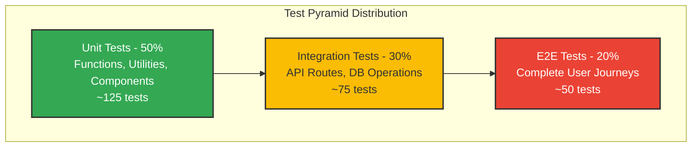
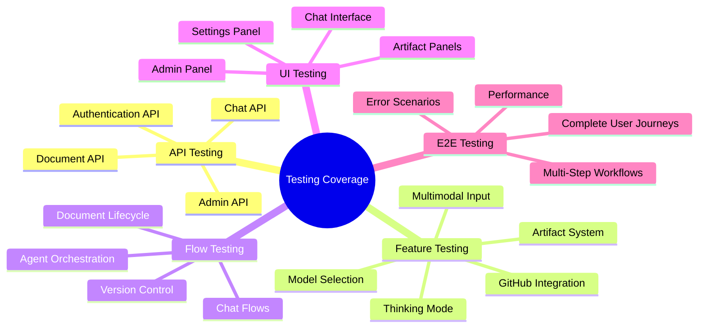
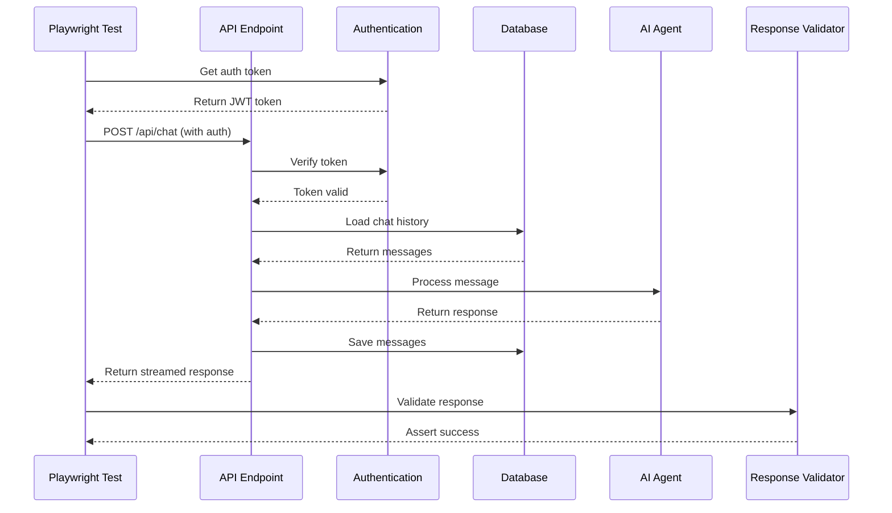
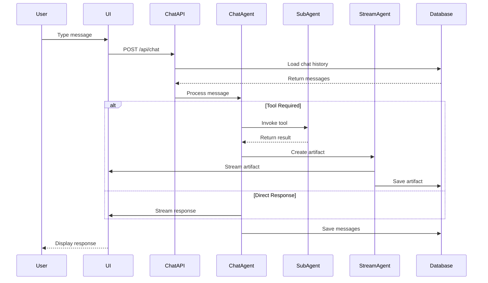
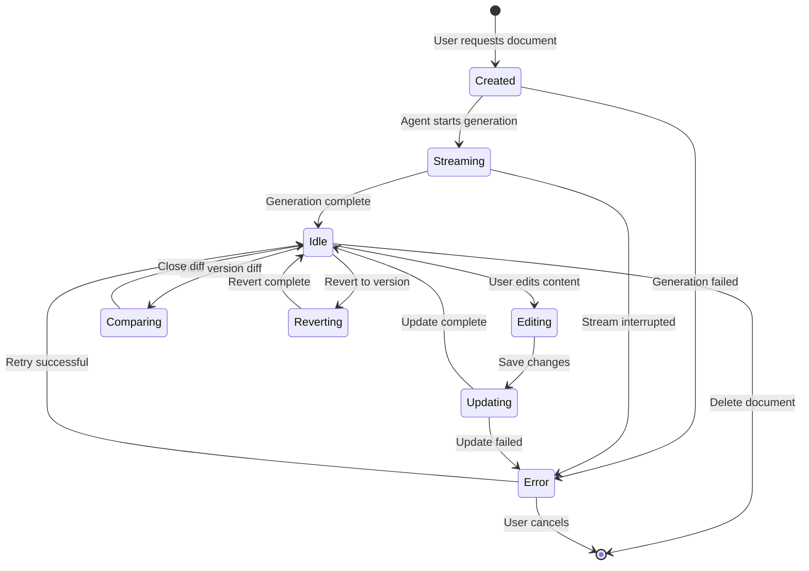
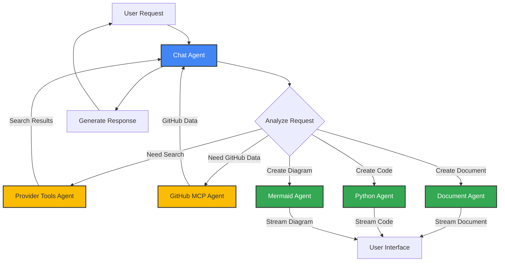
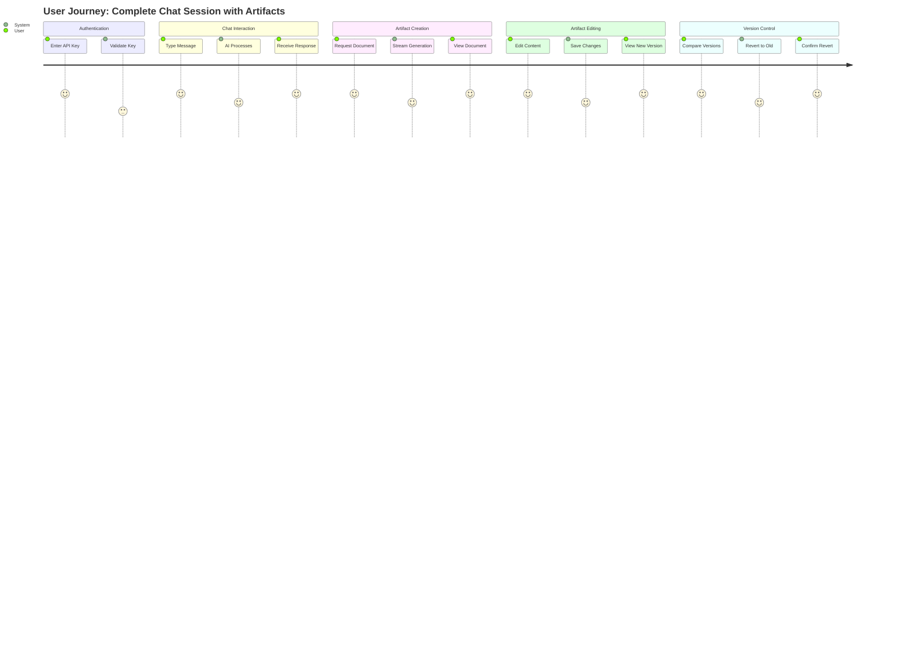
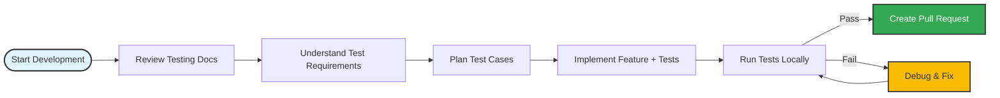

# Testing Documentation

## Table of Contents

1. [Overview](#overview)
2. [Testing Philosophy](#testing-philosophy)
3. [Test Pyramid Architecture](#test-pyramid-architecture)
4. [Quality Gates & PR Requirements](#quality-gates--pr-requirements)
5. [Test Coverage Areas](#test-coverage-areas)
6. [API Testing](#api-testing)
7. [Feature Testing](#feature-testing)
8. [Flow Testing](#flow-testing)
9. [UI Testing](#ui-testing)
10. [E2E Testing](#e2e-testing)
11. [Test Scenarios](#test-scenarios)
12. [Contributing Guidelines](#contributing-guidelines)
13. [File References](#file-references)
14. [TODOs](#todos)

---

## Overview

This document provides a comprehensive guide to testing the code-chatbot application. It covers testing philosophy, test scenarios, quality gates, and detailed guidelines for contributors raising pull requests.

**Current Testing Status:** 🔴 No tests implemented

**Target Testing Framework:** Playwright (for E2E, UI, and API testing) + Jest/Vitest (for unit tests)

**Key Testing Principles:**
- **Test-Driven Development (TDD)**: Write tests before or alongside new features
- **Comprehensive Coverage**: All critical paths must be tested
- **Real-Time Validation**: Tests run on every PR
- **Quality Over Quantity**: Focus on meaningful test cases
- **Fast Feedback**: Tests should run quickly and provide clear error messages

---

## Testing Philosophy

### Core Principles

#### 1. Test-Driven Development
- Write tests **before** implementing new features
- Use tests as living documentation
- Refactor with confidence knowing tests catch regressions

#### 2. Fail Fast, Fail Early
- Tests should catch errors immediately
- Clear error messages guide developers to the root cause
- No failing tests should be committed to main branch

#### 3. Test Independence
- Each test should be **isolated** and **independent**
- Tests should not rely on execution order
- Use proper setup and teardown for each test

#### 4. Continuous Improvement
- Regularly review and update tests
- Remove obsolete tests
- Add tests for discovered bugs

#### 5. Real-World Scenarios
- Tests should mirror actual user workflows
- Use realistic test data
- Validate edge cases and error conditions

---

## Test Pyramid Architecture

The application follows the **test pyramid** approach with the following distribution:



### Test Distribution Rationale

#### Unit Tests (50% - ~125 tests)
- **Fast execution** (milliseconds per test)
- **Isolated testing** of individual functions/components
- **Easy to debug** when failures occur
- **High code coverage** with minimal overhead

**Examples:**
- Utility functions (date formatting, string manipulation)
- React component rendering (without API calls)
- Data transformations
- Validation logic

#### Integration Tests (30% - ~75 tests)
- **Moderate execution time** (seconds per test)
- **Test interactions** between modules
- **Database operations** with test database
- **API route testing** with mocked dependencies

**Examples:**
- API endpoint responses
- Database queries and mutations
- Agent configuration loading
- Authentication flows

#### E2E Tests (20% - ~50 tests)
- **Slower execution** (tens of seconds per test)
- **Full user workflows** from UI to database
- **Browser automation** with Playwright
- **Critical path validation**

**Examples:**
- Complete chat conversation flow
- Document creation and editing
- Multi-agent orchestration
- GitHub MCP integration

---

## Quality Gates & PR Requirements

All pull requests **MUST** pass the following quality gates before merging:

```mermaid
flowchart TD
    Start([New Pull Request]) --> Lint[Run ESLint & Prettier]
    Lint --> |Pass| TypeCheck[TypeScript Type Check]
    Lint --> |Fail| Reject1[❌ PR Rejected]

    TypeCheck --> |Pass| UnitTests[Run Unit Tests]
    TypeCheck --> |Fail| Reject2[❌ PR Rejected]

    UnitTests --> |Pass| IntegrationTests[Run Integration Tests]
    UnitTests --> |Fail| Reject3[❌ PR Rejected]

    IntegrationTests --> |Pass| E2ETests[Run E2E Tests]
    IntegrationTests --> |Fail| Reject4[❌ PR Rejected]

    E2ETests --> |Pass| Build[Build Verification]
    E2ETests --> |Fail| Reject5[❌ PR Rejected]

    Build --> |Pass| Coverage[Check Coverage Thresholds]
    Build --> |Fail| Reject6[❌ PR Rejected]

    Coverage --> |Pass| Review[Code Review]
    Coverage --> |Fail| Reject7[❌ PR Rejected]

    Review --> |Approved| Merge[✅ Merge to Main]
    Review --> |Changes Requested| Reject8[🔄 Revise PR]

    style Start fill:#e1f5ff,stroke:#333,stroke-width:2px
    style Merge fill:#34a853,stroke:#333,stroke-width:3px,color:#fff
    style Reject1 fill:#ea4335,stroke:#333,stroke-width:2px,color:#fff
    style Reject2 fill:#ea4335,stroke:#333,stroke-width:2px,color:#fff
    style Reject3 fill:#ea4335,stroke:#333,stroke-width:2px,color:#fff
    style Reject4 fill:#ea4335,stroke:#333,stroke-width:2px,color:#fff
    style Reject5 fill:#ea4335,stroke:#333,stroke-width:2px,color:#fff
    style Reject6 fill:#ea4335,stroke:#333,stroke-width:2px,color:#fff
    style Reject7 fill:#ea4335,stroke:#333,stroke-width:2px,color:#fff
```



### Mandatory Requirements

#### ✅ All Existing Tests Must Pass
- **Zero tolerance** for failing tests
- PRs with failing tests will be **automatically rejected**
- If existing tests fail, either:
  - Fix the bug causing the failure
  - Update tests if requirements changed (with justification)

#### ✅ New Features Must Have Tests
- **New features** require corresponding test coverage
- **Bug fixes** must include regression tests
- **Refactoring** must maintain or improve test coverage

#### ✅ Code Quality Checks
- **ESLint**: No linting errors
- **Prettier**: Code must be formatted
- **TypeScript**: No type errors
- **Build**: Application must build successfully

#### ✅ Coverage Thresholds
- **Unit Tests**: Minimum 80% coverage
- **Integration Tests**: All critical API routes covered
- **E2E Tests**: All primary user flows covered

### PR Rejection Policy

**Pull requests will be REJECTED if:**

1. ❌ Any existing test fails
2. ❌ New features lack corresponding tests
3. ❌ Code coverage drops below threshold
4. ❌ Linting or type checking fails
5. ❌ Build process fails
6. ❌ Tests are commented out or skipped without justification

**Contributors must:**
- Run all tests locally before creating PR
- Add new tests for new functionality
- Update tests when modifying existing functionality
- Include test plan in PR description

---

## Test Coverage Areas

The application requires comprehensive test coverage across five key areas:



---

## API Testing

API testing validates that all backend endpoints function correctly, handle errors gracefully, and return expected responses.

### API Testing Architecture



### API Test Categories

#### 1. Chat API Tests (`/api/chat`)

**Test Scenarios:**
- ✅ Basic chat request with valid API key
- ✅ Chat request without API key (401 error)
- ✅ Chat request with invalid API key (401 error)
- ✅ Chat with thinking mode enabled
- ✅ Chat with thinking mode disabled
- ✅ Chat with file attachments (images, PDFs, code)
- ✅ Chat with GitHub context
- ✅ Long conversation with history
- ✅ Chat with artifact creation (document, python, mermaid)
- ✅ Multi-step tool execution (search + document creation)
- ✅ Rate limit enforcement (when implemented)
- ✅ Streaming response validation
- ✅ Error handling (network errors, timeout)

#### 2. Document API Tests (`/api/document`)

**Test Scenarios:**
- ✅ Create new document
- ✅ Update existing document
- ✅ Revert to previous version
- ✅ Get document by ID
- ✅ Get all versions of document
- ✅ Delete document
- ✅ Document with invalid user ID (403 error)
- ✅ Document not found (404 error)
- ✅ Concurrent updates (optimistic locking)
- ✅ Large document handling (>1MB)

#### 3. Admin API Tests (`/api/admin/*`)

**Test Scenarios:**
- ✅ Get admin configuration
- ✅ Update agent configuration
- ✅ Create model configuration
- ✅ Update model pricing
- ✅ Delete configuration
- ✅ Non-admin access attempt (403 error)
- ✅ Invalid configuration data (400 error)
- ✅ Configuration versioning
- ✅ Logging settings update
- ✅ Rate limit configuration

#### 4. Authentication API Tests

**Test Scenarios:**
- ✅ User registration
- ✅ User login with valid credentials
- ✅ Login with invalid credentials (401 error)
- ✅ Logout
- ✅ Session validation
- ✅ Password reset flow
- ✅ Email verification
- ✅ Token refresh

---

## Feature Testing

Feature testing validates individual features work correctly in isolation and when combined with other features.

### Multimodal Input Testing

```mermaid
flowchart TD
    Start([User Input]) --> CheckType{Input Type?}

    CheckType -->|Text| ValidateText[Validate Text Input]
    CheckType -->|Image| ValidateImage[Validate Image Upload]
    CheckType -->|PDF| ValidatePDF[Validate PDF Upload]
    CheckType -->|Code| ValidateCode[Validate Code File]
    CheckType -->|Multiple| ValidateMulti[Validate Multiple Attachments]

    ValidateText --> Process[Process Input]
    ValidateImage --> CheckSize{Size OK?}
    ValidatePDF --> CheckSize
    ValidateCode --> CheckSize
    ValidateMulti --> CheckSize

    CheckSize -->|Yes| CheckFormat{Format OK?}
    CheckSize -->|No| ErrorSize[❌ Size Error]

    CheckFormat -->|Yes| Process
    CheckFormat -->|No| ErrorFormat[❌ Format Error]

    Process --> SendToAgent[Send to Chat Agent]
    SendToAgent --> Response[✅ Response Generated]

    style Start fill:#e1f5ff,stroke:#333,stroke-width:2px
    style Response fill:#34a853,stroke:#333,stroke-width:2px,color:#fff
    style ErrorSize fill:#ea4335,stroke:#333,stroke-width:2px,color:#fff
    style ErrorFormat fill:#ea4335,stroke:#333,stroke-width:2px,color:#fff
```



**Test Scenarios:**
- ✅ Text-only input
- ✅ Image upload (PNG, JPG, WebP)
- ✅ PDF upload and extraction
- ✅ Code file upload (Python, JavaScript, TypeScript)
- ✅ Multiple file attachments
- ✅ File size validation (reject >10MB files)
- ✅ File type validation (reject unsupported types)
- ✅ Drag and drop file upload
- ✅ Copy-paste image from clipboard
- ✅ File preview before sending

### Thinking Mode Testing

**Test Scenarios:**
- ✅ Enable thinking mode for supported models
- ✅ Disable thinking mode
- ✅ Thinking mode with unsupported model (graceful degradation)
- ✅ Reasoning steps displayed in UI
- ✅ Reasoning token budget enforcement
- ✅ Reasoning improves response quality
- ✅ Thinking mode persists across chat sessions

### Model Selection Testing

**Test Scenarios:**
- ✅ Switch between different models (Gemini 2.0, 1.5 Pro, etc.)
- ✅ Model availability based on configuration
- ✅ Default model selection
- ✅ Model-specific features (thinking mode, vision)
- ✅ Model pricing display
- ✅ Model capabilities validation

### GitHub MCP Integration Testing

**Test Scenarios:**
- ✅ Connect to GitHub with valid PAT
- ✅ Invalid PAT error handling
- ✅ Repository browsing
- ✅ File content fetching
- ✅ Issue listing
- ✅ Pull request operations
- ✅ Code search
- ✅ Branch management
- ✅ Read-only mode enforcement
- ✅ Rate limit handling

### Artifact System Testing

**Test Scenarios:**
- ✅ Document artifact creation
- ✅ Python code artifact creation
- ✅ Mermaid diagram artifact creation
- ✅ Artifact versioning
- ✅ Artifact editing
- ✅ Version comparison (diff view)
- ✅ Version revert
- ✅ Artifact deletion
- ✅ Concurrent artifact edits
- ✅ Artifact streaming (real-time updates)

---

## Flow Testing

Flow testing validates complete workflows involving multiple components and agents.

### Chat Flow Testing



**Test Scenarios:**
- ✅ Simple question-answer flow
- ✅ Multi-turn conversation with context
- ✅ Tool invocation (search, document creation)
- ✅ Multi-step reasoning
- ✅ Error recovery during flow
- ✅ Stream interruption and resumption
- ✅ Conversation history loading
- ✅ Chat deletion

### Document Lifecycle Flow



**Test Scenarios:**
- ✅ Document creation from user prompt
- ✅ Real-time streaming during creation
- ✅ Document editing
- ✅ Saving edits (new version)
- ✅ Version history navigation
- ✅ Version comparison (diff)
- ✅ Version revert
- ✅ Document suggestions
- ✅ Suggestion acceptance
- ✅ Document deletion
- ✅ Error handling during creation
- ✅ Recovery from failed updates

### Multi-Agent Orchestration Flow



**Test Scenarios:**
- ✅ Single agent invocation
- ✅ Sequential agent calls (search → document)
- ✅ Parallel agent calls (rare but possible)
- ✅ Agent delegation based on user intent
- ✅ Tool selection logic
- ✅ Agent error handling
- ✅ Agent timeout handling
- ✅ Agent configuration loading
- ✅ Rate limit enforcement per agent

---

## UI Testing

UI testing validates that the user interface renders correctly, handles user interactions, and displays data accurately.

### Chat Interface Testing

**Test Scenarios:**
- ✅ Message input renders correctly
- ✅ Send button enabled/disabled states
- ✅ File upload button functionality
- ✅ Message list displays correctly
- ✅ User messages vs AI messages styling
- ✅ Thinking mode indicator
- ✅ Typing indicator during streaming
- ✅ Scroll to bottom on new message
- ✅ Empty state (no messages)
- ✅ Error message display
- ✅ Retry failed message

### Settings Panel Testing

**Test Scenarios:**
- ✅ API key input and validation
- ✅ Model selection dropdown
- ✅ Thinking mode toggle
- ✅ GitHub PAT input
- ✅ Settings persistence (localStorage)
- ✅ Settings reset
- ✅ Dark mode toggle (if implemented)
- ✅ Responsive design (mobile, tablet, desktop)

### Admin Panel Testing

**Test Scenarios:**
- ✅ Admin dashboard renders
- ✅ Provider cards display correctly
- ✅ Agent configuration tabs
- ✅ Form validation (rate limits, prompts)
- ✅ Save configuration success/error
- ✅ Configuration reset
- ✅ Model management UI
- ✅ Logging dashboard
- ✅ Non-admin redirect to home

### Artifact Panel Testing

**Test Scenarios:**
- ✅ Document artifact display
- ✅ Python code editor (Monaco)
- ✅ Mermaid diagram rendering
- ✅ Version footer navigation
- ✅ Diff viewer (side-by-side)
- ✅ Edit mode toggle
- ✅ Syntax highlighting
- ✅ Python code execution
- ✅ Console output display
- ✅ Error highlighting

### Responsive Design Testing

**Test Scenarios:**
- ✅ Desktop layout (1920x1080)
- ✅ Laptop layout (1366x768)
- ✅ Tablet layout (768x1024)
- ✅ Mobile layout (375x667)
- ✅ Artifact panel responsiveness
- ✅ Chat interface on mobile
- ✅ Admin panel on tablet

---

## E2E Testing

End-to-end testing validates complete user journeys from UI interaction to database persistence.

### Complete User Journey Flow



### Primary E2E Scenarios

#### 1. New User Chat Session
**Steps:**
1. User navigates to application
2. User enters Google API key
3. User selects model (Gemini 2.0)
4. User types first message
5. AI responds with answer
6. User continues conversation
7. Chat history persists

**Expected:**
- API key validation succeeds
- Messages stream in real-time
- Conversation history saved to database
- Page refresh preserves chat

#### 2. Document Creation and Editing
**Steps:**
1. User requests document creation
2. AI streams document in artifact panel
3. Document saves with version 1
4. User clicks "Edit" button
5. User modifies content in Monaco editor
6. User saves changes
7. New version (v2) created
8. User views version history
9. User compares v1 vs v2 (diff view)
10. User reverts to v1
11. New version (v3) created (copy of v1)

**Expected:**
- Document streams in real-time
- All versions preserved in database
- Diff shows exact changes
- Revert creates new version (non-destructive)

#### 3. Python Code Execution
**Steps:**
1. User requests Python code
2. AI generates code in artifact panel
3. Code displays in Monaco editor
4. User switches to "Console" tab
5. User clicks "Run" button
6. Pyodide executes code
7. Output displays in console
8. User modifies code
9. User runs modified code
10. New output displays

**Expected:**
- Code syntax highlighting works
- Pyodide loads successfully
- Code executes without errors
- stdout/stderr captured correctly

#### 4. Multi-Agent Workflow
**Steps:**
1. User asks "Search for Python best practices and create a document"
2. Chat Agent invokes Provider Tools Agent (search)
3. Search results returned
4. Chat Agent invokes Document Agent (create)
5. Document streams in artifact panel
6. Chat Agent responds "Created document: Python Best Practices"
7. User sees both chat response and artifact

**Expected:**
- Multi-step execution completes
- Search results influence document content
- Artifact and chat message both appear
- All data saved to database

#### 5. GitHub MCP Integration
**Steps:**
1. User enters GitHub PAT
2. User clicks "Connect to GitHub"
3. User selects repository
4. User browses repository files
5. User selects file
6. File content loads in chat context
7. User asks question about code
8. AI uses file context to answer

**Expected:**
- PAT validation succeeds
- Repository list loads
- File browser navigates correctly
- AI has access to file content

#### 6. Admin Configuration
**Steps:**
1. Admin user logs in
2. Admin navigates to `/admin`
3. Admin selects "Google" provider
4. Admin clicks "Chat Model Agent" tab
5. Admin updates system prompt
6. Admin adjusts rate limits
7. Admin saves configuration
8. Configuration saved to database
9. New chat uses updated configuration

**Expected:**
- Middleware allows admin access
- Configuration form loads current settings
- Save succeeds with validation
- New configuration immediately active

#### 7. Error Recovery
**Steps:**
1. User starts chat with invalid API key
2. Error message displays
3. User corrects API key
4. User retries message
5. Message succeeds
6. Conversation continues normally

**Expected:**
- Clear error message shown
- Retry functionality works
- No data loss
- Seamless recovery

---

## Test Scenarios

### Critical Path Test Matrix

| Feature | Unit Tests | Integration Tests | E2E Tests | Priority |
|---------|-----------|------------------|-----------|----------|
| **Chat API** | ✅ Required | ✅ Required | ✅ Required | Critical |
| **Document Creation** | ✅ Required | ✅ Required | ✅ Required | Critical |
| **Python Code Gen** | ✅ Required | ✅ Required | ✅ Required | Critical |
| **Mermaid Diagrams** | ✅ Required | ✅ Required | ✅ Required | Critical |
| **Version Control** | ✅ Required | ✅ Required | ✅ Required | Critical |
| **Thinking Mode** | ✅ Required | ✅ Required | ⚠️ Optional | High |
| **GitHub MCP** | ⚠️ Optional | ✅ Required | ✅ Required | High |
| **Admin Panel** | ✅ Required | ✅ Required | ⚠️ Optional | High |
| **Multimodal Input** | ✅ Required | ✅ Required | ✅ Required | High |
| **Authentication** | ✅ Required | ✅ Required | ✅ Required | High |
| **Rate Limiting** | ✅ Required | ✅ Required | ⚠️ Optional | Medium |
| **Logging System** | ✅ Required | ⚠️ Optional | ❌ Not Needed | Medium |
| **Error Handling** | ✅ Required | ✅ Required | ✅ Required | Critical |

### Edge Cases and Error Scenarios

#### Network Errors
- ✅ Network timeout during chat
- ✅ Connection lost during streaming
- ✅ API rate limit exceeded
- ✅ Invalid API response
- ✅ Malformed JSON response

#### Data Validation Errors
- ✅ Empty message submission
- ✅ Message exceeds character limit
- ✅ Invalid file type upload
- ✅ File size exceeds limit
- ✅ Malformed configuration data

#### Concurrency Issues
- ✅ Simultaneous document edits
- ✅ Multiple chat requests
- ✅ Race condition in version creation
- ✅ Database lock handling

#### Performance Scenarios
- ✅ Large document (>100KB)
- ✅ Long conversation (>100 messages)
- ✅ Multiple file attachments (10 files)
- ✅ Complex Mermaid diagram
- ✅ Long-running Python code

---

## Contributing Guidelines

### For Contributors Raising Pull Requests

When contributing to this project, follow these testing guidelines:

#### 1. Before Starting Development



**Steps:**
1. Read this testing documentation thoroughly
2. Understand the test pyramid and coverage requirements
3. Review existing tests for similar features
4. Plan test cases before writing code
5. Write tests alongside feature development (TDD approach)

#### 2. Writing Tests

**Test File Structure:**
```
tests/
├── unit/
│   ├── lib/
│   │   ├── ai/
│   │   │   ├── chat-agent.test.ts
│   │   │   └── tool-builder.test.ts
│   │   ├── db/
│   │   │   └── queries.test.ts
│   │   └── utils/
│   │       └── helpers.test.ts
│   └── components/
│       ├── artifact.test.tsx
│       └── chat.test.tsx
├── integration/
│   ├── api/
│   │   ├── chat.test.ts
│   │   ├── document.test.ts
│   │   └── admin.test.ts
│   └── flows/
│       ├── document-lifecycle.test.ts
│       └── agent-orchestration.test.ts
└── e2e/
    ├── chat-session.spec.ts
    ├── document-creation.spec.ts
    ├── python-execution.spec.ts
    └── admin-config.spec.ts
```

**Naming Conventions:**
- Unit tests: `*.test.ts` or `*.test.tsx`
- Integration tests: `*.test.ts`
- E2E tests: `*.spec.ts`

**Test Structure:**
```typescript
describe('Feature Name', () => {
  beforeEach(() => {
    // Setup before each test
  });

  afterEach(() => {
    // Cleanup after each test
  });

  it('should handle success scenario', async () => {
    // Arrange: Set up test data
    // Act: Execute the functionality
    // Assert: Verify the results
  });

  it('should handle error scenario', async () => {
    // Test error handling
  });

  it('should validate edge cases', async () => {
    // Test boundary conditions
  });
});
```

#### 3. Running Tests Locally

**Install Dependencies:**
```bash
npm install
```

**Run All Tests:**
```bash
npm test
```

**Run Specific Test Suite:**
```bash
# Unit tests only
npm run test:unit

# Integration tests only
npm run test:integration

# E2E tests only
npm run test:e2e
```

**Run Tests in Watch Mode:**
```bash
npm run test:watch
```

**Check Coverage:**
```bash
npm run test:coverage
```

#### 4. Test Coverage Requirements

Your PR must meet these coverage thresholds:

- **Overall Coverage**: ≥80%
- **Statements**: ≥80%
- **Branches**: ≥75%
- **Functions**: ≥80%
- **Lines**: ≥80%

**Check Coverage Report:**
```bash
npm run test:coverage
# Opens coverage report in browser
```

#### 5. PR Checklist

Before creating a pull request, ensure:

- [ ] All existing tests pass locally
- [ ] New tests added for new features
- [ ] Regression tests added for bug fixes
- [ ] Code coverage meets thresholds
- [ ] ESLint passes (`npm run lint`)
- [ ] TypeScript compiles (`npm run type-check`)
- [ ] Build succeeds (`npm run build`)
- [ ] Tests are documented with clear descriptions
- [ ] Edge cases are covered
- [ ] Error scenarios are tested

#### 6. PR Description Template

Include this information in your PR description:

```markdown
## Description
Brief description of changes

## Type of Change
- [ ] Bug fix
- [ ] New feature
- [ ] Breaking change
- [ ] Documentation update

## Test Plan
### Tests Added
- List of new test files/cases added
- Coverage percentage for new code

### Tests Modified
- List of modified existing tests
- Reason for modifications

### Manual Testing
- Steps performed for manual verification
- Screenshots/videos if applicable

## Coverage Report
- Overall: XX%
- New code: XX%
- Link to coverage report

## Checklist
- [ ] All tests pass locally
- [ ] New tests added
- [ ] Coverage meets threshold
- [ ] Linting passes
- [ ] Build succeeds
```

#### 7. Common Testing Mistakes to Avoid

❌ **Don't:**
- Skip writing tests ("I'll add tests later")
- Comment out failing tests
- Write tests that depend on execution order
- Use hardcoded values without explanation
- Ignore edge cases
- Test implementation details instead of behavior
- Create flaky tests (intermittent failures)

✅ **Do:**
- Write tests before or during development
- Fix failing tests immediately
- Ensure test independence
- Use descriptive test names
- Test all edge cases and errors
- Test behavior and outcomes
- Make tests deterministic and reliable

---

## File References

### Testing Infrastructure (To Be Created)

| File Path | Purpose |
|-----------|---------|
| `tests/setup.ts` | Global test setup and configuration |
| `tests/helpers/` | Test utility functions and helpers |
| `tests/fixtures/` | Test data and mock objects |
| `tests/mocks/` | Mock implementations of services |
| `playwright.config.ts` | Playwright E2E test configuration |
| `jest.config.js` or `vitest.config.ts` | Unit/integration test configuration |

### Application Files to Test

#### Core API Routes
- `app/(chat)/api/chat/route.ts` - Chat API endpoint
- `app/(chat)/api/document/route.ts` - Document operations
- `app/api/admin/config/[configKey]/route.ts` - Admin configuration
- `app/api/admin/models/route.ts` - Model management
- `app/api/history/route.ts` - Chat history

#### Agent System
- `lib/ai/chat-agent-resolver.ts` - Chat agent creation
- `lib/ai/providers/google/chat-agent.ts` - Google chat agent
- `lib/ai/providers/google/provider-tools-agent.ts` - Provider tools
- `lib/ai/providers/google/git-mcp-agent.ts` - GitHub MCP
- `lib/ai/providers/google/document-agent-streaming.ts` - Document agent
- `lib/ai/providers/google/python-agent-streaming.ts` - Python agent
- `lib/ai/providers/google/mermaid-agent-streaming.ts` - Mermaid agent

#### Database Queries
- `lib/db/queries/chat.ts` - Chat operations
- `lib/db/queries/document.ts` - Document operations
- `lib/db/queries/admin.ts` - Admin configuration
- `lib/db/queries/message.ts` - Message operations

#### UI Components
- `components/chat.tsx` - Chat interface
- `components/artifact.tsx` - Artifact container
- `components/document.tsx` - Document viewer
- `components/python-viewer.tsx` - Python code viewer
- `components/model-selector.tsx` - Model selection
- `components/admin/admin-dashboard.tsx` - Admin dashboard

#### Utilities
- `lib/ai/file-processing.ts` - File upload handling
- `lib/storage/local-storage-manager.ts` - Local storage
- `lib/logging/activity-logger.ts` - Activity logging
- `lib/errors/logger.ts` - Error logging

---

## TODOs

### Phase 1: Test Infrastructure Setup
**Priority:** Critical
**Estimated Effort:** 1-2 days

- [ ] **Install Testing Dependencies**
  - [ ] Install Playwright for E2E testing
  - [ ] Install Jest or Vitest for unit/integration testing
  - [ ] Install React Testing Library for component tests
  - [ ] Install test utilities (@testing-library/user-event, etc.)
  - [ ] Install coverage tools (istanbul, nyc)

- [ ] **Configure Test Framework**
  - [ ] Create `playwright.config.ts` with browser configs
  - [ ] Create `jest.config.js` or `vitest.config.ts`
  - [ ] Set up test environment (jsdom, node)
  - [ ] Configure coverage thresholds (80% minimum)
  - [ ] Set up test reporters (console, HTML, JSON)

- [ ] **Create Test Directory Structure**
  - [ ] Create `tests/unit/` directory
  - [ ] Create `tests/integration/` directory
  - [ ] Create `tests/e2e/` directory
  - [ ] Create `tests/helpers/` for utilities
  - [ ] Create `tests/fixtures/` for test data
  - [ ] Create `tests/mocks/` for service mocks

- [ ] **Set Up Test Utilities**
  - [ ] Create test database setup/teardown helpers
  - [ ] Create authentication helpers (mock tokens, sessions)
  - [ ] Create API request builders
  - [ ] Create fixture data generators
  - [ ] Create custom matchers for assertions
  - [ ] Create mock implementations (Supabase client, AI models)

- [ ] **Configure CI/CD Pipeline**
  - [ ] Create `.github/workflows/test.yml`
  - [ ] Add unit test job
  - [ ] Add integration test job
  - [ ] Add E2E test job
  - [ ] Add coverage reporting job
  - [ ] Add test result uploading
  - [ ] Configure PR status checks (block merge on failure)

---

### Phase 2: Unit Tests Implementation
**Priority:** Critical
**Estimated Effort:** 3-5 days

#### Agent System Unit Tests (~30 tests)

- [ ] **Chat Agent Tests** (`tests/unit/lib/ai/chat-agent.test.ts`)
  - [ ] Test agent initialization with config
  - [ ] Test API key setting and propagation
  - [ ] Test GitHub PAT setting
  - [ ] Test model selection
  - [ ] Test thinking mode support detection
  - [ ] Test tool building delegation
  - [ ] Test streaming configuration
  - [ ] Test error handling (invalid config, missing API key)

- [ ] **Tool Builder Tests** (`tests/unit/lib/ai/tool-builder.test.ts`)
  - [ ] Test tool creation for each agent type
  - [ ] Test tool enablement based on config
  - [ ] Test tool parameter validation
  - [ ] Test tool execution delegation
  - [ ] Test error handling in tool execution

- [ ] **Config Loader Tests** (`tests/unit/lib/ai/config-loader.test.ts`)
  - [ ] Test agent config loading from database
  - [ ] Test config caching
  - [ ] Test API key propagation to all agents
  - [ ] Test agent initialization on demand
  - [ ] Test config validation

#### Database Query Unit Tests (~25 tests)

- [ ] **Chat Query Tests** (`tests/unit/lib/db/queries/chat.test.ts`)
  - [ ] Test chat creation
  - [ ] Test chat retrieval by ID
  - [ ] Test chat list for user
  - [ ] Test chat deletion
  - [ ] Test chat update
  - [ ] Test error handling (not found, invalid user)

- [ ] **Document Query Tests** (`tests/unit/lib/db/queries/document.test.ts`)
  - [ ] Test document creation (version 1)
  - [ ] Test document update (new version)
  - [ ] Test version retrieval
  - [ ] Test version list for document
  - [ ] Test latest version retrieval
  - [ ] Test document deletion
  - [ ] Test version comparison query

- [ ] **Message Query Tests** (`tests/unit/lib/db/queries/message.test.ts`)
  - [ ] Test message creation
  - [ ] Test message list for chat
  - [ ] Test message deletion
  - [ ] Test message pagination

- [ ] **Admin Query Tests** (`tests/unit/lib/db/queries/admin.test.ts`)
  - [ ] Test config retrieval
  - [ ] Test config creation
  - [ ] Test config update
  - [ ] Test config deletion
  - [ ] Test config summary generation

#### Utility Function Tests (~20 tests)

- [ ] **File Processing Tests** (`tests/unit/lib/ai/file-processing.test.ts`)
  - [ ] Test image file validation (PNG, JPG, WebP)
  - [ ] Test PDF file validation
  - [ ] Test code file validation (py, js, ts)
  - [ ] Test file size validation (reject >10MB)
  - [ ] Test file type rejection (unsupported types)
  - [ ] Test file content extraction
  - [ ] Test base64 encoding

- [ ] **Storage Manager Tests** (`tests/unit/lib/storage/local-storage-manager.test.ts`)
  - [ ] Test API key storage
  - [ ] Test API key retrieval
  - [ ] Test API key deletion
  - [ ] Test settings persistence
  - [ ] Test settings retrieval

- [ ] **Logging Tests** (`tests/unit/lib/logging/activity-logger.test.ts`)
  - [ ] Test user activity logging
  - [ ] Test agent activity logging
  - [ ] Test error logging
  - [ ] Test batch processing
  - [ ] Test log filtering by category

#### Component Unit Tests (~50 tests)

- [ ] **Chat Component Tests** (`tests/unit/components/chat.test.tsx`)
  - [ ] Test rendering with messages
  - [ ] Test empty state rendering
  - [ ] Test message input
  - [ ] Test send button click
  - [ ] Test file upload
  - [ ] Test streaming message display
  - [ ] Test error message display
  - [ ] Test retry functionality

- [x] **Artifact Component Tests** (`tests/unit/components/artifact.test.tsx`)
  - [x] Test document artifact rendering
  - [x] Test Python artifact rendering
  - [x] Test Mermaid artifact rendering
  - [x] Test artifact type detection
  - [x] Test artifact loading state
  - [x] Test artifact error state

- [ ] **Document Viewer Tests** (`tests/unit/components/document.test.tsx`)
  - [ ] Test document display
  - [ ] Test edit mode toggle
  - [ ] Test version navigation
  - [ ] Test diff viewer
  - [ ] Test suggestion display

- [ ] **Python Viewer Tests** (`tests/unit/components/python-viewer.test.tsx`)
  - [ ] Test code editor rendering
  - [ ] Test console tab rendering
  - [ ] Test diff tab rendering
  - [ ] Test execution controls
  - [ ] Test syntax highlighting

- [ ] **Model Selector Tests** (`tests/unit/components/model-selector.test.tsx`)
  - [ ] Test model dropdown rendering
  - [ ] Test API key input
  - [ ] Test model selection
  - [ ] Test thinking mode toggle
  - [ ] Test validation messages

---

### Phase 3: Integration Tests Implementation
**Priority:** Critical
**Estimated Effort:** 4-6 days

#### API Route Integration Tests (~40 tests)

- [ ] **Chat API Integration Tests** (`tests/integration/api/chat.test.ts`)
  - [ ] Test POST /api/chat with valid request
  - [ ] Test chat without API key (401)
  - [ ] Test chat with invalid API key (401)
  - [ ] Test chat with thinking mode enabled
  - [ ] Test chat with file attachments
  - [ ] Test chat with GitHub context
  - [ ] Test streaming response
  - [ ] Test multi-step tool execution
  - [ ] Test error handling (timeout, network error)
  - [ ] Test rate limiting (when implemented)

- [ ] **Document API Integration Tests** (`tests/integration/api/document.test.ts`)
  - [ ] Test POST /api/document (create)
  - [ ] Test PUT /api/document/:id (update)
  - [ ] Test GET /api/document/:id (retrieve)
  - [ ] Test GET /api/document/:id/versions (list versions)
  - [ ] Test POST /api/document/:id/revert (revert)
  - [ ] Test DELETE /api/document/:id (delete)
  - [ ] Test unauthorized access (403)
  - [ ] Test not found (404)

- [ ] **Admin API Integration Tests** (`tests/integration/api/admin.test.ts`)
  - [ ] Test GET /api/admin/config/:key
  - [ ] Test PUT /api/admin/config/:key (create/update)
  - [ ] Test PATCH /api/admin/config/:key (partial update)
  - [ ] Test DELETE /api/admin/config/:key
  - [ ] Test GET /api/admin/config/summary
  - [ ] Test POST /api/admin/models (create model)
  - [ ] Test PATCH /api/admin/models/:id (update model)
  - [ ] Test non-admin access (403)

- [ ] **Authentication Integration Tests** (`tests/integration/api/auth.test.ts`)
  - [ ] Test user registration
  - [ ] Test user login
  - [ ] Test login with invalid credentials
  - [ ] Test logout
  - [ ] Test session validation
  - [ ] Test token refresh

#### Agent Flow Integration Tests (~20 tests)

- [ ] **Document Lifecycle Tests** (`tests/integration/flows/document-lifecycle.test.ts`)
  - [ ] Test complete document creation flow
  - [ ] Test document update flow with versioning
  - [ ] Test version comparison flow
  - [ ] Test version revert flow
  - [ ] Test suggestion generation and acceptance
  - [ ] Test concurrent edits handling

- [ ] **Multi-Agent Orchestration Tests** (`tests/integration/flows/agent-orchestration.test.ts`)
  - [ ] Test search + document creation flow
  - [ ] Test GitHub fetch + code analysis flow
  - [ ] Test sequential tool calls
  - [ ] Test tool error recovery
  - [ ] Test agent delegation logic

- [ ] **Streaming Tests** (`tests/integration/flows/streaming.test.ts`)
  - [ ] Test document streaming
  - [ ] Test Python code streaming
  - [ ] Test Mermaid diagram streaming
  - [ ] Test stream interruption handling
  - [ ] Test stream resumption

#### Database Integration Tests (~15 tests)

- [ ] **Transaction Tests** (`tests/integration/db/transactions.test.ts`)
  - [ ] Test chat + message creation in transaction
  - [ ] Test document versioning in transaction
  - [ ] Test rollback on error
  - [ ] Test concurrent updates with locking

- [ ] **Query Performance Tests** (`tests/integration/db/performance.test.ts`)
  - [ ] Test query performance with large datasets
  - [ ] Test pagination efficiency
  - [ ] Test index usage
  - [ ] Test N+1 query prevention

---

### Phase 4: E2E Tests Implementation
**Priority:** High
**Estimated Effort:** 5-7 days

#### Core User Journeys (~30 tests)

- [ ] **New User Chat Session** (`tests/e2e/chat-session.spec.ts`)
  - [ ] Test complete first-time user flow
  - [ ] Test API key entry and validation
  - [ ] Test model selection
  - [ ] Test sending first message
  - [ ] Test receiving response
  - [ ] Test multi-turn conversation
  - [ ] Test chat persistence after refresh

- [ ] **Document Creation Journey** (`tests/e2e/document-creation.spec.ts`)
  - [ ] Test requesting document creation
  - [ ] Test watching real-time streaming
  - [ ] Test document appearing in artifact panel
  - [ ] Test editing document
  - [ ] Test saving new version
  - [ ] Test viewing version history
  - [ ] Test comparing versions
  - [ ] Test reverting to previous version

- [ ] **Python Code Journey** (`tests/e2e/python-execution.spec.ts`)
  - [ ] Test requesting Python code
  - [ ] Test code appearing in editor
  - [ ] Test syntax highlighting
  - [ ] Test switching to console tab
  - [ ] Test executing code
  - [ ] Test viewing output
  - [ ] Test modifying and re-running code
  - [ ] Test error handling in execution

- [ ] **Mermaid Diagram Journey** (`tests/e2e/mermaid-diagram.spec.ts`)
  - [ ] Test requesting diagram
  - [ ] Test diagram streaming
  - [ ] Test live preview rendering
  - [ ] Test editing diagram code
  - [ ] Test preview updates
  - [ ] Test syntax error display
  - [ ] Test exporting diagram

- [ ] **GitHub MCP Journey** (`tests/e2e/github-integration.spec.ts`)
  - [ ] Test entering GitHub PAT
  - [ ] Test connecting to GitHub
  - [ ] Test selecting repository
  - [ ] Test browsing files
  - [ ] Test loading file content
  - [ ] Test asking questions about code
  - [ ] Test AI using GitHub context

- [ ] **Admin Configuration Journey** (`tests/e2e/admin-config.spec.ts`)
  - [ ] Test admin login
  - [ ] Test accessing admin panel
  - [ ] Test selecting provider
  - [ ] Test updating agent config
  - [ ] Test saving configuration
  - [ ] Test configuration taking effect
  - [ ] Test non-admin redirect

#### Error Recovery Scenarios (~10 tests)

- [ ] **Error Handling Journey** (`tests/e2e/error-recovery.spec.ts`)
  - [ ] Test invalid API key error
  - [ ] Test network error during chat
  - [ ] Test stream interruption recovery
  - [ ] Test file upload error
  - [ ] Test retry after error
  - [ ] Test error message clarity

#### Performance Tests (~10 tests)

- [ ] **Performance Journey** (`tests/e2e/performance.spec.ts`)
  - [ ] Test large document handling
  - [ ] Test long conversation (100+ messages)
  - [ ] Test multiple file uploads
  - [ ] Test complex Mermaid diagram
  - [ ] Test response time benchmarks
  - [ ] Test memory usage monitoring

---

### Phase 5: Advanced Testing Features
**Priority:** Medium
**Estimated Effort:** 3-4 days

- [ ] **Visual Regression Testing**
  - [ ] Set up Percy or similar tool
  - [ ] Create baseline screenshots
  - [ ] Add visual tests for UI components
  - [ ] Add visual tests for artifact panels
  - [ ] Configure diff tolerance

- [ ] **Performance Monitoring**
  - [ ] Set up Lighthouse CI
  - [ ] Add performance budgets
  - [ ] Monitor bundle size
  - [ ] Track Core Web Vitals
  - [ ] Add performance regression tests

- [ ] **Accessibility Testing**
  - [ ] Install axe-core or pa11y
  - [ ] Add a11y tests for all pages
  - [ ] Test keyboard navigation
  - [ ] Test screen reader compatibility
  - [ ] Validate ARIA attributes

- [ ] **Security Testing**
  - [ ] Test XSS prevention
  - [ ] Test CSRF protection
  - [ ] Test SQL injection prevention
  - [ ] Test authentication bypass attempts
  - [ ] Test authorization checks

---

### Phase 6: Test Maintenance & Documentation
**Priority:** Medium
**Estimated Effort:** 2-3 days

- [ ] **Test Documentation**
  - [ ] Document test patterns and conventions
  - [ ] Create examples for common test scenarios
  - [ ] Document mock data creation
  - [ ] Create debugging guide for test failures
  - [ ] Document CI/CD test pipeline

- [ ] **Test Reporting**
  - [ ] Set up test result dashboard
  - [ ] Configure Slack/email notifications
  - [ ] Create coverage trending reports
  - [ ] Add test execution time tracking
  - [ ] Generate weekly test health reports

- [ ] **Developer Experience**
  - [ ] Create test generation templates
  - [ ] Add VS Code test snippets
  - [ ] Create pre-commit hooks for tests
  - [ ] Add test runner shortcuts
  - [ ] Create test debugging configurations

---

### Phase 7: Continuous Improvement
**Priority:** Low
**Estimated Effort:** Ongoing

- [ ] **Test Optimization**
  - [ ] Identify and fix flaky tests
  - [ ] Optimize slow-running tests
  - [ ] Parallelize test execution
  - [ ] Reduce test data setup overhead
  - [ ] Cache test dependencies

- [ ] **Coverage Improvements**
  - [ ] Identify untested code paths
  - [ ] Add tests for edge cases
  - [ ] Increase branch coverage to 90%
  - [ ] Add mutation testing
  - [ ] Test error boundaries

- [ ] **Monitoring & Alerts**
  - [ ] Set up test failure alerts
  - [ ] Monitor test execution trends
  - [ ] Track test coverage trends
  - [ ] Alert on coverage drops
  - [ ] Monitor flaky test rates

---

## Summary

This testing documentation provides a comprehensive framework for ensuring code quality and reliability across the code-chatbot application. The key takeaways for contributors are:

### For New Contributors
1. **Read this document** before starting development
2. **Follow the test pyramid** (50% unit, 30% integration, 20% E2E)
3. **Write tests alongside code** using TDD approach
4. **Run tests locally** before creating PRs
5. **Meet coverage thresholds** (minimum 80%)

### For Reviewers
1. **Verify all tests pass** in CI/CD pipeline
2. **Check test coverage** meets thresholds
3. **Review test quality** (not just quantity)
4. **Validate test scenarios** cover edge cases
5. **Reject PRs** with failing or missing tests

### Testing Priorities

**Critical (Must Have):**
- ✅ Chat API tests
- ✅ Document creation/editing tests
- ✅ Agent orchestration tests
- ✅ Authentication tests
- ✅ Error handling tests

**High Priority (Should Have):**
- ⚠️ GitHub MCP integration tests
- ⚠️ Admin panel tests
- ⚠️ Multimodal input tests
- ⚠️ Performance tests

**Medium Priority (Nice to Have):**
- 🔵 Visual regression tests
- 🔵 Accessibility tests
- 🔵 Security tests
- 🔵 Load tests

### Next Steps

1. **Phase 1**: Set up test infrastructure (Playwright, Jest/Vitest)
2. **Phase 2**: Implement unit tests for core functionality
3. **Phase 3**: Add integration tests for API routes and flows
4. **Phase 4**: Create E2E tests for critical user journeys
5. **Phase 5**: Enhance with advanced testing features
6. **Phase 6**: Maintain and document test suite
7. **Phase 7**: Continuously improve test coverage and quality

---

**Remember:** Tests are not optional. They are a critical part of the development process that ensures code quality, prevents regressions, and gives confidence when refactoring. All contributors must embrace testing as part of their workflow.

For questions or clarifications, refer to the [TESTING_STRATEGY.md](../TESTING_STRATEGY.md) for implementation details, or consult the team leads.

**Last Updated:** 2025-11-16
